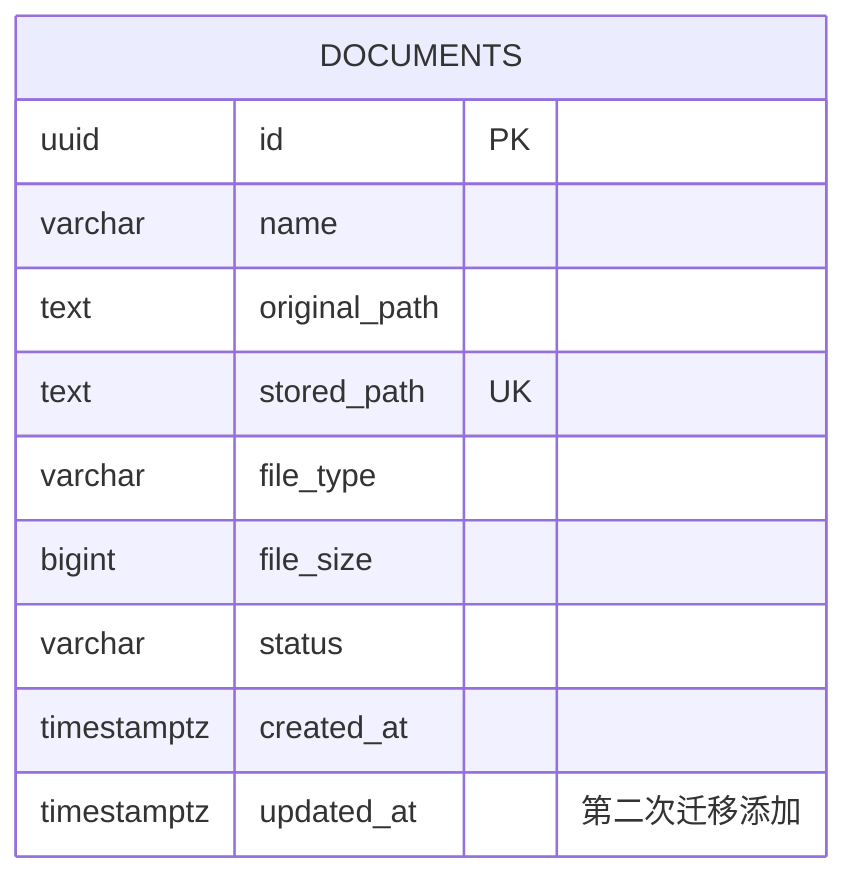

# PostgreSQL 原理、常用方法与 `documents` 表结构设计

## 1. 本阶段目标

阶段 3 只完成 PostgreSQL 环境验证和数据库设计，不在此阶段接入 SQLAlchemy，也不让 FastAPI 直接访问数据库。

当前已经完成以下环境验证：

- 本机运行 PostgreSQL 17，监听 `127.0.0.1:5432`。
- 使用非超级管理员账号 `knowledge_app` 连接开发数据库 `knowledge_assistant_dev`。
- 应用账号可以建表、插入和查询数据。
- 使用 `BEGIN` 和 `ROLLBACK` 验证了事务回滚。
- `.env` 已被 Git 忽略，真实连接密码不会提交到仓库。

本阶段的核心产出是确定 `documents` 表的字段、类型、约束和索引，为后续 SQLAlchemy ORM 和 Alembic 迁移提供依据。

> 本文中的 SQL 是设计稿和学习示例，暂时不要手工创建正式 `documents` 表。后续由 Alembic 迁移统一创建，以保证本机、测试环境和服务器结构一致。

---

## 2. PostgreSQL 的基本层级

可以把 PostgreSQL 的结构理解为：

```text
PostgreSQL 服务实例
└── 数据库 knowledge_assistant_dev
    └── Schema public
        └── 表 documents
            ├── 列 id、name、file_size 等
            └── 行 每一条文档元数据
```

### 2.1 PostgreSQL 服务实例

当前 Windows 服务 `postgresql-x64-17` 是一个正在运行的 PostgreSQL 实例。它负责监听端口、验证账号、管理数据库并执行 SQL。

### 2.2 数据库

数据库是相互隔离的数据集合。本项目使用两个本地数据库：

| 数据库 | 用途 |
| --- | --- |
| `knowledge_assistant_dev` | 日常开发、手工验证和 API 联调 |
| `knowledge_assistant_test` | pytest 数据库集成测试 |

测试库与开发库分开，可以避免自动化测试清理数据时误删开发数据。

### 2.3 Schema

Schema 是数据库内部的命名空间。同一个数据库中可以存在 `public.documents` 和 `archive.documents` 两张同名表。

本阶段使用默认的 `public` Schema，正式表的完整名称是：

```text
public.documents
```

### 2.4 表、行和列

- 表用于保存同一类数据，例如 `documents` 保存文档元数据。
- 一行代表一份文档的元数据。
- 一列代表一个固定属性，例如文件名或文件大小。

文件正文仍保存在 `data/uploads`，PostgreSQL 只保存文件的元数据和存储位置：

```text
文件本体  → data/uploads
文档元数据 → PostgreSQL documents 表
```

---

## 3. 为什么需要独立应用账号

`postgres` 是数据库超级管理员，可以创建和删除数据库、管理账号并绕过很多权限限制。FastAPI 不应该使用这个账号。

项目使用：

```text
账号：knowledge_app
权限：LOGIN、NOSUPERUSER、NOCREATEDB、NOCREATEROLE
```

应用账号只管理项目自己的数据库。即使应用代码出现错误，影响范围也比超级管理员账号小，这叫做“最小权限原则”。

账号、数据库和表是不同概念：

```text
knowledge_app           → 谁在访问
knowledge_assistant_dev → 访问哪一个数据库
documents               → 访问数据库中的哪张表
```

---

## 4. 与当前 Python 模型的关系

当前领域模型 `Document` 包含：

```python
id: str
name: str
original_path: str
stored_path: str
file_type: str
file_size: int
status: str
created_at: str
```

数据库不必照搬 Python 的存储类型。例如：

| Python 中的类型 | PostgreSQL 类型 | 原因 |
| --- | --- | --- |
| UUID 格式的 `str` | `UUID` | 数据库能够校验 UUID 格式，存储也更明确 |
| ISO 8601 时间字符串 | `TIMESTAMPTZ` | 数据库可以正确排序、比较和进行时间计算 |
| `int` 文件大小 | `BIGINT` | 可以保存较大的文件字节数 |

因此，领域模型、Pydantic Schema 和数据库表职责不同：

```text
Document             → Service 内部业务对象
DocumentResponse     → HTTP 返回结构
documents 表          → PostgreSQL 持久化结构
后续 DocumentORM      → Python 对象与 documents 表之间的映射
```

---

## 5. `documents` 第一版表结构

### 5.1 字段设计

| 字段 | PostgreSQL 类型 | 是否为空 | 默认值 | 约束和用途 |
| --- | --- | --- | --- | --- |
| `id` | `UUID` | 否 | 由应用生成 | 主键，唯一标识文档 |
| `name` | `VARCHAR(255)` | 否 | 无 | 原始文件名，去除空白后不能为空 |
| `original_path` | `TEXT` | 否 | 无 | 上传前的来源路径，仅供内部追踪 |
| `stored_path` | `TEXT` | 否 | 无 | 实际保存路径，要求唯一 |
| `file_type` | `VARCHAR(32)` | 否 | 无 | 小写扩展名，例如 `.txt`、`.pdf` |
| `file_size` | `BIGINT` | 否 | 无 | 文件字节数，必须大于或等于 0 |
| `status` | `VARCHAR(32)` | 否 | `uploaded` | 文档处理状态 |
| `created_at` | `TIMESTAMPTZ` | 否 | 当前数据库时间 | 文档记录创建时间 |

### 5.2 为什么 `id` 使用 UUID

UUID 不依赖数据库自增序列，应用在复制文件和写入元数据之前就能生成 ID。以后多个服务同时创建文档时，发生 ID 冲突的概率也极低。

当前 `Document.create()` 使用 `uuid4()` 生成 ID，因此第一版仍由应用生成 UUID，数据库负责验证格式和保证主键唯一。

### 5.3 为什么名称不唯一

不同目录可以存在同名文件，同一个文件也可能被重复上传，因此不能给 `name` 添加唯一约束：

```text
D:\资料\方案.pdf
D:\备份\方案.pdf
```

两条记录的 `name` 都可以是 `方案.pdf`。

### 5.4 为什么 `stored_path` 唯一

一个实际存储文件应该只对应一条元数据记录。如果两条记录指向同一个存储路径，删除其中一条时可能破坏另一条记录，因此给 `stored_path` 添加唯一约束。

### 5.5 为什么路径使用 `TEXT`

路径长度与操作系统和部署方式有关，没有必要人为固定在 255 个字符。PostgreSQL 的 `TEXT` 很适合保存长度不固定的路径。

`original_path` 和 `stored_path` 都属于内部字段，不应直接出现在对外的 `DocumentResponse` 中。

### 5.6 为什么文件大小使用 `BIGINT`

文件大小单位是字节。`BIGINT` 是 64 位整数，可以覆盖大型文件，并通过检查约束禁止负数：

```sql
CHECK (file_size >= 0)
```

### 5.7 为什么使用 `TIMESTAMPTZ`

`TIMESTAMPTZ` 表示带时区语义的时间点。PostgreSQL 内部会保存统一的时间点，查询时再根据会话时区显示。

项目代码使用 UTC 时间，因此数据库连接后可验证或设置时区：

```sql
SHOW timezone;
SET TIME ZONE 'UTC';
```

它比保存普通字符串更适合排序、筛选和时间计算。例如：

```sql
SELECT *
FROM documents
WHERE created_at >= CURRENT_TIMESTAMP - INTERVAL '7 days';
```

---

## 6. 状态字段设计

为后续文本解析、Embedding 等处理预留以下状态：

| 状态 | 含义 |
| --- | --- |
| `uploaded` | 文件已经保存，尚未开始处理 |
| `processing` | 正在解析或建立索引 |
| `ready` | 已处理完成，可以用于检索 |
| `failed` | 处理失败，需要查看日志或重试 |

第一版可以通过 `CHECK` 约束防止写入拼错或未知的状态：

```sql
CHECK (status IN ('uploaded', 'processing', 'ready', 'failed'))
```

本阶段选择 `VARCHAR + CHECK`，暂不使用 PostgreSQL `ENUM`。增加新状态时，修改检查约束通常比修改枚举类型更直观，也更适合当前学习项目。

---

## 7. 约束的作用

约束是在数据库层保护数据质量。即使应用代码出现遗漏，数据库仍会拒绝不合法数据。

| 约束 | 本表中的例子 | 作用 |
| --- | --- | --- |
| `PRIMARY KEY` | `id` | 非空且唯一，标识每一行 |
| `NOT NULL` | `name`、`file_size` 等 | 禁止缺少必要数据 |
| `UNIQUE` | `stored_path` | 禁止两条记录指向同一存储文件 |
| `DEFAULT` | `status='uploaded'` | 插入时未指定状态则使用默认值 |
| `CHECK` | `file_size >= 0` | 禁止不符合业务规则的数据 |

类型注解、Pydantic 校验和数据库约束并不重复，它们分别保护不同边界：

```text
mypy 类型检查       → 开发阶段检查 Python 源码
Pydantic            → 运行时检查 HTTP 输入输出
PostgreSQL 约束     → 最终保护持久化数据
```

---

## 8. 第一版建表 SQL 设计稿

下面的 SQL 将作为后续第一条 Alembic 迁移的设计依据，现在不需要手工执行：

```sql
CREATE TABLE documents (
    id UUID PRIMARY KEY,
    name VARCHAR(255) NOT NULL,
    original_path TEXT NOT NULL,
    stored_path TEXT NOT NULL,
    file_type VARCHAR(32) NOT NULL,
    file_size BIGINT NOT NULL,
    status VARCHAR(32) NOT NULL DEFAULT 'uploaded',
    created_at TIMESTAMPTZ NOT NULL DEFAULT CURRENT_TIMESTAMP,

    CONSTRAINT ck_documents_name_not_blank
        CHECK (btrim(name) <> ''),
    CONSTRAINT uq_documents_stored_path
        UNIQUE (stored_path),
    CONSTRAINT ck_documents_file_size_non_negative
        CHECK (file_size >= 0),
    CONSTRAINT ck_documents_status
        CHECK (status IN ('uploaded', 'processing', 'ready', 'failed'))
);
```

约束使用明确名称，例如 `ck_documents_file_size_non_negative`，以后数据库报错或 Alembic 修改约束时更容易定位。

---

## 9. 索引设计

索引类似书的目录，可以加快查询，但会占用空间，而且插入、更新和删除时也需要维护，所以不是越多越好。

主键和唯一约束会自动建立索引：

```text
PRIMARY KEY (id)     → 自动建立唯一索引
UNIQUE (stored_path) → 自动建立唯一索引
```

项目后续常见列表场景是按创建时间倒序，也可能按状态筛选，因此第一版额外设计一个组合索引：

```sql
CREATE INDEX ix_documents_status_created_at
ON documents (status, created_at DESC);
```

这个索引适用于：

```sql
SELECT *
FROM documents
WHERE status = 'ready'
ORDER BY created_at DESC;
```

如果实际接口只按创建时间排序、不按状态过滤，再根据真实 SQL 和执行计划决定是否增加独立的 `created_at` 索引。本阶段不提前堆积索引。

---

## 10. 第二次迁移预留：`updated_at`

为了学习数据库结构演进，第一条迁移先创建上述字段，第二条迁移再添加：

| 字段 | 类型 | 用途 |
| --- | --- | --- |
| `updated_at` | `TIMESTAMPTZ` | 最近一次修改名称、状态等元数据的时间 |

设计 SQL：

```sql
ALTER TABLE documents
ADD COLUMN updated_at TIMESTAMPTZ NOT NULL DEFAULT CURRENT_TIMESTAMP;
```

需要注意：PostgreSQL 不会因为执行 `UPDATE` 就自动刷新 `updated_at`。后续可以由 SQLAlchemy 在更新数据时赋值；现阶段不增加数据库触发器，以免同时引入太多概念。

---

## 11. 数据库连接 URL

本地开发连接 URL 的结构是：

```text
postgresql+psycopg://knowledge_app:密码@127.0.0.1:5432/knowledge_assistant_dev
```

逐段含义：

```text
postgresql+psycopg → SQLAlchemy 使用 PostgreSQL，并通过 psycopg 驱动连接
knowledge_app      → 数据库应用账号
密码               → 账号密码，需要保存在 .env
127.0.0.1          → 数据库主机
5432               → PostgreSQL 端口
knowledge_assistant_dev → 数据库名称
```

`.env` 保存真实密码且不能提交，`.env.example` 只保存占位符。密码包含 `@`、`:`、`/`、`#` 等字符时，需要进行 URL 编码；后续也可以用 SQLAlchemy 的 `URL.create()` 避免手工拼接密码。

---

## 12. 事务基础

事务将多条 SQL 作为一个整体处理：

```sql
BEGIN;

INSERT INTO documents (...);
UPDATE documents ...;

COMMIT;
```

- `COMMIT`：确认全部修改。
- `ROLLBACK`：撤销本次事务内尚未提交的修改。

前面的连接实验中，在一个事务里创建验证表、插入数据，然后执行 `ROLLBACK`，最后使用 `\dt` 看不到该表。这证明 PostgreSQL 对表结构修改也提供了事务保护。

以后添加文档时涉及两个资源：文件系统中的文件和 PostgreSQL 中的元数据。数据库事务只能回滚数据库操作，不能自动撤销已经复制的文件，因此 Service 仍需要在数据库写入失败时清理文件。

---

## 13. 设计中的边界与取舍

### 13.1 本表保存什么

- 文档身份和展示名称。
- 来源路径与内部存储路径。
- 文件类型和大小。
- 处理状态。
- 创建和更新时间。

### 13.2 本表暂时不保存什么

- 文件二进制正文：仍存储在文件系统。
- 文档解析后的全文：后续设计。
- 文本切片和 Embedding：后续向量检索阶段设计。
- 用户和权限：本周不做登录系统。
- OCR 结果：后续模型阶段处理。

### 13.3 为什么暂时只有一张表

当前业务只有文档元数据这一种核心实体。一开始拆出过多表会增加联表查询和迁移复杂度。等出现文本切片、标签、用户等明确实体后，再根据实体关系增加新表。

---

## 14. 简单 ER 图

当前阶段只有一个实体：



其中：

- `PK` 表示主键。
- `UK` 表示唯一键。
- `updated_at` 是预留字段，第一版表中暂时不存在。

---

## 15. 后续数据库验证命令

Alembic 创建表后，可以在 `psql` 中执行：

```sql
\conninfo
\dt
\d documents
```

查询约束和索引：

```sql
SELECT indexname, indexdef
FROM pg_indexes
WHERE tablename = 'documents';
```

查看前 10 条文档：

```sql
SELECT id, name, file_type, file_size, status, created_at
FROM documents
ORDER BY created_at DESC
LIMIT 10;
```

这些命令要等后续迁移真正创建表后再执行。当前执行 `\dt` 看不到 `documents` 是符合预期的。

---

## 16. 阶段 3 验收结论

### 已完成

- [x] PostgreSQL 17 本地服务正常运行。
- [x] 创建非超级管理员应用账号。
- [x] 创建独立开发数据库和测试数据库。
- [x] 使用应用账号成功连接开发数据库。
- [x] 验证建表、插入、查询和事务回滚。
- [x] 确认 `.env` 被 Git 忽略。
- [x] 确定 `documents` 第一版字段和约束。
- [x] 设计查询索引。
- [x] 为第二次迁移预留 `updated_at`。
- [x] 完成 PostgreSQL 基础与表结构设计文档。

### 留到后续阶段

- [ ] 安装 SQLAlchemy 和 psycopg。
- [ ] 编写 `DocumentORM`。
- [ ] 配置 Engine 与 Session。
- [ ] 初始化 Alembic。
- [ ] 通过第一条迁移创建 `documents`。
- [ ] 通过第二条迁移添加 `updated_at`。
- [ ] 在服务器 Docker PostgreSQL 17 中复现迁移。

阶段 3 的数据库设计不依赖 ORM 和 API，可以单独验收。下一阶段进入 SQLAlchemy 后，应以本文的字段和约束作为实现依据。

---

## 17. PostgreSQL 不只是“保存数据的程序”

PostgreSQL 是一个客户端/服务器架构的关系型数据库管理系统。应用进程不直接读写数据文件，而是通过网络协议向 PostgreSQL 服务发送 SQL：

```text
Python 应用
  ↓ SQLAlchemy / psycopg
TCP 连接 127.0.0.1:5432
  ↓
PostgreSQL 后端进程
  ↓
解析 SQL → 生成执行计划 → 执行 → 事务日志 → 数据页
```

几个容易混淆的概念：

| 名称 | 含义 |
| --- | --- |
| Cluster | 一个 PostgreSQL 服务管理的整套数据目录，不是这里的分布式集群 |
| Database | Cluster 内相互隔离的数据库，例如开发库和测试库 |
| Schema | 一个数据库内部的命名空间，例如 `public` |
| Relation | PostgreSQL 对表、索引、视图等对象的统称 |
| Table | 按行和列组织的数据集合 |
| Tablespace | 指定数据库对象物理文件存放位置的机制 |

不同 Database 之间不能直接使用普通 SQL 跨库 JOIN；同一 Database 的不同 Schema 可以互相引用。

---

## 18. SQL 的五类常用操作

### 18.1 DDL：定义结构

DDL 用于管理数据库对象：

```sql
CREATE TABLE documents (...);
ALTER TABLE documents ADD COLUMN updated_at TIMESTAMPTZ;
DROP TABLE documents;
TRUNCATE TABLE documents;
```

PostgreSQL 的多数 DDL 可以放进事务，因此 Alembic 能在迁移失败时回滚一组结构修改。

### 18.2 DML：操作数据

```sql
INSERT INTO documents (...) VALUES (...);
SELECT * FROM documents;
UPDATE documents SET status = 'ready' WHERE id = '...';
DELETE FROM documents WHERE id = '...';
```

### 18.3 DQL：查询数据

有些资料把 `SELECT` 单独称为 DQL。常用组成：

```sql
SELECT name, file_size
FROM documents
WHERE status = 'ready'
ORDER BY created_at DESC
LIMIT 20 OFFSET 0;
```

SQL 的书写顺序不等于逻辑处理顺序。可以先理解为：

```text
FROM/JOIN → WHERE → GROUP BY → HAVING → SELECT → ORDER BY → LIMIT
```

### 18.4 DCL：权限控制

```sql
GRANT SELECT, INSERT, UPDATE, DELETE ON TABLE documents TO knowledge_app;
REVOKE DELETE ON TABLE documents FROM knowledge_app;
```

### 18.5 TCL：事务控制

```sql
BEGIN;
SAVEPOINT before_update;
ROLLBACK TO SAVEPOINT before_update;
COMMIT;
```

---

## 19. 常用数据类型及选择方法

### 19.1 数值类型

| 类型 | 特点 | 常见用途 |
| --- | --- | --- |
| `SMALLINT` | 2 字节整数 | 很小的计数或状态码 |
| `INTEGER` | 4 字节整数 | 常规整数 |
| `BIGINT` | 8 字节整数 | 文件大小、大计数、自增主键 |
| `NUMERIC(p,s)` | 精确小数 | 金额、需要精确计算的数据 |
| `REAL/DOUBLE PRECISION` | 浮点数 | 科学计算，存在精度误差 |

金额通常不要使用浮点数。文件大小不含小数，因此本项目使用 `BIGINT`。

### 19.2 字符类型

| 类型 | 特点 |
| --- | --- |
| `TEXT` | 不限定业务长度，PostgreSQL 中常用 |
| `VARCHAR(n)` | 限制最大字符数，适合存在明确业务上限的字段 |
| `CHAR(n)` | 固定长度并补空格，业务系统较少使用 |

PostgreSQL 中 `TEXT` 和无限长 `VARCHAR` 没有通常意义上的性能优劣。使用 `VARCHAR(255)` 应表示“业务允许最多 255 个字符”，而不是机械套用默认长度。

### 19.3 时间类型

| 类型 | 含义 |
| --- | --- |
| `DATE` | 日期，不含时间 |
| `TIME` | 一天中的时间 |
| `TIMESTAMP` | 不带时区语义的日期时间 |
| `TIMESTAMPTZ` | 一个绝对时间点，显示时根据会话时区转换 |
| `INTERVAL` | 时间间隔 |

查看当前数据库时间和时区：

```sql
SELECT CURRENT_TIMESTAMP, CURRENT_DATE;
SHOW timezone;
```

### 19.4 UUID

```sql
SELECT '550e8400-e29b-41d4-a716-446655440000'::uuid;
```

使用原生 `UUID` 而不是 `VARCHAR(36)`，数据库可以拒绝格式错误的数据，比较和存储语义也更准确。

### 19.5 JSONB

`JSONB` 适合结构会变化、但仍需要查询的扩展元数据：

```sql
ALTER TABLE documents ADD COLUMN attributes JSONB NOT NULL DEFAULT '{}'::jsonb;

SELECT *
FROM documents
WHERE attributes @> '{"language": "zh"}';
```

不要因为 JSONB 灵活，就把所有稳定字段塞入一个 JSON。名称、状态、大小等核心字段仍应使用普通列和约束。

### 19.6 数组

PostgreSQL 支持数组：

```sql
ALTER TABLE documents ADD COLUMN tags TEXT[];
SELECT * FROM documents WHERE tags @> ARRAY['python'];
```

简单标签可以使用数组；当标签需要独立属性、统计和复杂关系时，更适合设计 `tags` 和关联表。

---

## 20. NULL 的三值逻辑

`NULL` 表示未知或缺失，不等于空字符串，也不等于数字 0。

错误写法：

```sql
WHERE updated_at = NULL
```

正确写法：

```sql
WHERE updated_at IS NULL
WHERE updated_at IS NOT NULL
```

SQL 判断可能得到 `TRUE`、`FALSE` 或 `UNKNOWN`。`WHERE` 只保留结果为 `TRUE` 的行，因此包含 NULL 的比较需要特别注意。

常用函数：

```sql
SELECT COALESCE(description, '暂无描述') FROM documents;
NULLIF(file_size, 0);
```

- `COALESCE` 返回第一个非 NULL 值。
- `NULLIF(a, b)` 在二者相等时返回 NULL。

---

## 21. 主键、外键和约束的深入理解

### 21.1 主键

主键同时表示：

```text
NOT NULL + UNIQUE + 一行数据的业务身份
```

一张表只能有一个主键，但主键可以由多个列组成。

### 21.2 外键

以后如果建立文本切片表，可以这样约束文档关系：

```sql
CREATE TABLE document_chunks (
    id UUID PRIMARY KEY,
    document_id UUID NOT NULL,
    content TEXT NOT NULL,
    CONSTRAINT fk_chunks_document
        FOREIGN KEY (document_id)
        REFERENCES documents(id)
        ON DELETE CASCADE
);
```

`ON DELETE CASCADE` 表示删除文档时由数据库自动删除切片。它很方便，但也扩大删除影响，需要明确业务含义。

常见外键动作：

| 动作 | 含义 |
| --- | --- |
| `RESTRICT/NO ACTION` | 存在引用时拒绝删除父记录 |
| `CASCADE` | 连带删除或更新子记录 |
| `SET NULL` | 把子表外键设置为 NULL |

### 21.3 CHECK 约束

CHECK 约束保证单行数据规则：

```sql
CHECK (file_size >= 0)
CHECK (status IN ('uploaded', 'processing', 'ready', 'failed'))
```

复杂跨行规则通常不适合用 CHECK，需要唯一约束、触发器或业务事务。

### 21.4 DEFERRABLE 约束

部分唯一约束和外键可以延迟到事务提交时检查：

```sql
SET CONSTRAINTS ALL DEFERRED;
```

它适合事务中临时违反关系、但提交前会恢复正确的复杂修改。普通业务优先保持即时检查。

---

## 22. MVCC：为什么读写可以并发

PostgreSQL 使用 MVCC（多版本并发控制）。更新一行时，数据库通常不是直接覆盖旧行，而是创建一个新版本，让不同事务根据自己的快照看到合适版本。

概念示意：

```text
事务 A 读取文档状态：uploaded

事务 B 更新状态：ready 并提交

事务 A 是否立即看到 ready
→ 取决于事务隔离级别和读取时快照
```

MVCC 的好处：

- 普通读取通常不会阻塞普通写入。
- 普通写入通常不会阻塞已经开始的普通读取。
- 事务可以获得一致的数据视图。

代价是旧版本需要后续清理。PostgreSQL 通过 VACUUM 回收不再需要的行版本空间，并防止事务 ID 回卷问题。

查看表的活动行和死亡行估计：

```sql
SELECT relname, n_live_tup, n_dead_tup, last_autovacuum, last_autoanalyze
FROM pg_stat_user_tables
WHERE relname = 'documents';
```

通常应该保持 autovacuum 开启，而不是日常手工关闭或替代它。

---

## 23. ACID 与事务隔离级别

### 23.1 ACID

| 特性 | 含义 |
| --- | --- |
| Atomicity 原子性 | 一组操作全部成功或全部失败 |
| Consistency 一致性 | 事务前后满足约束和业务规则 |
| Isolation 隔离性 | 并发事务尽量不互相看到中间状态 |
| Durability 持久性 | 提交后的结果在故障恢复后仍应存在 |

### 23.2 PostgreSQL 隔离级别

查看默认级别：

```sql
SHOW default_transaction_isolation;
```

常用级别：

| 级别 | PostgreSQL 中的行为 |
| --- | --- |
| Read Committed | 默认级别；每条语句获取新的已提交数据快照 |
| Repeatable Read | 一个事务中的普通读取使用稳定快照 |
| Serializable | 最强隔离；模拟串行执行，冲突时可能要求事务重试 |

设置单个事务：

```sql
BEGIN TRANSACTION ISOLATION LEVEL REPEATABLE READ;
```

隔离级别越高不代表永远越好。更强隔离可能带来更多冲突和重试，应根据业务一致性要求选择。

### 23.3 SAVEPOINT

SAVEPOINT 可以只回滚事务的一部分：

```sql
BEGIN;
INSERT INTO documents (...);
SAVEPOINT after_insert;
UPDATE documents SET status = 'ready' WHERE id = '...';
ROLLBACK TO SAVEPOINT after_insert;
COMMIT;
```

最终保留 INSERT，但撤销 UPDATE。SQLAlchemy 的 nested transaction 通常对应数据库 SAVEPOINT。

---

## 24. 锁、阻塞与死锁

MVCC 不等于完全没有锁。两个事务同时更新同一行时，后一个通常需要等待前一个完成。

显式锁定将要修改的行：

```sql
BEGIN;

SELECT *
FROM documents
WHERE id = '...'
FOR UPDATE;

UPDATE documents SET status = 'processing' WHERE id = '...';
COMMIT;
```

常见行锁语法：

- `FOR UPDATE`
- `FOR NO KEY UPDATE`
- `FOR SHARE`
- `FOR KEY SHARE`

避免无限等待可以使用：

```sql
FOR UPDATE NOWAIT
FOR UPDATE SKIP LOCKED
```

`SKIP LOCKED` 常用于多个工作进程竞争任务队列，但返回的是“当前未锁定的部分数据”，不适合普通一致性查询。

死锁示例：事务 A 先锁记录 1 再等记录 2，事务 B 先锁记录 2 再等记录 1。PostgreSQL 会检测死锁并中止其中一个事务。常见预防方式：

- 多个事务按一致顺序锁定资源。
- 缩短事务时间。
- 不在打开事务后等待用户输入或远程网络调用。
- 捕获死锁/序列化失败并在安全场景重试整个事务。

查看正在执行和等待的连接：

```sql
SELECT pid, usename, state, wait_event_type, wait_event, query
FROM pg_stat_activity
WHERE datname = current_database();
```

---

## 25. 索引类型与适用场景

### 25.1 B-tree

默认索引类型，适合：

```text
=、<、<=、>、>=、BETWEEN、ORDER BY、前缀范围
```

本项目的 UUID 主键、唯一路径和状态时间组合索引都使用 B-tree。

### 25.2 Hash

主要用于等值比较。实际项目中 B-tree 也支持等值并且用途更广，因此 Hash 索引需要有明确理由再使用。

### 25.3 GIN

适合一个值中包含多个元素的场景，例如：

- JSONB。
- 数组。
- 全文检索的 `tsvector`。

```sql
CREATE INDEX ix_documents_attributes_gin
ON documents USING GIN (attributes);
```

### 25.4 GiST

适合范围、几何、近邻等扩展数据类型，常用于 PostGIS 或范围查询。

### 25.5 BRIN

索引很小，适合物理存储顺序与值高度相关的超大表，例如持续按时间追加的日志。它通常没有 B-tree 精确，但维护成本和空间更低。

### 25.6 联合索引与最左前缀

索引：

```sql
CREATE INDEX ix_documents_status_created_at
ON documents (status, created_at DESC);
```

适合：

```sql
WHERE status = 'ready' ORDER BY created_at DESC
```

也通常可用于只按 `status` 查询，但不一定适合只按 `created_at` 查询。索引列顺序要根据真实 WHERE、JOIN 和 ORDER BY 设计。

### 25.7 部分索引

只为满足条件的行建立索引：

```sql
CREATE INDEX ix_documents_failed
ON documents (created_at DESC)
WHERE status = 'failed';
```

如果失败文档只占很小比例，该索引比全表索引更小。

### 25.8 表达式索引

```sql
CREATE INDEX ix_documents_lower_name
ON documents (lower(name));
```

查询必须使用匹配表达式才容易命中：

```sql
WHERE lower(name) = lower('Guide.PDF')
```

### 25.9 覆盖索引

```sql
CREATE INDEX ix_documents_status_cover
ON documents (status)
INCLUDE (name, file_size, created_at);
```

`INCLUDE` 列不参与搜索排序，只用于让查询可能从索引获得所需列。是否真正走 Index Only Scan 还取决于可见性映射等条件。

---

## 26. 使用 EXPLAIN 阅读执行计划

不要仅凭“建了索引”判断性能，要查看执行计划：

```sql
EXPLAIN
SELECT *
FROM documents
WHERE status = 'ready'
ORDER BY created_at DESC;
```

真正执行并统计时间：

```sql
EXPLAIN (ANALYZE, BUFFERS)
SELECT *
FROM documents
WHERE status = 'ready'
ORDER BY created_at DESC;
```

注意：`ANALYZE` 会真实执行 SQL，对 `UPDATE`、`DELETE` 使用时要特别谨慎，最好包在事务中并回滚。

常见节点：

| 节点 | 含义 |
| --- | --- |
| `Seq Scan` | 顺序扫描全表，小表时可能是最优选择 |
| `Index Scan` | 根据索引定位，再访问表数据 |
| `Index Only Scan` | 查询所需内容主要从索引获得 |
| `Bitmap Index/Heap Scan` | 汇总多个索引位置后批量访问数据页 |
| `Sort` | 额外排序操作 |
| `Nested Loop` | 嵌套循环连接，适合一侧结果较小等场景 |
| `Hash Join` | 基于哈希表连接，常见于等值连接 |

重点对比：

- 估算行数与实际行数是否相差很大。
- 最耗时节点在哪里。
- 是否发生不必要排序。
- 读取了多少共享缓冲区。
- 查询条件是否与索引顺序匹配。

统计信息过旧会影响优化器估算，可以执行：

```sql
ANALYZE documents;
```

---

## 27. JOIN、聚合和窗口函数常用写法

假设未来有 `document_chunks` 表。

### 27.1 JOIN

```sql
SELECT d.id, d.name, count(c.id) AS chunk_count
FROM documents AS d
LEFT JOIN document_chunks AS c ON c.document_id = d.id
GROUP BY d.id, d.name;
```

- `INNER JOIN` 只保留两边匹配行。
- `LEFT JOIN` 保留左表全部行，右表未匹配列为 NULL。

### 27.2 GROUP BY 与 HAVING

```sql
SELECT status, count(*)
FROM documents
GROUP BY status
HAVING count(*) >= 10;
```

`WHERE` 在分组前过滤行，`HAVING` 在分组后过滤分组结果。

### 27.3 窗口函数

窗口函数不会像 GROUP BY 那样把多行压缩成一行：

```sql
SELECT
    id,
    name,
    status,
    row_number() OVER (
        PARTITION BY status
        ORDER BY created_at DESC
    ) AS status_rank
FROM documents;
```

它适合排名、累计值、前后行比较等分析场景。

---

## 28. 角色、权限和默认权限

查看角色：

```sql
\du
```

创建只登录但不能创建数据库和角色的应用账号：

```sql
CREATE ROLE knowledge_app
WITH LOGIN NOSUPERUSER NOCREATEDB NOCREATEROLE;
```

对象权限需要按需授予：

```sql
GRANT CONNECT ON DATABASE knowledge_assistant_dev TO knowledge_app;
GRANT USAGE ON SCHEMA public TO knowledge_app;
GRANT SELECT, INSERT, UPDATE, DELETE ON ALL TABLES IN SCHEMA public TO knowledge_app;
```

为以后新建表设置默认权限：

```sql
ALTER DEFAULT PRIVILEGES IN SCHEMA public
GRANT SELECT, INSERT, UPDATE, DELETE ON TABLES TO knowledge_app;
```

对象所有者天然拥有较高权限。本项目的数据库由 `knowledge_app` 拥有，所以 Alembic 可以使用它创建表。生产环境中还可以进一步拆分迁移账号和应用运行账号：

```text
migration_user → 可以 ALTER/CREATE/DROP
app_user       → 只允许 SELECT/INSERT/UPDATE/DELETE
```

这样即使应用被攻击，也不能随意修改表结构。

---

## 29. Schema 与 search_path

不写 Schema 时：

```sql
SELECT * FROM documents;
```

PostgreSQL 会按照 `search_path` 查找对象：

```sql
SHOW search_path;
```

显式写全名：

```sql
SELECT * FROM public.documents;
```

多租户或模块隔离时可以使用不同 Schema，但要注意：

- `search_path` 配置会影响对象解析。
- 不可信用户可写的 Schema 不应出现在高权限连接的优先搜索路径中。
- Alembic 管理多 Schema 时需要额外配置 `include_schemas` 等选项。

---

## 30. VACUUM、ANALYZE 与数据库维护

### 30.1 VACUUM

```sql
VACUUM documents;
```

作用包括标记旧行版本空间可以复用、维护可见性信息。普通 VACUUM 通常不会把数据文件直接缩小到操作系统层面。

```sql
VACUUM FULL documents;
```

会重写表并需要更强锁，不能作为频繁日常操作。

### 30.2 ANALYZE

```sql
ANALYZE documents;
```

收集数据分布统计，让查询优化器更准确估算行数和选择执行计划。

### 30.3 Autovacuum

PostgreSQL 默认通过 autovacuum 自动执行必要维护。检查状态：

```sql
SELECT relname, last_vacuum, last_autovacuum, last_analyze, last_autoanalyze
FROM pg_stat_user_tables;
```

当存在长事务时，旧行版本可能长期不能回收。因此要避免应用 Session 打开事务后长时间空闲。

---

## 31. 备份和恢复基础

数据库迁移不等于备份。生产环境执行高风险迁移前需要独立备份策略。

逻辑备份单个数据库：

```powershell
pg_dump -h 127.0.0.1 -U knowledge_app -Fc knowledge_assistant_dev -f knowledge_assistant.dump
```

恢复到另一个数据库：

```powershell
pg_restore -h 127.0.0.1 -U knowledge_app -d knowledge_assistant_restore knowledge_assistant.dump
```

常见格式：

- 纯 SQL：可阅读，使用 `psql` 恢复。
- Custom `-Fc`：配合 `pg_restore`，支持选择对象和并行恢复。

真正生产环境还要考虑：

- 定期备份和保留周期。
- 备份文件加密与访问控制。
- 恢复演练，而不只是确认备份命令成功。
- WAL 归档和时间点恢复（PITR）。

---

## 32. psql 常用命令速查

psql 中以反斜杠开头的是客户端元命令，不是 SQL：

| 命令 | 作用 |
| --- | --- |
| `\conninfo` | 查看当前连接 |
| `\l` | 查看数据库 |
| `\c database_name` | 切换数据库 |
| `\dn` | 查看 Schema |
| `\dt` | 查看当前搜索路径中的表 |
| `\d documents` | 查看表字段、约束和索引 |
| `\di` | 查看索引 |
| `\du` | 查看角色 |
| `\x` | 切换扩展显示，适合列很多的结果 |
| `\timing` | 显示 SQL 执行耗时 |
| `\pset pager off` | 关闭分页器 |
| `\i file.sql` | 执行 SQL 文件 |
| `\q` | 退出 |

常用 SQL 查询：

```sql
SELECT current_database(), current_user;
SELECT version();
SHOW timezone;
SHOW transaction_isolation;
```

---

## 33. PostgreSQL 排障检查顺序

### 33.1 连接失败

依次确认：

```text
服务是否启动
→ 端口是否监听
→ 主机和端口是否正确
→ pg_hba.conf 是否允许该来源和用户
→ 用户名和密码是否正确
→ 数据库是否存在
→ 用户是否有 CONNECT 权限
```

命令：

```powershell
pg_isready -h 127.0.0.1 -p 5432
psql -h 127.0.0.1 -p 5432 -U knowledge_app -d knowledge_assistant_dev -W
```

### 33.2 查询慢

依次检查：

```text
EXPLAIN (ANALYZE, BUFFERS)
→ 实际行数与估算行数
→ WHERE/JOIN/ORDER BY 是否有合适索引
→ 是否返回过多列和行
→ 统计信息是否过旧
→ 是否存在锁等待
```

### 33.3 连接过多

```sql
SELECT state, count(*)
FROM pg_stat_activity
GROUP BY state;
```

应用应使用连接池并确保 Session/Connection 关闭。不要通过无限增大 `max_connections` 掩盖连接泄漏。

### 33.4 事务长时间未结束

```sql
SELECT pid, state, xact_start, query_start, query
FROM pg_stat_activity
WHERE xact_start IS NOT NULL
ORDER BY xact_start;
```

长事务会占用连接、持有锁，并阻碍旧行版本清理。

---

## 34. 与知识助手后续阶段的联系

PostgreSQL 不只用于当前 `documents` 表，后续还可以承担：

```text
documents       → 文档元数据
document_chunks → 文本切片
processing_jobs → 解析任务状态
users/roles     → 用户与权限
audit_logs      → 操作审计
```

如果未来使用 Milvus 保存向量，PostgreSQL 仍可保存文档、切片与向量主键的映射关系。也可以学习 PostgreSQL 的 `pgvector` 扩展作为向量数据库对比方案，但不要在当前阶段提前混入实现。

深入学习时建议亲自完成四个实验：

1. 开两个 psql 会话观察 Read Committed 下的可见性。
2. 用 `FOR UPDATE` 制造一次锁等待并查看 `pg_stat_activity`。
3. 为大量模拟数据运行 `EXPLAIN (ANALYZE, BUFFERS)`，比较建索引前后计划。
4. 执行 `pg_dump` 并恢复到一个新数据库，验证备份真的可用。

官方延伸阅读：

- [PostgreSQL 17 官方文档](https://www.postgresql.org/docs/17/)
- [并发控制](https://www.postgresql.org/docs/17/mvcc.html)
- [索引](https://www.postgresql.org/docs/17/indexes.html)
- [EXPLAIN](https://www.postgresql.org/docs/17/using-explain.html)
