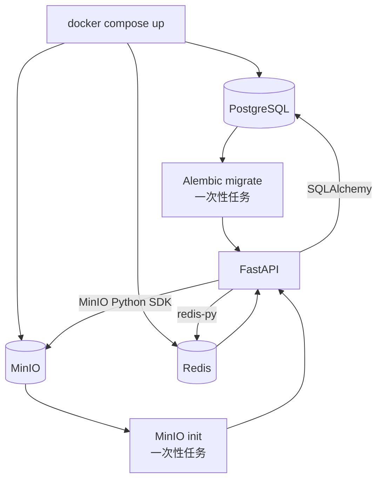

# Docker Compose 四服务编排

## 1. 本阶段要解决的问题

单独启动 FastAPI、PostgreSQL、MinIO 和 Redis 时，需要人工维护四套命令、端口、密码和启动顺序。`compose.yaml` 把这些运行条件声明成一个可复现的服务拓扑：



`migrate` 和 `minio-init` 不是长期运行的业务服务。它们执行成功后退出，用来保证 API 启动时数据库表、Bucket、应用账号和权限已经准备好。

## 2. 容器之间为什么不用服务器 IP

Compose 会创建项目专用网络，并把服务名注册为内部 DNS 名称。因此 API 使用：

- `postgres:5432` 连接 PostgreSQL；
- `minio:9000` 连接 MinIO；
- `redis:6379` 连接 Redis。

`127.0.0.1` 在容器中只代表该容器自己，不能表示宿主机，也不能表示另一个容器。宿主机端口映射只用于浏览器、开发工具或外部客户端访问。

## 3. 启动依赖不是简单的启动顺序

容器进程已经创建，不等于服务已经可以连接。例如 PostgreSQL 启动后还需要恢复数据并监听端口。Compose 因而使用三种条件：

| 条件 | 用途 |
| --- | --- |
| `service_healthy` | 等待 PostgreSQL、MinIO、Redis 健康检查通过 |
| `service_completed_successfully` | 等待 Alembic 或初始化任务以退出码 0 完成 |
| `restart: unless-stopped` | 长期服务异常退出后自动恢复 |

当前依赖链为：PostgreSQL 健康后执行 Alembic；MinIO 健康后执行初始化；Redis 健康且两个一次性任务成功后启动 API。

## 4. MinIO 初始化与最小权限

MinIO 容器首次启动只有管理员账号。`minio-init` 使用 MinIO Client 完成：

1. 注册名为 `local` 的服务别名；
2. 幂等创建 `MINIO_BUCKET`；
3. 创建仅允许访问该 Bucket 的 `knowledge-app` 策略；
4. 幂等创建应用账号；
5. 将策略绑定到应用账号。

FastAPI 只拿 `MINIO_ACCESS_KEY` 和 `MINIO_SECRET_KEY`，不拿管理员密码。即使应用凭据泄漏，它也不应拥有管理用户或访问其他 Bucket 的权限。

## 5. 数据持久化

三个命名卷分别保存：

| Volume | 内容 |
| --- | --- |
| `postgres_data` | 表、索引、事务日志等数据库文件 |
| `minio_data` | 上传的原文件对象 |
| `redis_data` | Redis AOF，用于容器重建后的缓存恢复 |

`docker compose down` 只删除容器和网络，不删除命名卷；`docker compose down -v` 会删除卷和数据，不能当作普通停止命令使用。

## 6. 配置准备

新环境可从模板创建本地配置：

```bash
cp -n .env.example .env
```

`-n` 表示已有 `.env` 时不覆盖。若当前项目已经有 `.env`，应对照 `.env.example` 补充缺少的 Compose 变量，保留原有真实配置和密码。

至少替换以下值，密码建议使用只含字母、数字的长随机字符串，避免数据库 URL 编码问题：

```dotenv
POSTGRES_PASSWORD=替换为数据库密码
MINIO_ROOT_PASSWORD=替换为MinIO管理员密码
MINIO_SECRET_KEY=替换为MinIO应用账号密码
REDIS_PASSWORD=替换为Redis密码
```

默认 `COMPOSE_BIND_ADDRESS=127.0.0.1`，只允许服务器本机访问映射端口。若确实需要从局域网访问 API 和 MinIO 控制台，可改为服务器内网 IP，或在完成防火墙限制后改成 `0.0.0.0`。不要直接把数据库和 Redis 暴露到公网。

## 7. 常用命令

在项目根目录执行：

```bash
# 只解析和检查配置，不启动服务
docker compose config --quiet

# 构建 API 镜像并后台启动
docker compose up -d --build

# 查看服务状态和健康状态
docker compose ps

# 查看 API、迁移与初始化日志
docker compose logs migrate minio-init api

# 持续查看 API 日志
docker compose logs -f api

# 查看当前 Alembic 版本
docker compose exec api alembic current

# 从容器内部验证 Redis
docker compose exec redis sh -c 'REDISCLI_AUTH="$REDIS_PASSWORD" redis-cli ping'

# 普通停止，保留数据卷
docker compose down
```

若 `migrate` 或 `minio-init` 显示 `Exited (0)`，表示一次性任务已经正常完成，不是服务故障。

## 8. 验收流程

1. `docker compose ps` 中 PostgreSQL、MinIO、Redis、API 均为 healthy；
2. `migrate` 和 `minio-init` 的退出码为 0；
3. 访问 `/health` 和 `/docs`；
4. 上传一份文档，确认 PostgreSQL 有元数据、MinIO 有对象；
5. 连续请求详情接口，确认 Redis 出现缓存键；
6. `docker compose down` 后重新 `up -d`，确认数据仍存在。

## 9. 与现有单独部署服务的关系

如果服务器上已经有占用 `5432`、`6379`、`9000` 或 `9001` 的容器，直接启动本 Compose 会发生端口冲突。先备份已有数据，再选择其中一种方式：

- 停止旧服务，让 Compose 接管这些端口；
- 临时修改 `.env` 中的宿主机映射端口；
- 保留外部服务，并另写一份只启动 API 的部署配置。

不能为了消除端口冲突直接删除旧容器或数据卷。
