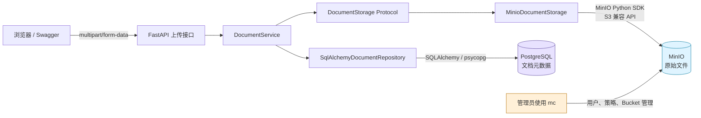
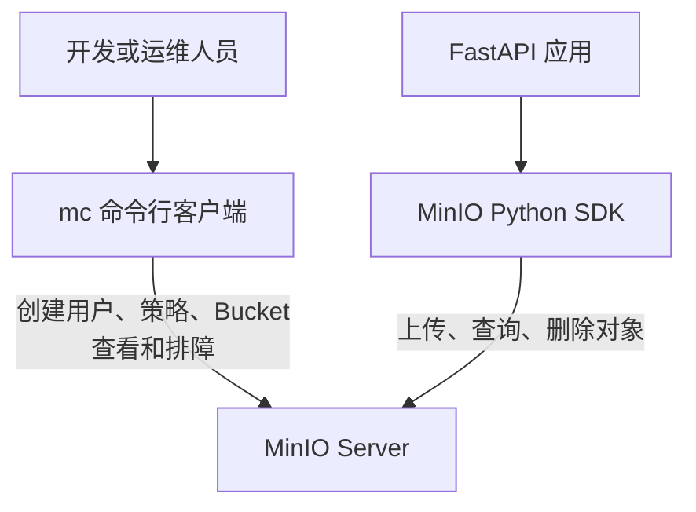
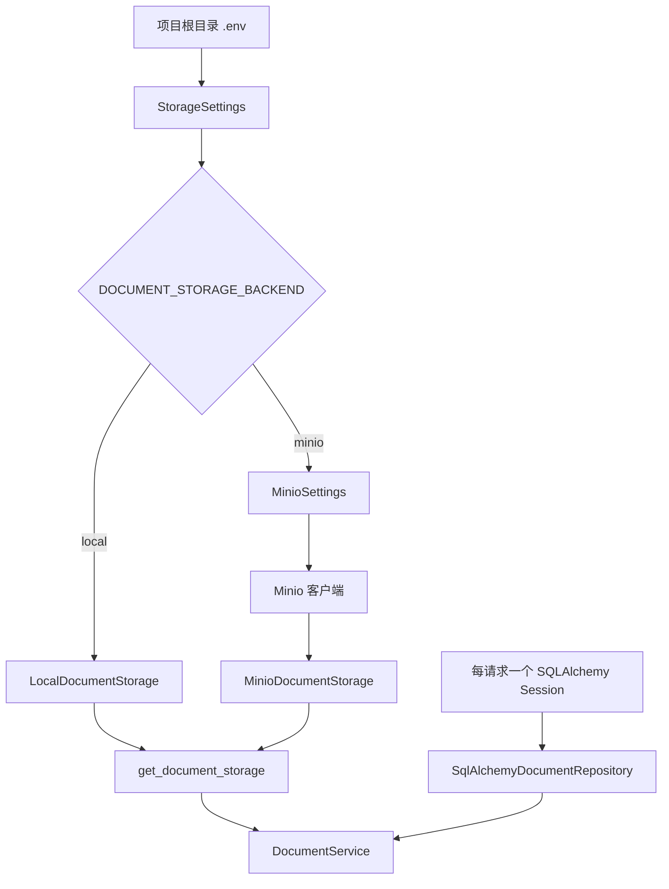
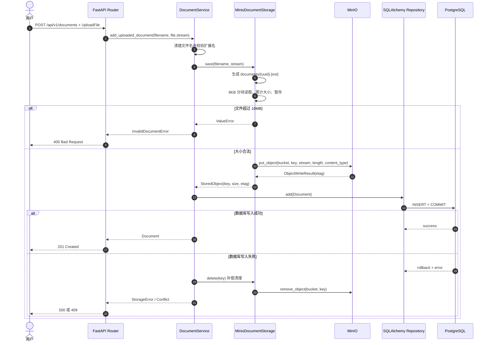
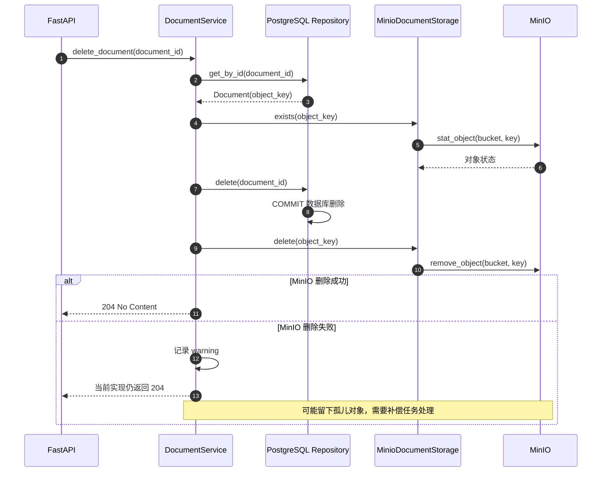
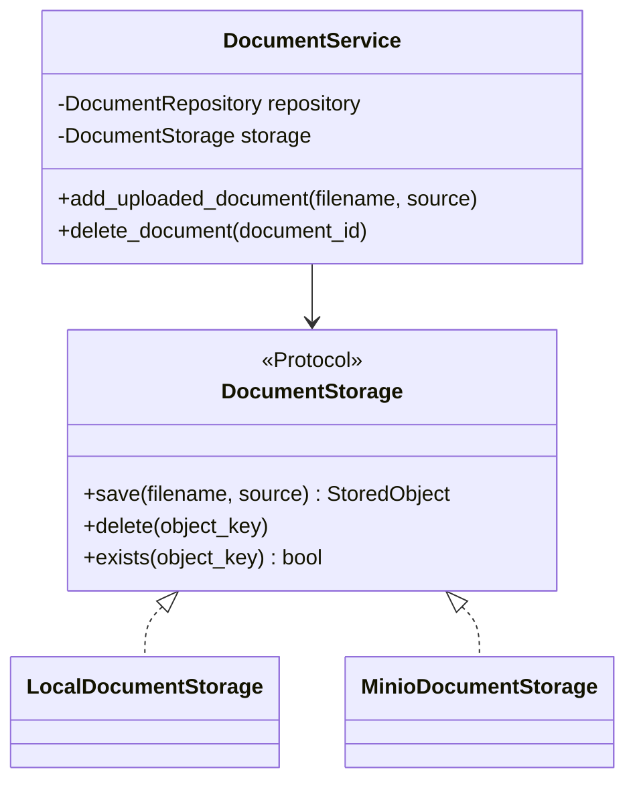

# MinIO 对象存储、Python SDK 与文件一致性

> 对应第三周阶段 3：把 API 上传的原始文档从本地目录迁移到 MinIO，同时让 PostgreSQL 继续保存文档元数据。
>
> 本文以当前 `knowledge-assistant` 实现为准，SDK 版本为 `minio 7.2.20`。

## 1. 本阶段完成结果

当前已经完成以下闭环：

- Linux 服务器运行 MinIO，API 端口为 `9000`，Console 端口为 `9001`。
- 创建私有 Bucket：`knowledge`。
- 使用 `mc` 创建独立应用用户 `knowledge_app`，并绑定只允许访问 `knowledge` 的最小权限策略。
- Windows 本地 FastAPI 使用 MinIO Python SDK 连接远程 MinIO。
- `POST /api/v1/documents` 上传成功后，原文件进入 MinIO，元数据进入 PostgreSQL。
- `DocumentService` 只依赖 `DocumentStorage`，不知道底层是本地目录还是 MinIO。
- MinIO Adapter 的单元测试使用假客户端，不依赖真实网络。
- 当前全量检查结果：76 个测试通过，Ruff 和 mypy 通过。

## 2. 整体架构



两个存储系统的职责不同：

| 数据 | 保存位置 | 原因 |
| --- | --- | --- |
| PDF、DOCX、TXT、Markdown 二进制内容 | MinIO | 适合保存大对象，独立于 API 进程和本地磁盘 |
| 文档 ID、名称、类型、大小、状态、时间 | PostgreSQL | 适合事务、约束、排序、分页和条件查询 |
| MinIO Object Key | PostgreSQL 的 `stored_path` 字段 | 让元数据能够定位 MinIO 中的对象 |
| Access Key、Secret Key | 本地 `.env` | 属于敏感配置，不能写入源码或 Git |

当前 `stored_path` 是历史字段名。切换 MinIO 后，它保存的不是 Windows 文件路径，而是类似下面的 Object Key：

```text
documents/83e8d2b89711443a8c7d20d14510afe3.pdf
```

后续可以用 Alembic 将该字段重命名为 `object_key`，但这不是接入 MinIO 的前置条件。

## 3. MinIO 核心概念

### 3.1 Endpoint

Endpoint 是程序访问 MinIO S3 API 的地址，例如：

```text
10.3.70.26:9000
```

- `9000` 是对象 API 端口，Python SDK 和 `mc` 使用它。
- `9001` 是浏览器 Console 端口，只用于人工管理和查看。
- 当前 SDK 初始化时将协议由 `secure` 参数单独指定，所以项目会把 `http://` 或 `https://` 从配置值中去掉。

### 3.2 Bucket

Bucket 是对象的顶层逻辑容器。当前项目使用：

```text
knowledge
```

它不是普通文件夹，但可以理解为对象命名空间和权限边界。权限策略可以只允许应用账号访问这个 Bucket。

### 3.3 Object 与 Object Key

Object 是“内容 + Key + 元数据”的组合。Object Key 是对象在 Bucket 中的唯一名称：

```text
documents/{uuid}.{extension}
```

例如：

```text
documents/83e8d2b89711443a8c7d20d14510afe3.docx
```

`documents/` 是 Key 的前缀。MinIO Console 会把斜杠显示成目录，但 S3 模型中的 Key 本质上仍是一个完整字符串。

不能直接把用户上传的完整路径作为 Key，原因包括：

- 同名文件会互相覆盖。
- Windows 和 Linux 路径分隔符不同。
- 用户输入可能带有 `../` 等路径语义。
- 原始文件名可能泄露内部目录或个人信息。

项目只保留安全文件名的扩展名，再使用 UUID 生成唯一 Key。

### 3.4 ETag

`put_object()` 成功后会返回 ETag。项目将它放入 `StoredObject.etag`，用于描述本次写入结果。

ETag 可以用于对象版本识别和条件请求，但不能在所有情况下简单等同于文件 MD5，尤其是分片上传时。因此不要把 ETag 当成通用文件哈希校验值。

### 3.5 S3 兼容 API

MinIO 提供与 Amazon S3 相似的对象操作接口，例如上传、查询元数据、删除和预签名 URL。S3 兼容不代表所有云厂商功能完全相同，而是核心对象 API、认证方式和常见 SDK 调用具有兼容性。

## 4. `mc` 与 Python SDK 的区别



| 工具 | 谁使用 | 主要用途 | 是否参与每次 API 请求 |
| --- | --- | --- | --- |
| MinIO Server | 服务端 | 真正保存对象和 IAM 配置 | 是 |
| `mc` | 开发/运维人员 | 创建账号、策略、Bucket，执行管理和排障命令 | 否 |
| MinIO Python SDK | FastAPI | 在业务代码中上传、查询和删除对象 | 是 |

`mc` 类似 PostgreSQL 的 `psql`；Python SDK 类似数据库驱动。安装好 `mc` 并不会让 FastAPI 自动连接 MinIO，FastAPI 仍然需要 SDK、配置和依赖注入。

## 5. 配置与依赖注入流程

### 5.1 当前环境变量

```env
DOCUMENT_STORAGE_BACKEND=minio
MINIO_ENDPOINT=10.3.70.26:9000
MINIO_ACCESS_KEY=knowledge_app
MINIO_SECRET_KEY=<应用账号的Secret Key>
MINIO_BUCKET=knowledge
MINIO_SECURE=false
MINIO_MAX_FILE_SIZE=10485760
```

真实 Secret Key 只能放在 `.env` 或受控的密钥管理系统中，不能写进本文、`.env.example`、源码、日志或 Git 提交。

### 5.2 配置如何变成运行对象



`get_document_storage()` 使用 `@lru_cache`，同一 FastAPI 进程会复用存储对象和 MinIO 客户端。因此修改 `.env` 后必须重启 FastAPI，旧进程不会自动重新构造客户端。

MinIO 官方客户端可以在线程间复用；当前同步 FastAPI 路由也直接调用同步 SDK。若未来改为大量并发的 `async def` 路由，需要避免在事件循环中直接执行阻塞网络调用，可以放入线程池或改用合适的异步 S3 客户端。

## 6. 关键 Python SDK

### 6.1 创建客户端：`Minio(...)`

项目中的核心初始化方式：

```python
client = Minio(
    endpoint=minio_settings.client_endpoint,
    access_key=minio_settings.minio_access_key,
    secret_key=minio_settings.minio_secret_key,
    secure=minio_settings.minio_secure,
)
```

当前 SDK 构造参数：

| 参数 | 当前项目是否使用 | 含义 |
| --- | --- | --- |
| `endpoint` | 是 | `host:port`，项目中不带 `http://` 或 `https://` |
| `access_key` | 是 | 应用身份，本项目为 `knowledge_app` |
| `secret_key` | 是 | 应用密钥，不能打印和提交 |
| `secure` | 是 | `False` 使用 HTTP，`True` 使用 HTTPS |
| `session_token` | 否 | 临时凭据场景使用 |
| `region` | 否 | 显式指定对象存储区域；MinIO 单机学习环境不需要 |
| `http_client` | 否 | 自定义连接池、代理、超时和 TLS 行为 |
| `credentials` | 否 | 使用动态凭据 Provider |
| `cert_check` | 否 | 是否校验 TLS 证书；生产环境不应随意关闭 |

构造客户端通常不会立刻证明账号和网络可用。真正执行 `bucket_exists()`、`put_object()` 等请求时，才会访问服务器并完成认证。

### 6.2 上传对象：`put_object(...)`

当前项目调用：

```python
result = client.put_object(
    bucket_name="knowledge",
    object_name="documents/<uuid>.pdf",
    data=staged,
    length=file_size,
    content_type="application/pdf",
)
```

关键参数：

| 参数 | 类型/示例 | 作用 |
| --- | --- | --- |
| `bucket_name` | `"knowledge"` | 目标 Bucket |
| `object_name` | `"documents/<uuid>.pdf"` | 完整 Object Key |
| `data` | 二进制文件流 | SDK 从该流读取要上传的字节 |
| `length` | `10240` | 上传字节数，SDK 需要它判断读取范围和上传方式 |
| `content_type` | `"application/pdf"` | 对象 MIME 类型 |
| `metadata` | 字典 | 可选自定义对象元数据 |
| `part_size` | 整数 | 可选分片大小；`length=-1` 时必须给有效值 |
| `num_parallel_uploads` | 默认 `3` | 分片上传的并行度 |
| `sse` | 可选 | 服务端加密配置 |
| `tags` | 可选 | 对象标签 |

返回的 `ObjectWriteResult` 中常用字段包括 ETag、对象名、Bucket 名和版本 ID。当前项目只依赖 `etag`，因此自定义了最小 `ObjectWriteResult Protocol`，减少业务代码对第三方 SDK 细节的耦合。

### 6.3 查询对象：`stat_object(...)`

```python
client.stat_object("knowledge", object_key)
```

它发送对象元数据请求，不下载完整文件。成功表示对象存在并返回大小、ETag、Content-Type、最后修改时间等信息；若返回 `NoSuchKey`、`NoSuchObject` 或 `NotFound`，当前 Adapter 将其转换为 `False`。

其他认证、权限、网络或服务端错误不能伪装成“不存在”，必须转换为 `StorageError`，否则程序可能错误地删除数据库记录或重复上传。

### 6.4 删除对象：`remove_object(...)`

```python
client.remove_object("knowledge", object_key)
```

当前 Adapter 把删除设计成幂等操作：同一个 Key 删除多次，不应因为对象已经不存在而破坏业务流程。网络、权限和服务端错误仍会转换为 `StorageError`。

### 6.5 连接检查：`bucket_exists(...)`

```python
client.bucket_exists("knowledge")
```

该方法适合联调和健康诊断。它会真实访问 MinIO，因此可以同时发现：

- Windows 到服务器 `9000` 端口不通。
- Endpoint 或 HTTP/HTTPS 配置错误。
- Access Key 或 Secret Key 错误。
- 应用账号缺少 Bucket 访问权限。
- Bucket 名称不存在。

当前项目没有在每次上传前调用它，因为上传请求本身已经会验证连接，而且每次多做一次请求会增加延迟。

### 6.6 预签名下载：`presigned_get_object(...)`

当前项目暂未实现下载接口。后续可以使用：

```python
from datetime import timedelta

url = client.presigned_get_object(
    "knowledge",
    object_key,
    expires=timedelta(minutes=10),
)
```

它生成一个有时效的下载 URL，客户端可以在有效期内直接从 MinIO 下载，不需要把 Secret Key 暴露给浏览器。预签名 URL 本身在有效期内具有访问能力，也不能写入日志或长期公开。

## 7. 上传完整流程



### 7.1 为什么上传前要暂存

`UploadFile.file` 是一个流，并不保证业务层事先知道准确大小。`put_object()` 又需要 `length`。因此当前 Adapter：

1. 每次读取 `8192` 字节。
2. 累计 `file_size`。
3. 超过 `MINIO_MAX_FILE_SIZE` 立即失败。
4. 将内容写入 `SpooledTemporaryFile`。
5. 把流位置重置到开头。
6. 调用 `put_object()`。

`SpooledTemporaryFile(max_size=1MB)` 的特点是：较小内容先放在内存，超过阈值后自动转为临时磁盘文件。它避免把整个允许的 10 MB 文件永久一次性保存在 Python `bytes` 中，同时又能得到准确长度并支持重新读取。

这里有两个不同的阈值：

| 阈值 | 当前值 | 作用 |
| --- | ---: | --- |
| 临时流转磁盘阈值 | 1 MB | 控制进程内存使用，不表示上传限制 |
| 业务最大文件大小 | 10 MB | 超过后拒绝上传 |

## 8. 删除流程与一致性



PostgreSQL 事务无法和 MinIO 对象操作组成一个普通的 ACID 事务，因为它们是两个独立系统。当前项目采用业务补偿：

- 上传：先写 MinIO，再写 PostgreSQL；数据库失败时删除已上传对象。
- 删除：先提交数据库删除，再删除 MinIO；对象删除失败时记录日志，可能留下孤儿对象。

这种设计优先避免“数据库仍指向已经删除的文件”。代价是删除失败时需要后续扫描或重试清理孤儿对象。更完整的生产方案可以采用：

- Outbox 事件表 + 后台删除任务。
- 删除状态机，例如 `deleting`、`deleted`、`delete_failed`。
- 定期对比 PostgreSQL Object Key 和 MinIO Object Key。
- 为补偿操作增加重试、告警和幂等键。

不能简单依赖数据库回滚恢复 MinIO 对象，因为数据库事务只控制 PostgreSQL，不控制远程对象存储。

## 9. Protocol 与 Adapter 为什么重要

业务层依赖的是：

```python
class DocumentStorage(Protocol):
    def save(self, filename: str, source: BinaryIO) -> StoredObject: ...
    def delete(self, object_key: str) -> None: ...
    def exists(self, object_key: str) -> bool: ...
```

关系如下：



收益包括：

- CLI 可以继续使用本地存储，API 可以切换 MinIO。
- Service 不需要导入 MinIO SDK。
- 单元测试可以替换为内存假客户端。
- 将来换成 AWS S3、阿里云 OSS 的 S3 兼容层或其他存储时，业务流程不用整体重写。
- 第三方异常在 Adapter 边界统一转换为项目自己的 `StorageError`。

## 10. 错误处理边界

| 原始情况 | Adapter/Service 处理 | API 结果 |
| --- | --- | --- |
| 文件扩展名不允许 | `InvalidDocumentError` | `400` |
| 文件超过 10 MB | `ValueError` 转 `InvalidDocumentError` | `400` |
| MinIO 认证、权限或服务错误 | `MinioException` 转 `StorageError` | `500` |
| HTTP 连接池错误 | `HTTPError` 转 `StorageError` | `500` |
| 网络/操作系统错误 | `OSError` 转 `StorageError` | `500` |
| `stat_object` 返回对象不存在 | 返回 `False` | 由上层决定后续行为 |
| PostgreSQL 唯一约束冲突 | `DocumentConflictError`，并补偿删除对象 | `409` |
| PostgreSQL 其他写入错误 | `StorageError`，并补偿删除对象 | `500` |

“对象不存在”和“暂时无法连接 MinIO”必须区分。若网络异常也返回 `False`，上层会误以为文件真的不存在，掩盖基础设施故障。

## 11. 权限模型

应用使用 `knowledge_app`，而不是 MinIO Root 账号。最小权限策略分成两层资源：

```text
arn:aws:s3:::knowledge
```

用于 Bucket 级操作，例如列出对象、查询位置和查询分片上传；以及：

```text
arn:aws:s3:::knowledge/*
```

用于对象级操作，例如获取、上传和删除对象。

当前应用需要的主要动作：

- `s3:GetBucketLocation`
- `s3:ListBucket`
- `s3:ListBucketMultipartUploads`
- `s3:GetObject`
- `s3:PutObject`
- `s3:DeleteObject`
- `s3:AbortMultipartUpload`
- `s3:ListMultipartUploadParts`

即使应用密钥泄露，攻击范围也被限制在指定 Bucket；它不能创建 MinIO 用户或修改服务器配置。不过它仍然能够读写和删除 `knowledge` 中的对象，因此密钥依然必须严格保护。

## 12. 测试分层

### 12.1 Adapter 单元测试

`tests/test_minio_storage.py` 使用 `FakeMinioClient`，测试：

- 上传流和返回对象信息。
- UUID Object Key 和扩展名。
- Content-Type。
- 大小限制在真正上传前生效。
- `exists()` 和幂等删除。
- SDK/网络错误转换为 `StorageError`。

这些测试不需要 Linux、MinIO、账号或网络，适合快速回归。

### 12.2 连接检查

Windows PowerShell：

```powershell
Test-NetConnection 10.3.70.26 -Port 9000
```

Python SDK：

```powershell
.\.venv\Scripts\python.exe -c "from minio import Minio; from knowledge_assistant.core.config import MinioSettings; s=MinioSettings(); c=Minio(s.client_endpoint, access_key=s.minio_access_key, secret_key=s.minio_secret_key, secure=s.minio_secure); print(c.bucket_exists(s.minio_bucket))"
```

这里不要打印 `s.minio_secret_key`。

### 12.3 API 端到端测试

启动：

```powershell
.\.venv\Scripts\python.exe -m uvicorn knowledge_assistant.api.main:app --reload
```

上传：

```powershell
curl.exe -X POST "http://127.0.0.1:8000/api/v1/documents" `
  -H "accept: application/json" `
  -F "file=@D:\Study\knowledge-assistant\samples\example.txt;type=text/plain"
```

Linux 验证对象：

```bash
mc ls --recursive knowledge-app/knowledge/documents
```

PostgreSQL 验证元数据：

```sql
SELECT id, name, stored_path, file_size, status, created_at
FROM documents
ORDER BY created_at DESC
LIMIT 5;
```

需要同时看到 MinIO 对象和 PostgreSQL 元数据，才算完整上传成功。只在 Console 手工上传对象不会自动产生 PostgreSQL 记录。

## 13. 常见问题排查

| 现象 | 常见原因 | 检查方式 |
| --- | --- | --- |
| 文件仍进入本地目录 | `DOCUMENT_STORAGE_BACKEND=local`，或修改 `.env` 后未重启 | 检查 `.env` 并重启 FastAPI |
| 连接 `127.0.0.1:9000` 失败 | FastAPI 在 Windows，MinIO 在 Linux；`127.0.0.1` 指向 Windows 自己 | 改为 Linux 实际 IP |
| `Connection refused` | MinIO 未监听 9000，容器未映射，服务未启动 | `ss -lntp`、`docker ps`、`mc admin info` |
| Windows 端口不通 | Linux 防火墙、网络 ACL 或服务监听地址限制 | `Test-NetConnection <IP> -Port 9000` |
| `AccessDenied` | 策略未绑定、Bucket 名不匹配或缺少动作 | `mc admin user info`、`mc admin policy info` |
| `InvalidAccessKeyId` | Access Key 错误或用户不存在 | 检查 `.env`，不要误用 `mc` alias 名称 |
| `SignatureDoesNotMatch` | Secret Key 错误、协议/代理问题 | 重新核对 Secret Key，不要带多余空格 |
| 使用 9001 后 SDK 报错 | 9001 是 Console，不是 S3 API | Endpoint 改为 9000 |
| 上传大文件失败 | 应用大小上限、策略缺少分片动作或网络中断 | 检查 `MINIO_MAX_FILE_SIZE` 和策略 |
| API 成功但响应没有 Object Key | `DocumentResponse` 主动过滤内部字段 | 从 PostgreSQL 或管理端查看，不向外暴露内部定位信息 |

## 14. 当前实现的边界与后续改进

当前已经满足学习阶段的核心目标，但还不是完整生产方案：

1. 暂无文档下载接口和预签名 URL。
2. 暂无上传内容哈希、病毒扫描和真实 MIME 检测。
3. `mimetypes` 依据文件名推断 Content-Type，不验证文件正文。
4. 暂无孤儿对象定期扫描和补偿队列。
5. 删除 MinIO 失败时只写 warning，尚未进入重试任务。
6. `stored_path` 字段尚未重命名为 `object_key`。
7. 健康检查 `/health` 当前只表示 API 进程运行，不代表 PostgreSQL 和 MinIO 都健康。
8. 开发环境使用 HTTP；生产环境应配置 HTTPS、证书校验、密钥轮换和网络访问控制。
9. 当前最大文件仅 10 MB；若未来支持大文档，需要重新设计流式校验、上传超时、分片策略和反向代理限制。

建议后续按以下顺序演进：

```text
增加下载/预签名接口
  → 增加对象清理重试或 Outbox
  → stored_path 重命名为 object_key
  → 增加依赖服务健康检查
  → HTTPS 与密钥管理
  → 大文件和异步处理
```

## 15. 本阶段验收清单

- [x] 能解释 MinIO Server、`mc` 和 Python SDK 的区别。
- [x] 能解释 Endpoint、Bucket、Object、Object Key、ETag 和 Content-Type。
- [x] 使用独立应用账号，不在 FastAPI 中使用 Root 账号。
- [x] 应用账号仅能访问 `knowledge` Bucket。
- [x] Windows 可以连接 Linux MinIO 的 9000 端口。
- [x] API 上传的原文件可以在 MinIO Console 中看到。
- [x] PostgreSQL 保存元数据与 Object Key，不保存文件正文。
- [x] 上传前执行大小限制，超限文件不会进入 MinIO。
- [x] PostgreSQL 写入失败时尝试补偿删除 MinIO 对象。
- [x] MinIO Adapter 有不依赖真实服务的单元测试。
- [x] 全量 pytest、Ruff 和 mypy 通过。

## 16. 参考资料

- [MinIO Python SDK 官方仓库](https://github.com/minio/minio-py)
- [MinIO Python SDK API](https://github.com/minio/minio-py/blob/master/docs/API.md)
- [MinIO `mc` 官方仓库](https://github.com/minio/mc)
- [MinIO 用户与策略示例](https://github.com/minio/minio/blob/master/docs/multi-user/README.md)
