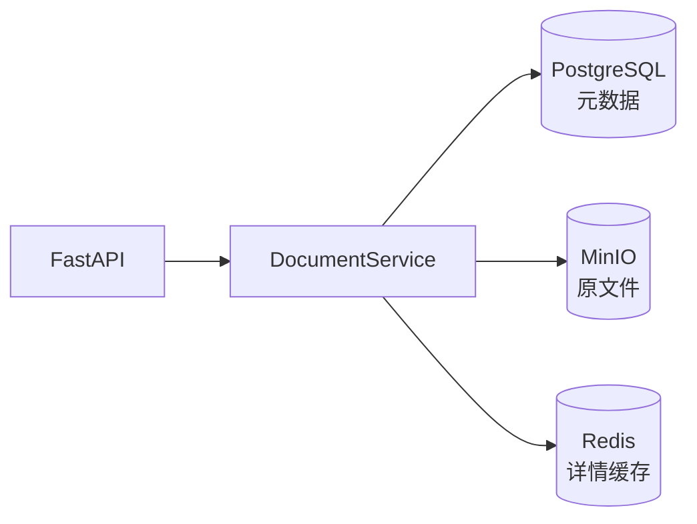

# 第三周文档索引

## 本周目标

第三周聚焦 MinIO、Redis、Docker 和 Docker Compose，不再进行 MySQL 对比。PostgreSQL 继续作为唯一关系数据库。

最终完成标准：

```text
Docker Compose
  → FastAPI
  → PostgreSQL
  → MinIO
  → Redis
```

## 当前状态

| 模块 | 状态 |
| --- | --- |
| Dockerfile 和 `.dockerignore` | 已完成基础版 |
| 本地存储抽象 | 已完成 |
| MinIO 部署、账号和权限 | 已完成 |
| MinIO SDK 和 API 上传 | 已完成 |
| Redis Docker 部署 | 已完成 |
| Redis SDK 和 Cache Aside | 已完成 |
| 完整 Docker Compose | 已完成并在 Linux 服务器验收 |
| 第三周总结和演示 | 已完成 |



## 文档目录

- [第三周学习任务清单](./第三周学习任务清单.md)
- [第三周每日任务分解](./第三周每日任务分解.md)
- [Docker 基础与应用镜像](./Docker基础与应用镜像.md)
- [本地存储抽象与 Service 重构](./本地存储抽象与Service重构.md)
- [MinIO 对象存储、Python SDK 与文件一致性](./MinIO对象存储与文件一致性.md)
- [Redis 基础、Cache Aside 与缓存一致性](./Redis缓存模式与一致性.md)
- [Docker Compose 四服务编排](./DockerCompose四服务编排.md)
- [第三周学习总结与验收记录](./第三周学习总结与验收记录.md)

全局产品目标见：[知识助手功能目标与技术路线](../知识助手功能目标与技术路线.md)。

## 下一步

第三周已收尾。第四周进入“文档入库与向量检索”闭环：从 MinIO 读取原文件，经过 Parser/OCR、Chunk、Embedding 写入 Milvus，并提供语义检索 API。

第四周计划见：[第四周文档索引](../week04/README.md)。本周接入 Milvus；Reranker、Neo4j、Agent 和 LLM 留到后续周次。
