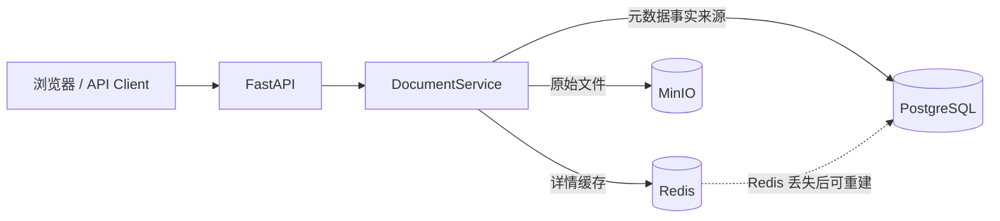
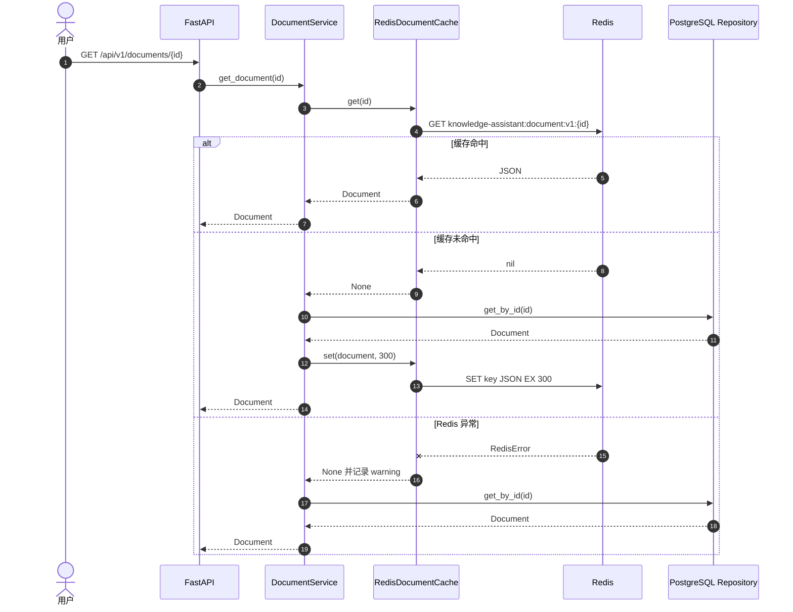
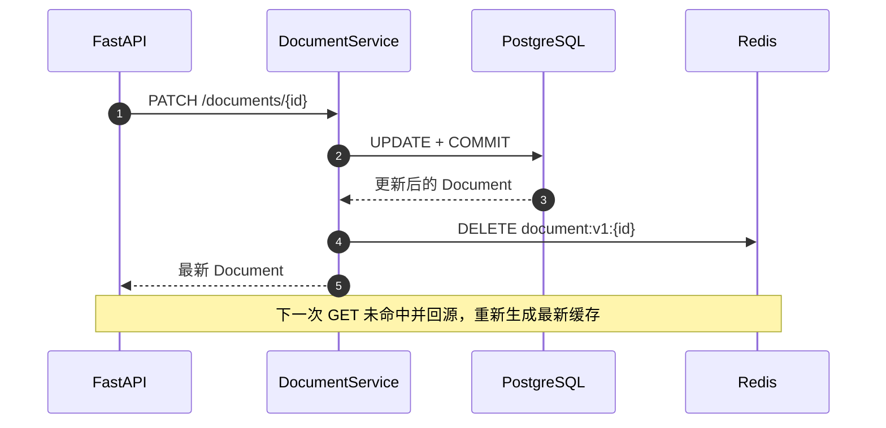
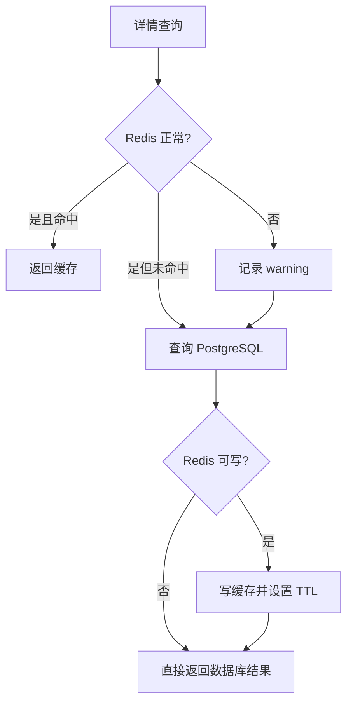

# Redis 基础、Cache Aside 与缓存一致性

> 对应第三周 Redis 阶段。本文不只记录项目中写了哪些代码，还解释 Redis 的定位、关键 SDK、Cache Aside 调用链、TTL、主动失效、故障降级和常见缓存问题。
>
> 当前环境：Redis Server `7.4.11`，redis-py `8.1.0`。

## 1. 本阶段完成结果

- Redis 使用 Docker 部署在 Linux 服务器，开启密码认证和 AOF。
- Windows 本地 FastAPI 能访问远程 Redis `6379` 端口。
- 使用官方 `redis` SDK 创建同步客户端和连接池。
- 只缓存单文档详情，不缓存文档列表。
- 缓存 Key 使用应用名、资源名和版本号。
- GET 使用 Cache Aside；PATCH 和 DELETE 主动失效缓存。
- Redis 故障时记录 warning，并降级查询 PostgreSQL。
- 缓存内容异常时删除坏 Key，再回源 PostgreSQL。
- 真实 Redis 的 PING、SET、GET、TTL、DELETE 已通过。
- 当前全量自动化测试为 86 个，Ruff 和 mypy 通过。

## 2. Redis 在项目中的位置



三种存储的职责必须分开：

| 系统 | 保存内容 | 能否作为最终事实来源 |
| --- | --- | --- |
| PostgreSQL | 文档元数据、状态、时间、Object Key | 是 |
| MinIO | PDF、DOCX、TXT 等原文件 | 是 |
| Redis | 文档详情副本、临时状态、短期结果 | 否 |

Redis 中的数据允许过期、被淘汰或因故障丢失。只要 PostgreSQL 仍然可用，缓存就能重新生成。因此 Redis 不能替代 PostgreSQL，也不能作为数据库备份。

## 3. Redis 为什么快

Redis 的主要数据结构保存在内存中，常用命令由单线程命令执行模型按顺序处理，避免大量锁竞争；网络协议和数据结构也针对高频读写进行了优化。需要注意：

- “命令执行单线程”不等于 Redis 整个进程只有一个线程。
- 慢命令、大 Key、阻塞操作仍会拖慢其他请求。
- 内存访问快，不代表可以忽略容量和淘汰策略。
- Redis 快的前提是 Key 设计、值大小和命令复杂度合理。

## 4. 常用数据结构

| 类型 | 常用命令 | 适合场景 | 本项目可能用途 |
| --- | --- | --- | --- |
| String | `GET`、`SET`、`INCR` | JSON 缓存、计数器、锁值 | 文档详情 JSON |
| Hash | `HSET`、`HGETALL` | 字段较多的小对象 | 文档处理任务状态 |
| List | `LPUSH`、`BRPOP` | 简单队列、时间线 | 学习演示；不作为正式任务队列 |
| Set | `SADD`、`SMEMBERS` | 去重集合、标签 | 文档标签集合 |
| Sorted Set | `ZADD`、`ZRANGE` | 排行、按分数排序 | 热门文档、检索评测分数 |

当前详情缓存使用 String，因为一个文档被序列化成一段 JSON，可以用一次 GET/SET 完成读写。

## 5. Redis 部署参数

当前学习环境采用：

```text
Redis 7.4.11 Alpine
端口：6379
持久化：AOF
appendfsync：everysec
maxmemory：512 MB
淘汰策略：allkeys-lru
认证：requirepass
```

### AOF 与缓存的关系

AOF 会记录写命令，使容器重启后可以恢复数据。对“纯缓存”而言，即使 Redis 数据丢失也能回源，因此生产环境是否启用 AOF需要结合恢复速度、磁盘开销和缓存预热成本决定。本项目开启 AOF主要用于学习持久化机制，不意味着 Redis 已变成主数据库。

### `allkeys-lru`

达到 `maxmemory` 后，Redis 会从所有 Key 中优先淘汰较久未使用的数据。它适合缓存场景，因为所有 Key 都允许被清理。LRU 在 Redis 中是近似算法，不是对全部 Key 做绝对精确排序。

## 6. Python SDK 初始化

依赖：

```toml
redis>=8.1,<9.0
```

项目创建客户端：

```python
client = Redis.from_url(
    settings.redis_url,
    decode_responses=True,
    socket_connect_timeout=settings.redis_connect_timeout_seconds,
    socket_timeout=settings.redis_socket_timeout_seconds,
    health_check_interval=30,
)
```

关键参数：

| 参数 | 当前值/示例 | 作用 |
| --- | --- | --- |
| `redis_url` | `redis://:密码@10.3.70.26:6379/0` | 协议、密码、主机、端口和数据库编号 |
| `decode_responses` | `True` | 把 Redis 返回的 bytes 解码成字符串 |
| `socket_connect_timeout` | `1` 秒 | 建立连接最长等待时间 |
| `socket_timeout` | `1` 秒 | 已连接后单次网络操作等待时间 |
| `health_check_interval` | `30` 秒 | 空闲连接复用前按间隔做健康检测 |

`Redis.from_url()` 默认管理连接池。`get_document_cache()` 使用 `@lru_cache`，一个 FastAPI 进程复用一个客户端和连接池，而不是每次请求重新建立 TCP 连接。

修改 `.env` 后需要重启 FastAPI，因为已经缓存的客户端不会自动读取新 URL。

## 7. 关键 SDK 命令

### `SET key value EX seconds`

项目调用：

```python
client.set(key, payload, ex=ttl_seconds)
```

`ex` 让写值和设置 TTL 在一条 Redis 命令中完成，避免先 SET、后 EXPIRE 之间发生异常，留下永不过期的 Key。

### `GET key`

```python
payload = client.get(key)
```

- 返回字符串：缓存命中。
- 返回 `None`：Key 不存在或已过期，即缓存未命中。
- 抛出 `RedisError`：Redis 网络、认证或服务异常，不能解释为正常未命中。

### `DELETE key`

```python
client.delete(key)
```

用于 PATCH/DELETE 后主动失效缓存。删除不存在的 Key 返回 0，因此天然适合幂等失效操作。

### `TTL key`

用于测试和排障：

```text
大于 0：剩余生存秒数
-1：Key 存在但没有过期时间
-2：Key 不存在
```

## 8. Cache Aside 读取流程



Cache Aside 的关键是：缓存不是自动同步的数据库副本，业务代码明确控制“查缓存、回源、写缓存、失效缓存”。

## 9. 为什么不缓存列表接口

列表接口包含 `offset`、`limit`、排序和总数。若直接缓存，会产生很多组合：

```text
documents:list:offset:0:limit:20
documents:list:offset:20:limit:20
documents:list:status:ready:offset:0:limit:20
```

上传、修改和删除后还要失效所有受影响的列表 Key，第一版复杂度明显高于收益。因此当前只缓存按 ID 查询的文档详情。等有真实性能数据后，再决定是否缓存热点列表。

## 10. Key 设计与版本号

当前 Key：

```text
knowledge-assistant:document:v1:{document_id}
```

各部分含义：

| 部分 | 作用 |
| --- | --- |
| `knowledge-assistant` | 避免与同一 Redis 中其他应用冲突 |
| `document` | 标识资源类型 |
| `v1` | 缓存结构版本 |
| `{document_id}` | 资源唯一标识 |

如果以后 JSON 字段结构不兼容，可以改成 `v2`。旧 `v1` Key 会依靠 TTL 自动消失，不需要在发布瞬间扫描并修改全部缓存。

## 11. 序列化与坏缓存处理

写入时：

```text
Document
  → to_dict()
  → json.dumps(ensure_ascii=False)
  → Redis String
```

读取时：

```text
Redis String
  → json.loads()
  → 字段类型检查
  → Document.from_dict()
```

若 JSON 被截断、手工改坏或字段类型不正确，Adapter 会：

1. 记录 warning。
2. 删除坏 Key。
3. 返回 `None`。
4. Service 回源 PostgreSQL。
5. 写入一份新的正确缓存。

这避免坏缓存一直导致接口 500。

## 12. PATCH 和 DELETE 的主动失效



采用“先更新数据库，再删缓存”：

- 数据库仍是事实来源。
- 更新失败时不需要动缓存。
- 删除缓存失败时，旧值最多保留到 TTL 到期。

TTL 是一致性的最后兜底，不替代主动失效。如果只等 300 秒过期，用户修改文档后可能持续读到旧值。

DELETE 文档成功后也会删除缓存，避免缓存继续返回数据库中已经不存在的文档。

## 13. Redis 故障降级



当前 Adapter 捕获 `RedisError`：

- GET 失败返回 `None`，Service 回源数据库。
- SET 失败只记录 warning，数据库结果仍返回。
- DELETE 失败记录 warning，等待 TTL 兜底。

降级避免 Redis 变成整个接口的单点故障，但会增加 PostgreSQL 压力。真实生产系统还需要监控 Redis 错误率和数据库回源量，不能让故障长期处于“悄悄降级”状态。

## 14. 三类常见缓存问题

### 缓存穿透

大量请求查询根本不存在的 ID，每次都绕过缓存访问 PostgreSQL。

可选方案：短时间缓存“空结果”、参数校验、布隆过滤器、限流。当前第一版没有缓存 404，先保持语义简单。

### 缓存击穿

某个热点 Key 到期瞬间，大量请求同时回源数据库。

可选方案：互斥锁、逻辑过期、后台刷新、请求合并。当前文档详情访问量较低，暂不增加分布式锁。

### 缓存雪崩

大量 Key 同时到期或 Redis 整体不可用，数据库流量骤增。

可选方案：TTL 加随机抖动、分批预热、限流、熔断、Redis 高可用。当前固定 300 秒 TTL 适合学习；规模扩大后可增加随机 TTL。

## 15. 测试体系

### Adapter 单元测试

`tests/test_redis_cache.py` 使用假 Redis 客户端测试：

- JSON 序列化。
- 版本化 Key。
- TTL 参数。
- 命中、未命中和删除。
- 无效 JSON 与错误字段结构。
- Redis 连接失败降级。
- 非法 TTL 和 Key 前缀。

### Service 测试

`tests/test_document_service.py` 验证：

- 第一次 GET 查询 Repository 并写缓存。
- 第二次 GET 命中缓存，不再查询 Repository。
- 配置的 TTL 正确传入。
- PATCH 后缓存失效。
- DELETE 后缓存失效。

### 真实 Redis 验证

Linux 查看缓存 Key：

```bash
read -rsp "Redis密码: " REDIS_PASSWORD; echo
docker exec -e REDISCLI_AUTH="$REDIS_PASSWORD" knowledge-redis \
  redis-cli --scan --pattern 'knowledge-assistant:document:v1:*'
```

查看 TTL：

```bash
docker exec -e REDISCLI_AUTH="$REDIS_PASSWORD" knowledge-redis \
  redis-cli TTL 'knowledge-assistant:document:v1:<document_id>'
```

查看值时要注意缓存中可能含内部对象 Key，不应把完整内容粘贴到公开位置：

```bash
docker exec -e REDISCLI_AUTH="$REDIS_PASSWORD" knowledge-redis \
  redis-cli GET 'knowledge-assistant:document:v1:<document_id>'
```

完成后：

```bash
unset REDIS_PASSWORD
```

## 16. 常见故障

| 现象 | 常见原因 | 处理 |
| --- | --- | --- |
| `Connection refused` | Redis 未启动、未映射端口 | `docker ps`、`docker logs` |
| `Timeout connecting` | 防火墙、IP、端口错误 | `Test-NetConnection <IP> -Port 6379` |
| `Authentication required` | URL 没有密码 | 检查 `REDIS_URL` |
| `invalid username-password pair` | 密码错误 | 重新核对，不打印密码 |
| GET 后没有 Key | FastAPI 未重启、没走详情接口或 Redis 写入失败 | 检查日志和 `.env` |
| PATCH 后仍有旧值 | 缓存未失效或连接到了不同 Redis DB | 检查 Key、URL 中的 `/0` |
| Key 没有 TTL | 没有使用 `SET ... EX` | `TTL key` 检查，修复写缓存方法 |
| 中文变成 `\u` | JSON 默认转义 | 使用 `ensure_ascii=False`，不影响语义 |

## 17. 当前边界与下一步

当前不做：

- Redis Cluster、哨兵和主从高可用。
- 分布式锁。
- 列表缓存。
- 缓存空结果。
- 将 Redis 当成任务队列。
- 缓存向量检索最终答案。

下一步不是继续扩大缓存范围，而是先用 Docker Compose 把 API、PostgreSQL、MinIO 和 Redis 编排成一个可重复启动的系统，并为四个服务增加正确的健康检查和持久化配置。

## 18. 参考资料

- [redis-py 官方包](https://pypi.org/project/redis/)
- [Redis 官方文档](https://redis.io/docs/latest/)
- [Redis 官方 Docker 镜像](https://hub.docker.com/_/redis)

