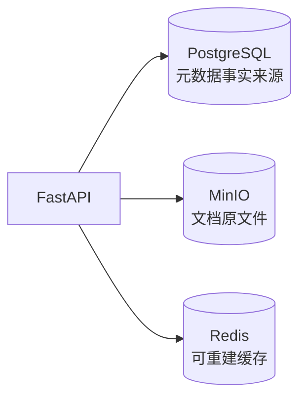

# 第三周学习任务清单

> 主题：MinIO、Redis、Docker 与 Docker Compose
>
> 产品目标：让文档原文件、元数据和缓存职责清晰，并用 Docker Compose 一键启动完整基础系统。
>
> 范围调整：取消 PostgreSQL/MySQL 对比实验。PostgreSQL 继续作为唯一关系数据库。

## 1. 第三周完成定义

第三周结束时，应能通过一条命令：

```bash
docker compose up -d
```

启动 FastAPI、PostgreSQL、MinIO、Redis，并完成：

```text
上传文档
  → MinIO 保存原文件
  → PostgreSQL 保存元数据和 Object Key
  → 第一次 GET 回源 PostgreSQL 并写 Redis
  → 第二次 GET 命中 Redis
  → PATCH/DELETE 主动失效 Redis
```

## 2. 当前进度

| 阶段 | 任务 | 状态 | 证据 |
| --- | --- | --- | --- |
| 0 | 第二周基线 | 已完成 | FastAPI + PostgreSQL CRUD |
| 1 | Docker 基础与 Dockerfile | 已完成基础版 | `Dockerfile`、学习文档 |
| 2 | 本地存储抽象 | 已完成 | `DocumentStorage`、本地 Adapter |
| 3 | MinIO 部署与账号权限 | 已完成 | Linux MinIO、应用账号、Bucket |
| 4 | MinIO SDK 与 API 接入 | 已完成 | Adapter、真实上传 |
| 5 | Redis 独立部署 | 已完成 | Docker Redis、密码、AOF |
| 6 | Redis Cache Aside | 已完成 | TTL、主动失效、故障降级 |
| 7 | 完整 Docker Compose | 待完成 | 四服务一键启动和健康检查 |
| 8 | 验收、总结与 Git 提交 | 待完成 | 测试、演示、文档和 tag |

当前基线：

```text
pytest：86 passed
Ruff：通过
mypy：通过
真实 MinIO 上传：通过
真实 Redis PING/SET/GET/TTL/DELETE：通过
```

## 3. 数据职责



| 系统 | 保存内容 | 持久化要求 |
| --- | --- | --- |
| PostgreSQL | 文档 ID、名称、状态、大小、Object Key、时间 | 必须持久化 |
| MinIO | PDF、DOCX、TXT、Markdown 原文件 | 必须持久化 |
| Redis | 文档详情 JSON、TTL | 可以丢失并回源 |

## 4. 已完成：Docker 与存储抽象

- 理解镜像、容器、端口映射和数据卷。
- 创建 API `Dockerfile` 和 `.dockerignore`。
- Service 依赖 `DocumentStorage Protocol`。
- `LocalDocumentStorage` 具有 UUID Key、大小限制和路径保护。
- CLI 继续使用本地存储，API 可切换 MinIO。

Compose 收尾时复验：

```bash
docker build -t knowledge-assistant-api:week03 .
docker image inspect knowledge-assistant-api:week03
```

- [ ] 镜像可重复构建。
- [ ] 镜像中不存在 `.env` 和 `.venv`。
- [ ] Uvicorn 作为容器前台进程运行。

## 5. 已完成：MinIO

- Linux 部署 MinIO。
- 使用 `mc` 配置管理员 alias。
- 创建 `knowledge` Bucket。
- 创建 `knowledge_app` 应用账号和最小权限策略。
- 实现 `put_object()`、`stat_object()`、`remove_object()`。
- 数据库失败时补偿删除已上传对象。
- API 上传真实文件进入 MinIO。

产出：

- [x] `src/knowledge_assistant/storage/minio_storage.py`
- [x] `tests/test_minio_storage.py`
- [x] 《MinIO 对象存储、Python SDK 与文件一致性》

## 6. 已完成：Redis 与 Cache Aside

- Docker 部署 Redis 7.4，配置密码、AOF、内存上限和淘汰策略。
- Windows 到 Linux `6379` 端口连通。
- 安装官方 redis-py SDK。
- 实现版本化 Key、JSON 序列化和 300 秒 TTL。
- GET 未命中时回源 PostgreSQL。
- PATCH 和 DELETE 后主动失效。
- Redis 故障时降级 PostgreSQL。
- 坏缓存自动删除并重新生成。
- 不缓存分页列表。

调用链：

```text
GET /documents/{id}
  → Redis GET
  → 命中：返回
  → 未命中：PostgreSQL 查询
  → Redis SET EX 300

PATCH /documents/{id}
  → PostgreSQL 更新
  → Redis DELETE

DELETE /documents/{id}
  → PostgreSQL + MinIO 删除
  → Redis DELETE
```

产出：

- [x] `src/knowledge_assistant/cache/base.py`
- [x] `src/knowledge_assistant/cache/redis_cache.py`
- [x] `tests/test_redis_cache.py`
- [x] 《Redis 基础、Cache Aside 与缓存一致性》

## 7. 待完成：完整 Docker Compose

这是第三周唯一剩余的核心开发任务。

### 目标服务

```text
services:
  api
  postgres
  minio
  redis

volumes:
  postgres_data
  minio_data
  redis_data
```

### 现有骨架必须调整

1. API 设置 `DOCUMENT_STORAGE_BACKEND=minio`。
2. API 使用 `minio:9000`，不是宿主机 IP。
3. API 使用独立 MinIO 应用账号，不使用 Root 账号。
4. Redis 开启密码，API 的 URL 包含密码。
5. Redis 健康检查携带认证。
6. MinIO 和 API 增加健康检查。
7. PostgreSQL 保留健康检查和命名卷。
8. 移除 API 的 `uploads_data` 过渡卷。
9. 固定关键镜像版本，不使用 `latest`。
10. 明确 Alembic 迁移执行方式。

### 容器网络

```text
API → postgres:5432
API → minio:9000
API → redis:6379
```

容器中的 `127.0.0.1` 只表示当前容器，不能访问另一个服务。

### 推荐启动顺序

```bash
docker compose config
docker compose build
docker compose up -d postgres minio redis
docker compose ps
docker compose run --rm api alembic upgrade head
docker compose up -d api
docker compose logs --tail=100 api postgres minio redis
```

### 健康检查

- PostgreSQL：`pg_isready`。
- Redis：带认证执行 `redis-cli PING`。
- MinIO：访问 `/minio/health/live`。
- API：访问 `/health`。

### 持久化验证

1. 上传测试文档并查询详情两次。
2. 执行 `docker compose down`。
3. 再执行 `docker compose up -d`。
4. PostgreSQL 记录和 MinIO 原文件必须仍存在。
5. Redis 缓存即使丢失，也必须能从 PostgreSQL 重建。

普通验证不要执行 `docker compose down -v`，因为 `-v` 会删除命名卷。

### Compose 验收清单

- [ ] `docker compose config` 通过。
- [ ] 四个服务可一键启动。
- [ ] 四个健康检查正常。
- [ ] 空数据库可通过 Alembic 创建表。
- [ ] API 可读写 PostgreSQL、MinIO 和 Redis。
- [ ] API 容器重建后原文件不丢失。
- [ ] `.env` 和密码不进入镜像或 Git。
- [ ] 完成 Compose 学习文档。

## 8. 第三周最终验收

```powershell
.\.venv\Scripts\python.exe -m pytest --basetemp=.pytest-tmp
.\.venv\Scripts\python.exe -m ruff check .
.\.venv\Scripts\python.exe -m mypy
git diff --check
git status
```

演示：

```text
docker compose up -d
  → 四服务健康
  → Alembic 迁移
  → Swagger 上传
  → MinIO 查看对象
  → PostgreSQL 查看元数据
  → Redis 未命中/命中
  → PATCH 缓存失效
  → Redis 停止时降级查询
  → 重启并验证持久化
```

文档交付：

- [x] 《Docker 基础与应用镜像》
- [x] 《本地存储抽象与 Service 重构》
- [x] 《MinIO 对象存储、Python SDK 与文件一致性》
- [x] 《Redis 基础、Cache Aside 与缓存一致性》
- [ ] 《Docker Compose 编排与服务通信》
- [ ] 《第三周学习总结》
- [ ] 第三周 AI Coding 使用记录

## 9. 本周明确不做

- MySQL 安装、对比或双数据库适配。
- Milvus、Embedding、Reranker。
- OCR 和文档解析。
- Neo4j 和知识图谱。
- Celery、RabbitMQ 和复杂任务队列。
- Redis Cluster、哨兵和分布式锁。
- Kubernetes 和生产级高可用。

后续产品顺序见：[知识助手功能目标与技术路线](../知识助手功能目标与技术路线.md)。

