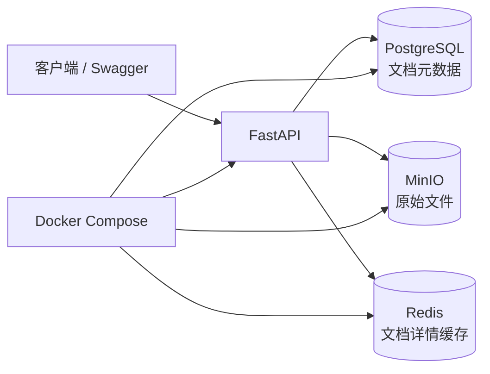

# 第三周学习总结与验收记录

> 周主题：MinIO、Redis、Docker 与 Docker Compose
>
> 完成状态：已完成

## 1. 本周交付能力

第三周将第二周的“PostgreSQL 文档元数据 CRUD”扩展为完整的文档存储基础设施：



职责边界如下：

| 组件 | 本项目职责 | 是否可丢失 |
| --- | --- | --- |
| PostgreSQL | 文档 ID、名称、状态、文件大小、对象 Key 等业务元数据 | 不可丢失 |
| MinIO | PDF、DOCX、TXT、Markdown 等原始文件 | 不可丢失 |
| Redis | 文档详情缓存、TTL | 可丢失，可从 PostgreSQL 重建 |
| FastAPI | HTTP 接口、依赖注入、业务编排 | 可重建 |

## 2. 关键技术点与项目落地

### 2.1 MinIO：对象存储而不是文件夹

文件在 MinIO 中通过 `bucket + object key` 定位。应用将对象 Key 保存到 PostgreSQL 的 `stored_path` 字段，而不是依赖服务器绝对路径。

`DocumentStorage` Protocol 让 Service 依赖抽象；`MinioDocumentStorage` 是生产式对象存储 Adapter，`LocalDocumentStorage` 保留给 CLI 与本地学习场景。上传、读取存在性检查和删除由 Adapter 封装，Service 只处理业务顺序和失败补偿。

上传过程中的一致性策略：若 MinIO 上传成功而数据库写入失败，Service 会补偿删除刚上传的对象，避免无主文件。

### 2.2 Redis：Cache Aside

文档详情查询使用 Cache Aside：

```text
GET /documents/{id}
  → Redis 命中：直接返回
  → Redis 未命中：查询 PostgreSQL
  → 将结果以 TTL 写入 Redis
```

`PATCH` 和 `DELETE` 先处理数据库或文件的业务结果，再删除对应缓存键，避免继续返回旧数据。Redis 不可用时，异常被降级处理，查询仍可回源 PostgreSQL；因此 Redis 不是业务事实来源。

### 2.3 Docker 镜像：可重复的 API 运行环境

Dockerfile 使用 `python:3.11-slim`，安装项目依赖、复制 Alembic 配置和迁移脚本，并以非 root 用户运行 Uvicorn。`.dockerignore` 排除了 `.env`、虚拟环境、测试缓存、日志和数据文件。

服务器无法直接访问 PyPI 时，Dockerfile 使用构建参数 `PIP_INDEX_URL`。Compose 从服务器 `.env` 将可访问的清华 PyPI 镜像传入构建阶段；该地址不会作为应用运行时环境变量保留。

### 2.4 Docker Compose：服务就绪而非仅容器启动

Compose 长期运行四个服务：`api`、`postgres`、`minio`、`redis`；另有两个一次性任务：

- `migrate`：等待 PostgreSQL 健康后执行 `alembic upgrade head`；
- `minio-init`：等待 MinIO 健康后创建 Bucket、应用账号和最小权限策略。

API 仅在迁移和 MinIO 初始化均以退出码 0 完成、Redis 健康后启动。容器之间通过服务名通信：`postgres`、`minio`、`redis`，而不是宿主机 IP 或 `127.0.0.1`。

## 3. Linux 服务器验收证据

服务器执行：

```bash
docker compose config --quiet
docker compose up -d --build
docker compose ps -a
```

实际结果：

| 服务 | 验收状态 | 含义 |
| --- | --- | --- |
| `postgres` | `healthy` | 数据库已可连接 |
| `minio` | `healthy` | 对象存储存活 |
| `redis` | `healthy` | 带认证的 Redis 可用 |
| `api` | 已启动，健康检查通过 | FastAPI 可对外提供接口 |
| `migrate` | `Exited (0)` | Alembic 迁移已成功执行 |
| `minio-init` | `Exited (0)` | Bucket、账号与权限已完成初始化 |

还验证了：

- API 健康检查；
- 文档上传、列表与详情查询；
- PostgreSQL 元数据写入；
- MinIO 原文件保存；
- Redis 缓存写入、命中及失效；
- `.env` 不进入 Git 或镜像。

> `migrate` 与 `minio-init` 的 `Exited (0)` 是成功状态。它们是完成初始化即退出的一次性容器，不应保持运行。

## 4. 问题与处理记录

| 现象 | 原因 | 处理方式 |
| --- | --- | --- |
| Git 拉取被 `*.egg-info` 阻止 | `pip install -e` 改写了已跟踪的构建元数据 | 只还原可自动生成的文件后拉取；后续应停止跟踪该目录 |
| Docker Hub 拉取超时 | 服务器可访问部分网站，但无法直连 Docker Hub | 配置 Docker 镜像加速器，逐步验证镜像拉取 |
| API 构建找不到 `setuptools>=75` | 构建隔离阶段无法访问 PyPI | 新增可配置的 `PIP_INDEX_URL`，服务器使用可访问的清华镜像 |
| 旧 Redis、MinIO 与 Compose 端口冲突 | 两套容器都要绑定 6379、9000、9001 | 先停止旧容器，保留容器和卷作为可回滚备份 |

## 5. AI Coding 使用记录

本周使用 AI Coding 的方式是“先明确边界，再让 AI 协助生成小步改动，最后自己在真实 Linux 环境验证”：

1. 先审阅 Compose 的服务职责、端口、账号和依赖；
2. 由 AI 生成 Dockerfile、Compose、配置模板和测试建议；
3. 人工执行每条 Docker、Git、网络诊断命令并阅读输出；
4. 根据真实错误（Docker Hub、PyPI、端口冲突）迭代配置；
5. 用健康检查、日志和业务 API 验收，而不是只看容器已创建。

这说明 AI Coding 的价值不只是写代码，还包括将部署问题拆分为网络、镜像、配置、服务依赖和业务验证等可判断步骤；最终密码、端口暴露和实际执行仍需要开发者负责。

## 6. 第三周汇报话术

> 我完成了知识助手的基础设施层：PostgreSQL 保存业务元数据，MinIO 保存原文件，Redis 做可降级缓存；通过 Docker Compose 将四个长期服务与数据库迁移、MinIO 初始化任务一起编排。服务器上已经完成健康检查、迁移和上传链路验证。下一步会把 MinIO 中的文件解析为可追溯的文本 Chunk，为后续向量检索提供高质量输入。

## 7. 下一周边界

根据七周交付节奏，第四周完成“原文件 → Parser/OCR → Chunk → PostgreSQL → Embedding → Milvus → Search API”的闭环。Reranker、Neo4j、Agent、RAG 和 LLM 不进入第四周。
