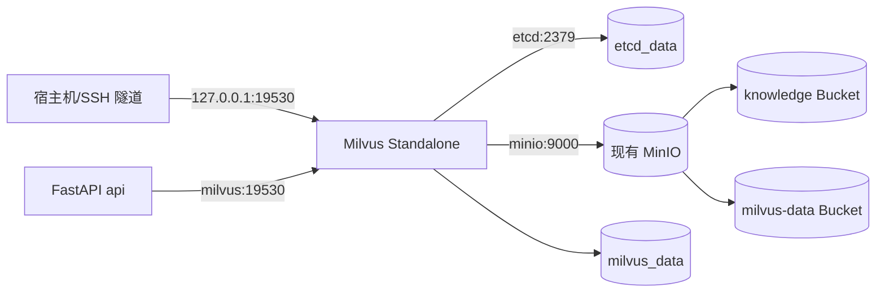
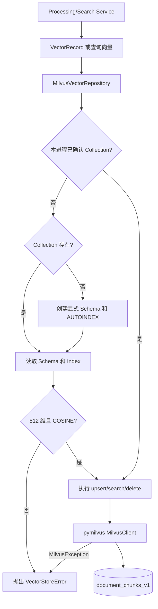
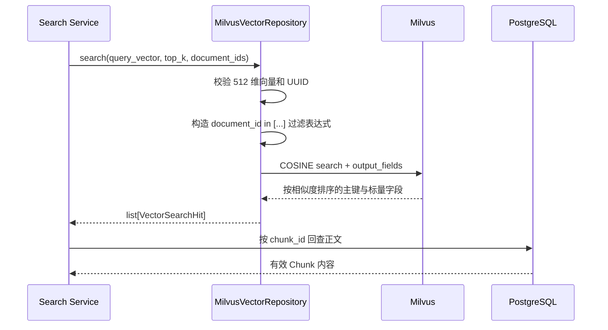

# Milvus 部署与 Collection 设计

> 对应第四周任务 10。本文只完成 Milvus Standalone 基础设施与 Collection 设计；Collection 的创建和向量读写由任务 11 实现。

## 1. 本阶段目标

项目需要用 Milvus 保存 Chunk 的 512 维语义向量，并通过 COSINE 相似度完成近邻搜索。PostgreSQL 仍然是 Chunk 正文与业务状态的事实来源，Milvus 只是可以重新生成的向量索引。

```text
文档原文件 ──> MinIO knowledge Bucket
Chunk 正文  ──> PostgreSQL document_chunks
Chunk 向量  ──> Milvus document_chunks_v1
                    │
                    ├── etcd：Milvus 元数据
                    └── MinIO milvus-data Bucket：Milvus 对象数据
```

本项目基于 Milvus 官方 Standalone Compose 方案调整：固定使用 `milvusdb/milvus:v2.6.22` 和 `quay.io/coreos/etcd:v3.5.25`。官方方案默认再启动一个 MinIO；本项目第三周已经有持久化 MinIO，因此选择复用现有服务，并用独立的 `milvus-data` Bucket 隔离 Milvus 数据。

- 官方部署说明：<https://milvus.io/docs/v2.6.x/install_standalone-docker-compose.md>
- MinIO 参数说明：<https://milvus.io/docs/configure_minio.md>

## 2. 容器与依赖关系



启动依赖如下：

1. `minio` 和 `etcd` 先通过健康检查；
2. `milvus` 才启动，并检查容器内 `9091/healthz`；
3. `api` 等待 `milvus` 健康后再启动；
4. `api` 通过 Compose 内部 DNS 名称 `milvus:19530` 访问，不走宿主机端口。

`etcd`、`milvus`、`api`、`minio` 之间还连接到 `vector-backend` 内部网络。etcd 完全不映射宿主机端口。Milvus 同时加入默认桥接网络，使宿主机回环端口和 SSH 隧道能够抵达容器；19530 仍只绑定到 `${COMPOSE_BIND_ADDRESS:-127.0.0.1}`，因此默认不能从公网直接访问。

不能让 Milvus 只加入 `internal: true` 的网络。Docker 的内部网络不连接宿主机接口，这会导致本机虽然能够建立 SSH 隧道监听，但服务器端转发到 `127.0.0.1:19530` 时被拒绝。

## 3. 数据持久化与第三周数据保护

保留第三周原有卷名：

| 数据卷 | 内容 | 本次是否修改 |
| --- | --- | --- |
| `postgres_data` | Document、Chunk 元数据和正文 | 否 |
| `redis_data` | Redis AOF 与缓存 | 否 |
| `minio_data` | 文档原文件及 Milvus 对象数据 | 不更名、不重建 |

新增：

| 数据卷 | 内容 |
| --- | --- |
| `etcd_data` | Milvus Collection、Schema 等元数据 |
| `milvus_data` | Milvus Standalone 本地运行数据 |

`docker compose up -d` 或重新构建 API 不会删除这些命名卷。不要执行以下命令：

```bash
docker compose down -v
```

其中 `-v` 会删除 Compose 管理的数据卷。Milvus 的完整可恢复状态至少涉及 `etcd_data`、`milvus_data` 和 MinIO 的 `milvus-data` Bucket，备份时应整体考虑。

## 4. 为什么复用现有 MinIO

官方 Standalone Compose 同时启动专用 MinIO，默认占用 9000/9001。本项目已有 MinIO，如果原样复制官方配置会产生端口冲突，并重复维护对象存储。

当前方案使用：

```yaml
MINIO_ADDRESS: minio:9000
MINIO_BUCKET_NAME: milvus-data
```

文档上传仍然使用 `knowledge` Bucket；Milvus 使用 `milvus-data` Bucket，两者不会混写。Milvus 当前通过只在 Docker 内部传递的 MinIO 管理凭据初始化和访问自己的 Bucket。生产环境可继续改造成专用最小权限账号，本周学习环境先保证官方 Standalone 能稳定启动。

注意：首次启动后不要随意更改 `MILVUS_MINIO_BUCKET`，否则 Milvus 可能无法读取旧对象数据。

## 5. 关键配置

```dotenv
ETCD_IMAGE=quay.io/coreos/etcd:v3.5.25
MILVUS_IMAGE=milvusdb/milvus:v2.6.22
MILVUS_PORT=19530
MILVUS_MINIO_BUCKET=milvus-data

MILVUS_URI=http://127.0.0.1:19530
MILVUS_COLLECTION=document_chunks_v1
MILVUS_METRIC_TYPE=COSINE
MILVUS_TIMEOUT_SECONDS=5
```

地址根据运行位置不同：

| 调用方 | URI | 原因 |
| --- | --- | --- |
| Compose 中的 FastAPI | `http://milvus:19530` | 使用 Compose 服务发现 |
| 服务器宿主机 | `http://127.0.0.1:19530` | 端口只绑定回环地址 |
| 本地开发机 | `http://127.0.0.1:19530` | 通过 SSH 隧道转发到服务器 |

本地连接服务器 Milvus：

```powershell
ssh -N -o ExitOnForwardFailure=yes -L 19530:127.0.0.1:19530 root@服务器IP
```

## 6. BGE 模型只读挂载

模型文件不复制进镜像，也不提交 Git。宿主机模型目录通过只读挂载进入 API 容器：

```dotenv
EMBEDDING_MODEL_HOST_PATH=./models/bge-small-zh-v1.5
EMBEDDING_MODEL_PATH=/models/bge-small-zh-v1.5
```

服务器应提前准备模型目录：

```bash
cd ~/knowledge-assistant
mkdir -p models/bge-small-zh-v1.5
```

目录里必须直接包含模型的 `config.json`、tokenizer 文件和权重文件，不能多嵌套一层同名目录。挂载使用 `read_only: true`，应用只能加载模型，不能修改宿主机模型。

`.dockerignore` 排除了 `models` 和 `volumes`，防止数百 MB 的模型或运行数据进入 Docker 构建上下文。

Dockerfile 安装 `.[embedding,ocr]`，使服务器 API 镜像具备与本地 `.venv` 一致的 Embedding、PaddleOCR 和 PDF 转图片运行库。模型权重仍通过挂载提供，不会被打进镜像。

## 7. Collection 设计

Collection 名为 `document_chunks_v1`：

| 字段 | Milvus 类型 | 约束与用途 |
| --- | --- | --- |
| `chunk_id` | `VARCHAR` | Primary Key，与 PostgreSQL `document_chunks.id` 相同 |
| `document_id` | `VARCHAR` | 文档范围过滤和按文档删除 |
| `processing_version` | `INT64` | 过滤旧处理版本 |
| `page_start` | `INT64` | 无页码时写 0 |
| `embedding` | `FLOAT_VECTOR(512)` | BGE-small-zh-v1.5 生成的归一化向量 |

索引和度量：

- 向量维度由 `EMBEDDING_DIMENSION=512` 决定；
- 距离度量为 `COSINE`；
- 初期数据量较小，任务 11 使用 Milvus 默认/自动索引；
- Milvus 不重复保存正文，命中后用 `chunk_id` 回查 PostgreSQL；
- 更换模型或维度时新建 Collection 版本，不能把不同维度向量混写到同一个 Collection。

本任务不会提前创建 Collection。任务 11 的 Repository 会幂等创建并检查已有 Collection 的维度和 Metric，防止错误配置悄悄污染向量数据。

### 7.1 Repository 调用流程

任务 11 新增三层对象：

| 对象 | 作用 |
| --- | --- |
| `VectorRecord` | Service 交给向量库的 Chunk ID、文档 ID、版本、页码和向量 |
| `VectorSearchHit` | Milvus 返回给 Search Service 的主键、过滤字段和相似度 |
| `VectorRepository` | 隔离业务层与 pymilvus SDK 的抽象接口 |

`MilvusVectorRepository` 是该接口的适配器。业务 Service 不需要了解 Collection Schema、Milvus 过滤表达式和 SDK 返回字典的结构。



Collection 校验在每个 Repository 实例的第一次有效操作时执行，成功后在进程内缓存结果。锁保证同一进程的并发请求不会重复初始化；多个进程同时创建时，失败的一方会再次检查 Collection，随后仍以 Schema 校验结果为准。

### 7.2 Upsert 流程

```text
Sequence[VectorRecord]
  -> 校验 UUID、处理版本、页码、512 维有限数值
  -> 按 chunk_id 去重，同批重复时保留最后一条
  -> 每 100 条调用一次 MilvusClient.upsert
  -> 相同 chunk_id 在 Milvus 中覆盖，不增加重复主键
```

这里选择 `upsert` 而不是 `insert`，因为文档强制重新处理、失败重试或接口重放时可能再次写入同一个 Chunk。主键相同就更新，使重复调用具备幂等性。

### 7.3 Search 流程



Repository 保持 Milvus 的排序，不在 Python 中重新计算距离。Milvus 只返回用于定位正文的标量字段；真正的 Chunk 内容仍从 PostgreSQL 获取，因此数据库删除或版本变化后可以过滤陈旧向量。

### 7.4 Delete 流程

- `delete_by_chunk_ids` 直接使用主键列表删除，并先去重；
- `delete_by_document_id` 在 UUID 校验后生成精确过滤表达式；
- 空 Chunk ID 列表直接返回 0，不创建连接；
- SDK 返回的 `delete_count` 统一转成整数；
- SDK 的 `MilvusException` 对业务层统一表现为 `VectorStoreError`。

这种异常转换使任务 12 只处理项目自己的异常，不依赖 pymilvus 的异常类和错误码。

## 8. 部署和验证

先检查服务器 `.env` 已包含 MinIO 管理凭据及本节配置，再执行：

```bash
cd ~/knowledge-assistant
docker compose config --quiet
docker compose up -d milvus
docker compose ps -a
docker compose logs --tail=100 milvus
```

`docker compose up -d milvus` 会按依赖关系启动/复用 `minio`，并启动 `etcd`、`milvus`。不会启动第二个 MinIO，也不会删除已有数据卷。

健康状态应为：

```text
knowledge-assistant-etcd-1    healthy
knowledge-assistant-minio-1   healthy
knowledge-assistant-milvus-1  healthy
```

从宿主机检查：

```bash
curl -f http://127.0.0.1:9091/healthz
```

9091 没有映射到宿主机，因此该命令默认不会成功；应通过容器内部执行：

```bash
docker compose exec milvus curl -f http://127.0.0.1:9091/healthz
```

从 API 容器网络检查 19530：

```bash
docker compose exec api python -c "import socket; socket.create_connection(('milvus', 19530), 5).close(); print('milvus reachable')"
```

检查宿主机没有公网监听：

```bash
docker compose ps
ss -lntp | grep 19530
```

预期是 `127.0.0.1:19530`，而不是 `0.0.0.0:19530`。

## 9. 重启持久化验收

任务 11 创建 Collection 后再执行完整持久化验收：

1. 写入一组测试向量并确认可搜索；
2. `docker compose restart etcd milvus`；
3. 等待两者恢复健康；
4. 再次连接并确认 Collection 与测试向量仍存在。

任务 10 当前只能验证数据卷已配置、容器重启后未重新创建卷。Collection 尚未创建，因此不能在本任务声称已完成向量数据持久化验证。

## 10. 常见问题

### Milvus 一直处于 starting

先看依赖和日志：

```bash
docker compose ps -a
docker compose logs --tail=100 etcd minio milvus
```

常见原因包括服务器内存不足、MinIO 凭据不一致、镜像未完整拉取或旧端口被占用。

### 本地无法连接服务器 19530

因为端口有意绑定在服务器 `127.0.0.1`。先保持 SSH 隧道运行，再连接本地 `127.0.0.1:19530`，不要把 Compose 改成 `0.0.0.0:19530`。

### 更改 `.env` 后 API 仍使用旧配置

环境变量在容器创建时写入。更新 `.env` 后执行：

```bash
docker compose up -d api
```

Compose 会按新配置重建 API 容器，而不是只重启旧进程。
