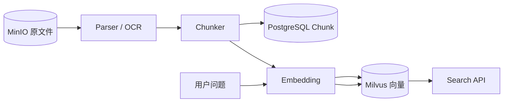

# 第四周文档索引：文档入库与向量检索

## 本周产品目标

将已经保存到 MinIO 的原文件转换为可追溯 Chunk，生成 Embedding 并写入 Milvus，最终提供语义检索 API：

本周结束时，用户能够上传文本型或扫描型文档，触发处理，并用自然语言问题检索到带文档 ID、Chunk ID、页码和相似度的原文片段。

## 文档目录

- [第四周技术方案 plan.md](./plan.md)
- [第四周实施任务 tasks.md](./tasks.md)
- [第四周学习任务清单](./第四周学习任务清单.md)

## 本周边界

本周支持 TXT、Markdown、原生文本 PDF 和 DOCX，并至少用一个扫描样例跑通 CPU OCR；Embedding 与 Milvus 必须形成真实检索闭环。Reranker、Neo4j、Agent、RAG 和异步任务队列留到后续阶段。
