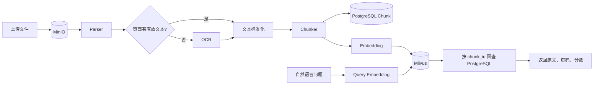
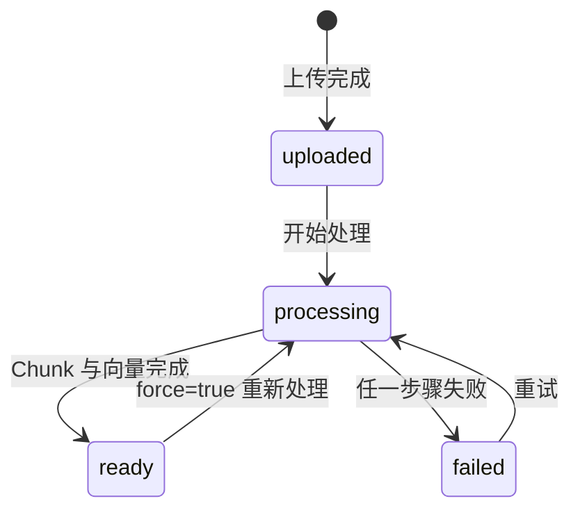
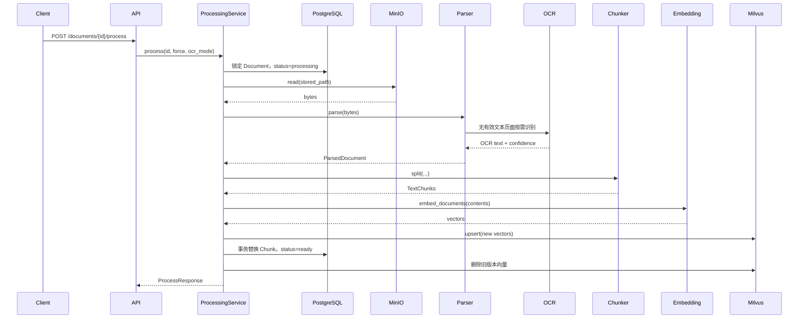

# 第四周技术方案：文档入库与向量检索

> 文档状态：设计完成，尚未编码
>
> 范围：Parser、OCR、Chunk、Embedding、Milvus、语义检索 API
>
> 依赖基线：FastAPI + PostgreSQL + MinIO + Redis + Docker Compose 已运行
>
> 编码基线：2026-09-01 已冻结。后续实现以本文的数据模型、接口契约、处理状态机和错误码为准；如需调整，先更新方案再修改代码。

## 1. 目标与非目标

### 1.1 本周目标

打通一条真实、可追溯、可重复执行的文档处理链：



完成后应支持：

- 从 MinIO 读取已上传文件；
- 解析 TXT、Markdown、文本型 PDF 和 DOCX；
- 对无有效文本的 PDF 页面以及 PNG/JPEG 图片执行 OCR；
- 将标准化文本切分为可追溯 Chunk；
- PostgreSQL 保存 Chunk 正文和来源；
- Embedding 模型生成真实向量；
- Milvus 保存、搜索和删除向量；
- API 触发处理、查看 Chunk、执行语义检索；
- 重复处理和删除文档时不留下有效脏数据。

### 1.2 本周非目标

- 不接入 Reranker；
- 不做 Neo4j、实体关系抽取；
- 不做 Agno、MCP、Skills；
- 不生成 LLM 答案；
- 不引入 Celery、RabbitMQ、Kafka 等异步队列；
- 不处理手写体、复杂表格结构和高精度版面还原；
- 不做 Milvus 集群和高可用。

## 2. 总体架构与职责

| 层/组件 | 职责 | 不负责 |
| --- | --- | --- |
| FastAPI Route | 参数校验、HTTP 状态码、Schema 转换 | 解析和向量逻辑 |
| `DocumentProcessingService` | 编排读取、解析、OCR、分块、向量化和状态 | 具体 SDK 调用细节 |
| `SearchService` | 查询向量化、Milvus 召回、PostgreSQL 回查 | Reranker 和生成答案 |
| `DocumentStorage` | 保存、读取、删除 MinIO/本地原文件 | 文本解析 |
| Parser/OCR | 将原文件转为带来源信息的文本页 | 数据库存储和 HTTP |
| Chunker | 标准化和分块 | Embedding 和 Milvus |
| PostgreSQL | Document、Chunk 正文和当前有效版本的事实来源 | 向量近邻搜索 |
| Embedding Provider | 文本与查询转固定维度向量 | 保存向量 |
| Milvus Repository | 向量写入、搜索、按文档删除 | 保存业务正文 |
| Redis | 继续缓存 Document 详情 | Chunk 或搜索结果的唯一来源 |

核心原则：PostgreSQL 决定哪些 Chunk 当前有效；Milvus 是可重建索引。Milvus 中出现但 PostgreSQL 已不存在的 `chunk_id` 视为陈旧向量，Search 层必须过滤。

## 3. 数据模型

### 3.1 Document 领域模型调整

保留现有字段：

```text
id, name, original_path, stored_path, file_type,
file_size, status, created_at
```

补充字段：

| 字段 | 类型 | 可空 | 说明 |
| --- | --- | --- | --- |
| `updated_at` | ISO 8601 datetime | 否 | ORM 已有，领域模型与 API 补齐 |
| `processing_version` | int | 否 | 成功或准备中的处理版本，初始为 0 |
| `content_hash` | str(64) | 是 | 原始对象内容 SHA-256，用于幂等判断 |
| `processed_at` | ISO 8601 datetime | 是 | 最近一次成功完成向量入库的时间 |
| `processing_error` | str | 是 | 最近一次处理失败的安全错误摘要 |

Document 状态沿用数据库已有约束：



状态只能由上传和处理 Service 修改。现有 `PATCH /documents/{id}` 应停止接受客户端直接修改 `status`，只保留名称修改；否则客户端可以伪造 `ready`。

### 3.2 ParsedPage

Parser/OCR 层内部模型，不直接作为数据库表：

| 字段 | 类型 | 说明 |
| --- | --- | --- |
| `page_number` | `int \| None` | PDF 从 1 开始；TXT/MD/DOCX 可为空 |
| `text` | str | 页面或逻辑段落文本 |
| `source_type` | `parser \| ocr` | 文本来源 |
| `ocr_confidence` | `float \| None` | OCR 平均置信度，普通解析为空 |

### 3.3 ParsedDocument

| 字段 | 类型 | 说明 |
| --- | --- | --- |
| `pages` | `list[ParsedPage]` | 按原文顺序排列 |
| `content_hash` | str | 原始文件 SHA-256 |
| `parser_name` | str | 如 `pypdf`、`python-docx` |
| `parser_version` | str | 便于重现结果 |

### 3.4 TextChunk 领域模型

| 字段 | 类型 | 说明 |
| --- | --- | --- |
| `id` | UUID string | Chunk 唯一 ID，同时作为 Milvus 主键 |
| `document_id` | UUID string | 所属 Document |
| `processing_version` | int | 处理版本 |
| `chunk_index` | int | 文档内从 0 开始的稳定顺序 |
| `content` | str | 标准化正文 |
| `content_hash` | str(64) | Chunk 内容 SHA-256 |
| `char_start` | int | 在标准化全文中的起始位置，包含 |
| `char_end` | int | 结束位置，不包含 |
| `page_start` | `int \| None` | 起始页码 |
| `page_end` | `int \| None` | 结束页码 |
| `source_type` | `parser \| ocr \| mixed` | Chunk 来源 |
| `ocr_confidence` | `float \| None` | OCR Chunk 的平均置信度 |
| `token_count` | int | 当前 Embedding tokenizer 计算值 |
| `created_at` | datetime | 创建时间 |

### 3.5 PostgreSQL documents 表变更

新增列：

| 列 | PostgreSQL 类型 | 默认/约束 |
| --- | --- | --- |
| `processing_version` | INTEGER | `NOT NULL DEFAULT 0`, `>= 0` |
| `content_hash` | VARCHAR(64) | nullable |
| `processed_at` | TIMESTAMPTZ | nullable |
| `processing_error` | TEXT | nullable |

保留现有 `status` CheckConstraint。`processing_error` 只存可展示摘要，不存完整堆栈；完整异常写日志。

### 3.6 PostgreSQL document_chunks 表

| 列 | PostgreSQL 类型 | 约束 |
| --- | --- | --- |
| `id` | UUID | Primary Key |
| `document_id` | UUID | FK `documents.id ON DELETE CASCADE`, NOT NULL |
| `processing_version` | INTEGER | NOT NULL, `> 0` |
| `chunk_index` | INTEGER | NOT NULL, `>= 0` |
| `content` | TEXT | NOT NULL，`btrim(content) <> ''` |
| `content_hash` | VARCHAR(64) | NOT NULL |
| `char_start` | INTEGER | NOT NULL, `>= 0` |
| `char_end` | INTEGER | NOT NULL, `> char_start` |
| `page_start` | INTEGER | nullable，非空时 `> 0` |
| `page_end` | INTEGER | nullable，非空时 `>= page_start` |
| `source_type` | VARCHAR(16) | `parser / ocr / mixed` |
| `ocr_confidence` | REAL | nullable，范围 `[0, 1]` |
| `token_count` | INTEGER | NOT NULL, `> 0` |
| `created_at` | TIMESTAMPTZ | `NOT NULL DEFAULT CURRENT_TIMESTAMP` |

约束与索引：

- `UNIQUE(document_id, processing_version, chunk_index)`；
- `INDEX(document_id, chunk_index)`，用于查看当前文档 Chunk；
- `INDEX(document_id, processing_version)`，用于版本替换和删除；
- 不为 `content` 建普通 B-tree 索引；关键词检索不属于本周范围。

### 3.7 Milvus Collection

Collection 名称：`document_chunks_v1`。

| 字段 | Milvus 类型 | 说明 |
| --- | --- | --- |
| `chunk_id` | VARCHAR，Primary Key | 与 PostgreSQL `document_chunks.id` 相同 |
| `document_id` | VARCHAR | 文档过滤与按文档删除 |
| `processing_version` | INT64 | 排查和版本过滤 |
| `page_start` | INT64 | 无页码写 0 |
| `embedding` | FLOAT_VECTOR(512) | BGE-small-zh-v1.5 向量 |

Collection 配置：

- Metric：`COSINE`；
- 向量维度来自 `EMBEDDING_DIMENSION`，创建时必须与模型一致；
- 初始数据量小，采用 Milvus 当前推荐的默认/自动索引；
- 不在 Milvus 重复保存 `content`；
- 模型或维度变化时创建新版本 Collection，不能混写。

## 4. 文件解析与分块规则

### 4.1 文件读取接口

现有 `DocumentStorage` 只有 `save/delete/exists`。新增：

```text
read(object_key) → bytes
```

当前上传限制为 10 MiB，第一版整文件读入内存可以接受。MinIO Adapter 使用 `get_object()`，无论成功失败都必须关闭响应并释放连接；Local Adapter 从安全校验后的上传目录读取。

### 4.2 Parser 选择

| 扩展名 | Parser | 失败条件 |
| --- | --- | --- |
| `.txt` | UTF-8 Text Parser | 编码错误或正文为空 |
| `.md` | Markdown Text Parser | 正文为空；保留标题文本 |
| `.pdf` | Page PDF Parser | 文件损坏；单页无文本则进入 OCR |
| `.docx` | DOCX Parser | 文件损坏或无段落/表格文本 |
| `.png / .jpg / .jpeg` | Image OCR Parser | 图片损坏或 OCR 无有效文本 |

文件扩展名先决定 Parser，Parser 还需验证文件内容是否可读取，不能只信扩展名。
现有上传白名单需要同步增加 `.png`、`.jpg`、`.jpeg`，并为图片配置正确的 MIME 类型和相同的 10 MiB 大小限制。

### 4.3 OCR 策略

OCR 模式：`auto | never | force`，默认 `auto`。

- `auto`：PDF 每页普通文本低于阈值才 OCR；图片直接 OCR；
- `never`：不启用 OCR，无有效文字时处理失败；
- `force`：全部支持页面走 OCR，仅用于测试或纠错。

第一版 OCR Provider 为 PaddleOCR CPU。阈值配置：

```dotenv
OCR_ENABLED=true
OCR_MIN_TEXT_CHARS_PER_PAGE=20
OCR_DEVICE=cpu
```

### 4.4 Chunk 规则

- 统一 `\r\n` 和 `\r` 为 `\n`；
- 删除行尾空格，连续空行最多保留一个；
- 优先按标题、段落和句子边界切分；
- 目标 800 字符，最大 1,000 字符；
- 相邻 Chunk 重叠约 100 字符；
- OCR 页面不跨页合并，保证页码准确；
- 文本 Parser 可跨页，但必须记录 `page_start/page_end`；
- 空白 Chunk 不写入数据库，也不调用 Embedding。

## 5. API 设计

统一前缀继续使用 `/api/v1`。

### 5.1 调整现有 Document 响应

`DocumentResponse` 增加：

```json
{
  "updated_at": "2026-09-01T08:00:00+00:00",
  "processing_version": 1,
  "processed_at": "2026-09-01T08:05:00+00:00",
  "processing_error": null
}
```

`stored_path`、MinIO Bucket、内部异常堆栈仍不对客户端公开。

### 5.2 PATCH `/api/v1/documents/{document_id}`

调整后请求只允许修改名称：

```json
{
  "name": "新名称.pdf"
}
```

客户端不再允许传 `status`。状态由上传、Process 和删除流程维护。

### 5.3 POST `/api/v1/documents/{document_id}/process`

作用：同步执行读取、解析、按需 OCR、分块、Embedding 和 Milvus 入库。

请求：

```json
{
  "force": false,
  "ocr_mode": "auto"
}
```

字段约束：

| 字段 | 类型 | 默认 | 说明 |
| --- | --- | --- | --- |
| `force` | bool | false | `ready` 且内容未变化时是否强制重建 |
| `ocr_mode` | enum | `auto` | `auto / never / force` |

成功响应：`200 OK`

```json
{
  "document_id": "uuid",
  "status": "ready",
  "processing_version": 1,
  "chunk_count": 12,
  "vector_count": 12,
  "parser_name": "pypdf",
  "ocr_page_count": 2,
  "embedding_model": "BAAI/bge-small-zh-v1.5",
  "duration_ms": 2530,
  "processed_at": "2026-09-01T08:05:00+00:00"
}
```

幂等行为：

- `ready + content_hash 未变化 + force=false`：不重复处理，返回当前摘要；
- `processing`：返回 `409 PROCESSING_IN_PROGRESS`；
- `force=true`：创建新 `processing_version` 并完整替换；
- 同一文档同时只能有一个处理请求，数据库行锁或等效互斥控制。

可能错误：

| HTTP | code | 场景 |
| --- | --- | --- |
| 404 | `DOCUMENT_NOT_FOUND` | 文档不存在 |
| 409 | `PROCESSING_IN_PROGRESS` | 同文档已有处理执行 |
| 415 | `UNSUPPORTED_DOCUMENT_TYPE` | Parser 不支持 |
| 422 | `NO_EXTRACTABLE_TEXT` | Parser/OCR 均无有效文本 |
| 503 | `PROCESSING_DEPENDENCY_UNAVAILABLE` | MinIO、OCR、Embedding 或 Milvus 不可用 |
| 500 | `PROCESSING_FAILED` | 其他已记录内部错误 |

第一版同步执行，因此客户端需要等待完成。后续若引入异步任务，该接口可改为 `202 + task_id`，但不在第四周实现。

### 5.4 GET `/api/v1/documents/{document_id}/chunks`

查询参数：

| 参数 | 默认 | 限制 |
| --- | --- | --- |
| `offset` | 0 | `>= 0` |
| `limit` | 20 | `1..100` |
| `page_number` | null | 可选，`>= 1` |

响应：

```json
{
  "items": [
    {
      "id": "chunk-uuid",
      "document_id": "document-uuid",
      "processing_version": 1,
      "chunk_index": 0,
      "content": "...",
      "page_start": 1,
      "page_end": 1,
      "source_type": "parser",
      "ocr_confidence": null,
      "token_count": 180
    }
  ],
  "total": 12,
  "offset": 0,
  "limit": 20
}
```

只返回 Document 当前 `processing_version` 的 Chunk。文档存在但尚未处理时返回空列表，而不是 404。

### 5.5 POST `/api/v1/search`

请求：

```json
{
  "query": "数据库迁移是如何触发的？",
  "top_k": 5,
  "document_ids": null,
  "min_score": null
}
```

约束：

| 字段 | 限制 |
| --- | --- |
| `query` | 去空白后 1～500 字符 |
| `top_k` | 1～20，默认 5 |
| `document_ids` | 可选，最多 50 个 UUID |
| `min_score` | 可选，COSINE 分数范围建议 `[-1, 1]` |

响应：

```json
{
  "query": "数据库迁移是如何触发的？",
  "embedding_model": "BAAI/bge-small-zh-v1.5",
  "items": [
    {
      "rank": 1,
      "score": 0.86,
      "document_id": "document-uuid",
      "document_name": "Alembic学习文档.md",
      "chunk_id": "chunk-uuid",
      "chunk_index": 3,
      "content": "...",
      "page_start": null,
      "page_end": null,
      "source_type": "parser"
    }
  ],
  "returned": 5,
  "duration_ms": 48
}
```

Search 调用步骤：

1. 校验查询；
2. `embed_query()` 生成 512 维归一化向量；
3. Milvus 搜索 `top_k * 3` 个候选，为陈旧向量过滤留余量；
4. 按 `chunk_id` 从 PostgreSQL 批量读取当前有效 Chunk；
5. 丢弃不存在、版本不匹配或 Document 非 `ready` 的候选；
6. 保留 Milvus 原排序，截取 Top K；
7. 返回正文、来源和分数。

错误：

| HTTP | code | 场景 |
| --- | --- | --- |
| 422 | FastAPI 校验错误 | query/top_k/document_ids 非法 |
| 503 | `EMBEDDING_UNAVAILABLE` | 模型不可用 |
| 503 | `VECTOR_STORE_UNAVAILABLE` | Milvus 不可用 |

### 5.6 DELETE `/api/v1/documents/{document_id}` 调整

现有删除流程扩展为：

```text
读取 Document
  → 删除 PostgreSQL Document（级联 Chunk）
  → 删除 MinIO 原文件
  → 删除 Milvus 中 document_id 对应向量
  → 删除 Redis Document 缓存
```

Milvus 或 MinIO 清理失败时记录告警并允许后续补偿，不回滚已经成功的 PostgreSQL 删除。Search 会过滤 PostgreSQL 中已不存在的 Chunk，因此不会向用户返回已删除正文。

## 6. Pydantic Schema 清单

| Schema | 用途 |
| --- | --- |
| `DocumentProcessRequest` | `force`、`ocr_mode` |
| `DocumentProcessResponse` | 处理数量、模型、耗时和状态 |
| `DocumentChunkResponse` | 单个 Chunk 的公开字段 |
| `DocumentChunkListResponse` | Chunk 分页 |
| `SemanticSearchRequest` | query、top_k、过滤和阈值 |
| `SearchResultItem` | 文档、Chunk、来源和分数 |
| `SemanticSearchResponse` | 查询信息、结果和耗时 |
| `ErrorResponse` | 统一 `{error: {code, message}}` |

不得将向量数组、MinIO Object Key、模型本地目录和内部异常堆栈放入公开响应。

## 7. 抽象接口与模块规划

### 7.1 新增 Protocol

```text
DocumentStorage.read(object_key) -> bytes

DocumentParser.parse(content, filename) -> ParsedDocument

OcrProvider.recognize(page_image, page_number) -> ParsedPage

TextChunker.split(parsed_document, document_id, version) -> list[TextChunk]

EmbeddingProvider.embed_documents(texts) -> list[list[float]]
EmbeddingProvider.embed_query(query) -> list[float]
EmbeddingProvider.count_tokens(text) -> int

DocumentChunkRepository.replace_for_document(...)
DocumentChunkRepository.list_page(...)
DocumentChunkRepository.get_many_by_ids(...)

VectorRepository.upsert(records)
VectorRepository.search(vector, top_k, document_ids)
VectorRepository.delete_by_document_id(document_id)
VectorRepository.delete_by_chunk_ids(chunk_ids)
```

### 7.2 计划目录

```text
src/knowledge_assistant/
├── processing/
│   ├── models.py
│   ├── parsers/
│   │   ├── base.py
│   │   ├── text_parser.py
│   │   ├── pdf_parser.py
│   │   └── docx_parser.py
│   ├── ocr/
│   │   ├── base.py
│   │   └── paddle_ocr.py
│   └── chunker.py
├── embeddings/
│   ├── base.py
│   └── bge.py
├── vectors/
│   ├── base.py
│   └── milvus_repository.py
├── repositories/
│   └── chunk_repository.py
├── services/
│   ├── document_processing_service.py
│   └── search_service.py
├── schemas/
│   ├── processing.py
│   └── search.py
└── api/routes/
    ├── processing.py
    └── search.py
```

## 8. 处理调用链



模型加载、OCR 初始化和 Milvus Client 通过 FastAPI 依赖注入创建并复用，不在每个请求内重复创建。

## 9. 一致性、失败和补偿

PostgreSQL 与 Milvus 不支持同一个本地事务，采用“事实来源 + 补偿 + 查询过滤”：

### 9.1 成功路径

1. 行锁检查并写 `processing`；
2. 在内存中完成解析、Chunk 和 Embedding；
3. 生成新 Chunk UUID，先向 Milvus upsert 新向量；
4. PostgreSQL 事务替换当前 Chunk、更新版本并写 `ready`；
5. 删除 Milvus 旧版本向量；
6. 删除 Redis Document 缓存。

### 9.2 失败处理

| 失败点 | 处理 |
| --- | --- |
| MinIO 读取失败 | status=`failed`，保存安全摘要 |
| Parser/OCR 无文本 | status=`failed`，不写 Chunk/向量 |
| Embedding 失败 | status=`failed`，不写 Milvus |
| Milvus 新向量写入失败 | status=`failed`，保留旧有效数据 |
| Milvus 成功、PostgreSQL 提交失败 | 按新 chunk_ids 补偿删除新向量 |
| 新版本成功、旧向量删除失败 | 记录告警；Search 回查 PostgreSQL 时过滤 |
| Redis 删除失败 | 记录告警；TTL 最终过期 |

失败时不删除原始 MinIO 文件。解析、Chunk 和向量都应能从原文件重建。

## 10. 配置项

```dotenv
# Parser / Chunk
CHUNK_TARGET_CHARS=800
CHUNK_MAX_CHARS=1000
CHUNK_OVERLAP_CHARS=100

# OCR
OCR_ENABLED=true
OCR_PROVIDER=paddle
OCR_DEVICE=cpu
OCR_MIN_TEXT_CHARS_PER_PAGE=20

# Embedding
EMBEDDING_PROVIDER=bge
EMBEDDING_MODEL=BAAI/bge-small-zh-v1.5
EMBEDDING_MODEL_PATH=/models/bge-small-zh-v1.5
EMBEDDING_DIMENSION=512
EMBEDDING_BATCH_SIZE=16
EMBEDDING_DEVICE=cpu

# Milvus
MILVUS_URI=http://milvus:19530
MILVUS_COLLECTION=document_chunks_v1
MILVUS_METRIC_TYPE=COSINE
MILVUS_TIMEOUT_SECONDS=5
```

生产式容器优先加载挂载到 `/models` 的离线模型，避免容器重启时访问外网。模型目录使用命名卷或只读 bind mount，不提交到 Git。

## 11. Docker Compose 方案

现有 Compose 保留 API、PostgreSQL、MinIO、Redis。第四周增加 Milvus Standalone 及其官方要求的依赖组件或采用官方 Standalone 编排后与项目网络连接。

需要提前解决：

- 官方 Milvus Compose 通常自带 MinIO，可能与项目现有 `9000/9001` 冲突；
- 本项目优先复用现有 MinIO或调整 Milvus 内部 MinIO 的宿主机端口，不能直接复制后同时暴露相同端口；
- API 容器访问 Milvus 使用服务名 `milvus:19530`；
- Milvus 端口默认不需要暴露到公网；
- 增加 Milvus 健康检查和持久化卷；
- API 必须等待 PostgreSQL、MinIO、Redis、Milvus 健康及迁移成功。

具体 Compose 改造在 Milvus 阶段单独评审，不能未经检查直接覆盖已验收的第三周 `compose.yaml`。

## 12. 测试方案

| 层级 | 测试重点 |
| --- | --- |
| Parser | TXT/MD/PDF/DOCX、坏文件、空文件、页码 |
| OCR | 真实小图片冒烟；单测使用 Fake Provider，覆盖置信度和失败 |
| Chunker | 边界、重叠、页码、字符范围、空白、超长段落 |
| Embedding | Fake Provider 做业务测试；真实模型做维度/相似度冒烟 |
| Chunk Repository | 替换、分页、批量读取、级联删除、约束 |
| Vector Repository | Collection、upsert、search、过滤、删除 |
| Processing Service | 状态机、幂等、重试、各失败点补偿 |
| Search Service | 排序保持、陈旧向量过滤、文档过滤、Top K |
| API | 200/404/409/415/422/503 与响应过滤 |
| Migration | 从当前 revision 升级到最新并验证表结构 |

测试策略：大多数自动化测试使用 Fake OCR、Fake Embedding、Fake Vector Repository，保证快速稳定；另设少量带标记的真实模型、Milvus 集成测试，不让普通 pytest 每次下载模型或依赖服务器。

## 13. 验收数据与指标

样例集：至少 5 份文档，包括文本 PDF、扫描页、DOCX、Markdown、TXT；至少 10 个问题，每个问题标注预期 Chunk。

第四周记录：

- Parser/OCR 成功率；
- OCR 页面数量与置信度；
- Chunk 数量、平均字符数和最大字符数；
- Embedding 维度与批处理耗时；
- Recall@5；
- Top 1 命中数；
- 单文档处理耗时；
- 单次搜索耗时；
- 重复处理后的 PostgreSQL Chunk 与 Milvus 向量数量；
- 删除后是否仍能搜索到已删除正文。

完成标准：10 个问题中至少 8 个在 Top 5 召回预期 Chunk；这是学习阶段基线，不代表生产质量。第五周加入 Reranker 后再比较排序指标。

## 14. 实施顺序

| 阶段 | 内容 | 完成证据 |
| --- | --- | --- |
| 0 | 固化本方案与样例集 | `plan.md`、输入和预期输出 |
| 1 | Document/Chunk 模型与 Alembic | 迁移、Repository 测试 |
| 2 | Storage.read、Parser | 多格式单测 |
| 3 | OCR、标准化和 Chunker | 扫描样例与分块对照 |
| 4 | Embedding Provider | 真实 512 维向量冒烟 |
| 5 | Milvus 与 VectorRepository | 写入、搜索、删除集成测试 |
| 6 | Processing/Search Service | 状态机、幂等、补偿测试 |
| 7 | API、Compose、服务器验收 | 端到端演示和指标记录 |

每阶段单独提交，避免一次提交同时混入数据库、模型、Milvus 和 API，导致出错后无法定位。

## 15. 编码前待确认事项

进入阶段 1 前只需要确认三项：

1. 服务器是否能为 Milvus 和 Embedding 模型提供足够内存与磁盘；
2. `BAAI/bge-small-zh-v1.5` 是否能从服务器访问的模型源下载，或是否需要离线传输；
3. 扫描样例使用图片还是扫描 PDF，两者至少准备一种。

这三项只影响部署和样例，不改变上述领域模型与 API 契约。
