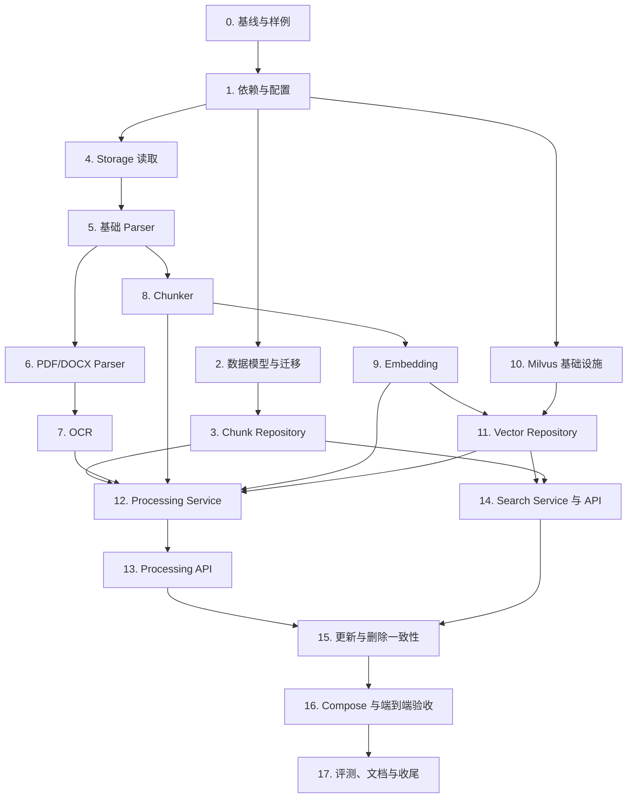

# 第四周实施任务清单

> 来源：[第四周技术方案](./plan.md)
>
> 当前状态：仅规划，尚未开始实现
>
> 执行规则：严格按依赖顺序完成；每个任务单独验证、提交后再进入下一项。

## 总体依赖关系



---

## 任务 0：冻结基线与准备验收样例

**依赖：** 无。

**目标文件：**

- `docs/week04/plan.md`
- `docs/week04/fixtures/README.md`（新增）
- `tests/fixtures/week04/`（新增样例目录）
- `.gitignore`（仅在样例不应提交时调整）

**具体改动：**

- 确认 `plan.md` 中模型、接口、状态机和错误码作为本周编码基线；
- 准备 TXT、Markdown、两页文本 PDF、DOCX、PNG/JPEG、扫描 PDF、空文件和损坏文件；
- 在 `fixtures/README.md` 记录每份样例的来源、预期文本、页码和是否应触发 OCR；
- 样例不得包含公司敏感信息；大文件和模型文件不提交 Git。

**验证命令：**

```powershell
Get-ChildItem tests/fixtures/week04
git status --short
git check-ignore -v .env
```

**完成标准：**

- 至少 5 份正常样例和 2 份异常样例；
- 每份正常样例都有可人工核对的预期文本；
- Git 中没有密码、内部文档和大型模型文件。

---

## 任务 1：增加依赖与第四周配置模型

**依赖：** 任务 0。

**目标文件：**

- `pyproject.toml`
- `src/knowledge_assistant/core/config.py`
- `.env.example`
- `tests/test_config.py`（不存在则新增）

**具体改动：**

- 增加 PDF、DOCX、OCR、Embedding、Milvus 所需依赖；
- 评估 OCR/模型依赖是否放入可选依赖组，避免普通开发环境被迫安装重型模型；
- 新增 `ProcessingSettings`、`OcrSettings`、`EmbeddingSettings`、`MilvusSettings`；
- 校验 Chunk 长度与重叠、模型维度、批量大小、超时和 Collection 名称；
- `.env.example` 只写安全示例，不写真实服务器地址和密码。

**验证命令：**

```powershell
python -m pip install -e ".[dev]"
pytest tests/test_config.py --basetemp=.pytest-tmp-week04-config
ruff check src/knowledge_assistant/core/config.py tests/test_config.py
mypy
```

**完成标准：**

- 合法配置可实例化，非法维度、重叠或空地址会被拒绝；
- 普通测试不触发模型下载；
- `.env` 仍被 Git 忽略。

---

## 任务 2：扩展 Document 并建立 Chunk 数据模型

**依赖：** 任务 1。

**目标文件：**

- `src/knowledge_assistant/models.py`
- `src/knowledge_assistant/processing/__init__.py`（新增）
- `src/knowledge_assistant/processing/models.py`（新增）
- `src/knowledge_assistant/db/models.py`
- `src/knowledge_assistant/schemas/documents.py`
- `migrations/versions/<revision>_add_document_processing_and_chunks.py`（新增）
- `tests/test_models.py`
- `tests/test_migrations.py`

**具体改动：**

- Document 增加 `updated_at`、`processing_version`、`content_hash`、`processed_at`、`processing_error`；
- 新增 `ParsedPage`、`ParsedDocument`、`TextChunk` 领域模型；
- 新增 `DocumentChunkORM` 和 Document/Chunk ORM 关系；
- 创建 `document_chunks` 表、外键、级联删除、CheckConstraint、UniqueConstraint 和索引；
- 迁移为 `documents` 增加处理字段；
- `DocumentResponse` 增加可公开的处理状态字段，但不暴露 `stored_path`；
- 调整 ORM 与领域模型转换，确保 UTC 时间和 nullable 字段正确。

**验证命令：**

```powershell
alembic upgrade head
alembic current
pytest tests/test_models.py tests/test_migrations.py --basetemp=.pytest-tmp-week04-models
ruff check src tests migrations
mypy
```

**完成标准：**

- 新数据库可通过 Alembic 创建两张业务表；
- 已有 documents 数据升级后保持有效；
- 外键、级联、唯一约束和范围约束都有测试；
- Document 与 ORM 双向转换不丢字段。

---

## 任务 3：实现 DocumentChunk Repository

**依赖：** 任务 2。

**目标文件：**

- `src/knowledge_assistant/repositories/chunk_repository.py`（新增）
- `src/knowledge_assistant/repositories/__init__.py`
- `tests/test_chunk_repository.py`（新增）

**具体改动：**

- 定义并实现按文档事务替换 Chunk；
- 实现当前版本分页、计数、按 Chunk ID 批量查询和按文档删除；
- 所有数据库异常转换为项目领域异常；
- 查询顺序固定为 `chunk_index`；
- 批量查询结果能够按输入 ID 重建顺序，供 Search 回查使用。

**验证命令：**

```powershell
pytest tests/test_chunk_repository.py --basetemp=.pytest-tmp-week04-chunk-repository
ruff check src/knowledge_assistant/repositories tests/test_chunk_repository.py
mypy
```

**完成标准：**

- 替换、分页、批量读取、删除和回滚测试全部通过；
- 重复 `chunk_index` 被数据库约束拒绝；
- 删除 Document 后 Chunk 自动级联删除。

---

## 任务 4：为 DocumentStorage 增加读取能力

**依赖：** 任务 1。

**目标文件：**

- `src/knowledge_assistant/storage/base.py`
- `src/knowledge_assistant/storage/local_storage.py`
- `src/knowledge_assistant/storage/minio_storage.py`
- `tests/test_local_storage.py`
- `tests/test_minio_storage.py`

**具体改动：**

- 为 Protocol 增加 `read(object_key) -> bytes`；
- Local Adapter 继续执行路径越界保护；
- MinIO Adapter 封装 `get_object()`，正确关闭响应并释放连接；
- 将 MinIO SDK、网络和文件系统异常转换为 `StorageError`；
- 对不存在对象、空文件和读取异常增加测试。

**验证命令：**

```powershell
pytest tests/test_local_storage.py tests/test_minio_storage.py --basetemp=.pytest-tmp-week04-storage
ruff check src/knowledge_assistant/storage tests/test_local_storage.py tests/test_minio_storage.py
mypy
```

**完成标准：**

- 保存后可以读取出完全相同的字节；
- MinIO 响应资源在成功和异常路径都被释放；
- Local Storage 仍拒绝目录越界。

---

## 任务 5：实现 Parser 抽象与 TXT/Markdown Parser

**依赖：** 任务 4。

**目标文件：**

- `src/knowledge_assistant/processing/parsers/__init__.py`（新增）
- `src/knowledge_assistant/processing/parsers/base.py`（新增）
- `src/knowledge_assistant/processing/parsers/text_parser.py`（新增）
- `tests/test_text_parser.py`（新增）

**具体改动：**

- 定义 `DocumentParser` Protocol 和 Parser 选择规则；
- 实现 TXT/Markdown UTF-8 解码；
- Markdown 保留标题、列表和正文文本，不做 HTML 渲染；
- 输出 `ParsedDocument/ParsedPage`；
- 对编码错误、空文本和扩展名不匹配返回领域异常。

**验证命令：**

```powershell
pytest tests/test_text_parser.py --basetemp=.pytest-tmp-week04-text-parser
ruff check src/knowledge_assistant/processing tests/test_text_parser.py
mypy
```

**完成标准：**

- TXT 和 Markdown 样例文本、顺序与预期一致；
- 空文件和无效编码被明确拒绝；
- Parser 测试不依赖数据库或 MinIO。

---

## 任务 6：实现 PDF 与 DOCX Parser

**依赖：** 任务 5。

**目标文件：**

- `src/knowledge_assistant/processing/parsers/pdf_parser.py`（新增）
- `src/knowledge_assistant/processing/parsers/docx_parser.py`（新增）
- `tests/test_pdf_parser.py`（新增）
- `tests/test_docx_parser.py`（新增）

**具体改动：**

- PDF 按页提取文本并保存从 1 开始的页码；
- 标记需要 OCR 的空文本或低文本量页面；
- DOCX 提取标题、段落和基础表格文本；
- 捕获损坏 PDF/DOCX 并转换为解析领域异常；
- 不在 Parser 内写数据库或调用 Embedding。

**验证命令：**

```powershell
pytest tests/test_pdf_parser.py tests/test_docx_parser.py --basetemp=.pytest-tmp-week04-document-parser
ruff check src/knowledge_assistant/processing tests/test_pdf_parser.py tests/test_docx_parser.py
mypy
```

**完成标准：**

- PDF 页码与人工核对一致；
- DOCX 标题、段落和表格顺序可解释；
- 扫描页被识别为“需要 OCR”，而不是静默返回空文本。

---

## 任务 7：接入 OCR Provider

**依赖：** 任务 6。

**目标文件：**

- `src/knowledge_assistant/processing/ocr/__init__.py`（新增）
- `src/knowledge_assistant/processing/ocr/base.py`（新增）
- `src/knowledge_assistant/processing/ocr/paddle_ocr.py`（新增）
- `src/knowledge_assistant/exceptions.py`
- `tests/test_ocr.py`（新增）
- `tests/integration/test_real_ocr.py`（新增，可标记为 integration）

**具体改动：**

- 定义 `OcrProvider` 和 `OcrError`；
- 封装 PaddleOCR CPU，模型实例在进程内复用；
- 实现 `auto/never/force` 三种模式；
- PDF 只对无有效文本页面 OCR，PNG/JPEG 直接 OCR；
- 输出页码、文本和归一化置信度；
- 普通单测使用 Fake Provider，真实模型只跑小型集成测试。

**验证命令：**

```powershell
pytest tests/test_ocr.py --basetemp=.pytest-tmp-week04-ocr
pytest tests/integration/test_real_ocr.py -m integration --basetemp=.pytest-tmp-week04-real-ocr
ruff check src/knowledge_assistant/processing/ocr tests/test_ocr.py
mypy
```

**完成标准：**

- 一个真实中文扫描样例可得到可读文字；
- 文本 PDF 不会无条件重复 OCR；
- OCR 关闭、模型失败和无识别结果都有明确行为。

---

## 任务 8：实现文本标准化与 Chunker

**依赖：** 任务 5；完整页码测试依赖任务 6、7。

**目标文件：**

- `src/knowledge_assistant/processing/chunker.py`（新增）
- `tests/test_chunker.py`（新增）
- `docs/week04/分块输入输出对照.md`（新增）

**具体改动：**

- 统一换行、行尾空格和连续空行；
- 优先按标题、段落、句子边界分块；
- 实现目标 800、最大 1,000、重叠约 100 字符的配置化规则；
- 生成稳定 `chunk_index`、字符范围、页码范围和来源类型；
- OCR 页面不跨页合并；
- 空白 Chunk 不输出。

**验证命令：**

```powershell
pytest tests/test_chunker.py --basetemp=.pytest-tmp-week04-chunker
ruff check src/knowledge_assistant/processing/chunker.py tests/test_chunker.py
mypy
```

**完成标准：**

- 边界、重叠、中文标点、多页和超长段落测试通过；
- 每个字符范围都能追溯到标准化文本；
- 学习文档包含至少一个分块前后对照。

---

## 任务 9：实现 Embedding Provider 与模型加载

**依赖：** 任务 8。

**目标文件：**

- `src/knowledge_assistant/embeddings/__init__.py`（新增）
- `src/knowledge_assistant/embeddings/base.py`（新增）
- `src/knowledge_assistant/embeddings/bge.py`（新增）
- `tests/test_embedding.py`（新增）
- `tests/integration/test_real_embedding.py`（新增）

**具体改动：**

- 定义文档向量、查询向量和 token 统计接口；
- 封装 `BAAI/bge-small-zh-v1.5`；
- 模型单例复用，支持 CPU、批量大小和本地模型路径；
- 校验向量数量、512 维、有限浮点数与归一化；
- 单测使用 Fake Provider，真实模型测试相似文本得分高于无关文本；
- 禁止普通 pytest 自动下载模型。

**验证命令：**

```powershell
pytest tests/test_embedding.py --basetemp=.pytest-tmp-week04-embedding
pytest tests/integration/test_real_embedding.py -m integration --basetemp=.pytest-tmp-week04-real-embedding
ruff check src/knowledge_assistant/embeddings tests/test_embedding.py
mypy
```

**完成标准：**

- 真实模型输出 512 维向量；
- 相似文本的 COSINE 分数明显高于无关文本；
- 同一进程不会为每次调用重新加载模型。

---

## 任务 10：规划并部署 Milvus Standalone

**依赖：** 任务 1；可与任务 2～9 并行准备，但在任务 11 前必须完成。

**目标文件：**

- `compose.yaml`
- `.env.example`
- `Dockerfile`（仅在 API 新依赖或模型目录需要时调整）
- `.dockerignore`
- `docs/week04/Milvus部署与Collection设计.md`（新增）

**具体改动：**

- 基于官方 Standalone 方案增加 Milvus 和必要依赖；
- 解决官方 Milvus MinIO 与现有 MinIO 的端口及存储冲突；
- 增加健康检查、持久化卷、内部网络和 API 启动依赖；
- Milvus 端口默认不暴露公网；
- 为模型目录增加持久化或只读挂载；
- 固定镜像版本，不覆盖第三周已验收的数据卷。

**验证命令：**

```bash
docker compose config --quiet
docker compose up -d milvus
docker compose ps -a
docker compose logs --tail=100 milvus
```

**完成标准：**

- 现有 PostgreSQL、MinIO、Redis 数据不受影响；
- Milvus 健康并可从 API 容器网络访问 `milvus:19530`；
- 重启后 Collection 数据仍存在；
- 宿主机没有新增不必要的公网端口。

---

## 任务 11：实现 Milvus Vector Repository

**依赖：** 任务 9、10。

**目标文件：**

- `src/knowledge_assistant/vectors/__init__.py`（新增）
- `src/knowledge_assistant/vectors/base.py`（新增）
- `src/knowledge_assistant/vectors/milvus_repository.py`（新增）
- `tests/test_vector_repository.py`（新增）
- `tests/integration/test_milvus_repository.py`（新增）

**具体改动：**

- 定义 `upsert/search/delete_by_document_id/delete_by_chunk_ids`；
- 幂等创建 `document_chunks_v1` Collection；
- 校验 Collection 向量维度和 Metric；
- 实现批量写入、COSINE 搜索、document_ids 过滤和删除；
- SDK 异常转换为 `VectorStoreError`；
- 普通单测使用 Fake Client，集成测试连接真实 Milvus。

**验证命令：**

```powershell
pytest tests/test_vector_repository.py --basetemp=.pytest-tmp-week04-vector
pytest tests/integration/test_milvus_repository.py -m integration --basetemp=.pytest-tmp-week04-milvus
ruff check src/knowledge_assistant/vectors tests/test_vector_repository.py
mypy
```

**完成标准：**

- 同一个 `chunk_id` 重复 upsert 不产生重复记录；
- 搜索顺序、Top K、文档过滤和删除测试通过；
- Collection 配置与 Embedding 的 512 维一致。

---

## 任务 12：实现 DocumentProcessingService

**依赖：** 任务 3、4、6、7、8、9、11。

**目标文件：**

- `src/knowledge_assistant/services/document_processing_service.py`（新增）
- `src/knowledge_assistant/exceptions.py`
- `src/knowledge_assistant/api/dependencies.py`
- `tests/test_document_processing_service.py`（新增）

**具体改动：**

- 编排行锁、状态更新、Storage.read、Parser/OCR、Chunker、Embedding、Milvus 和 PostgreSQL；
- 实现 `force=false` 幂等返回、强制重建和 processing 冲突；
- 实现新向量写入、数据库替换、旧向量清理顺序；
- 各失败点设置 `failed` 和安全错误摘要；
- PostgreSQL 提交失败时补偿删除新向量；
- 成功或失败后失效 Redis Document 缓存；
- Service 不依赖 FastAPI HTTP 类型。

**验证命令：**

```powershell
pytest tests/test_document_processing_service.py --basetemp=.pytest-tmp-week04-processing-service
ruff check src/knowledge_assistant/services src/knowledge_assistant/api/dependencies.py tests/test_document_processing_service.py
mypy
```

**完成标准：**

- 成功、重复、强制、并发冲突及每个失败补偿路径都有测试；
- 只有 Chunk 与向量都完成时状态才为 `ready`；
- 原始 MinIO 文件在处理失败时不会被删除。

---

## 任务 13：实现处理与 Chunk API

**依赖：** 任务 12。

**目标文件：**

- `src/knowledge_assistant/schemas/processing.py`（新增）
- `src/knowledge_assistant/api/routes/processing.py`（新增）
- `src/knowledge_assistant/api/main.py`
- `src/knowledge_assistant/api/dependencies.py`
- `tests/test_processing_api.py`（新增）

**具体改动：**

- 实现 `POST /api/v1/documents/{id}/process`；
- 实现 `GET /api/v1/documents/{id}/chunks` 分页与页码过滤；
- 定义请求、处理摘要和 Chunk 分页响应 Schema；
- 将领域异常映射为 404、409、415、422、503、500；
- 使用统一 `ErrorResponse`，不暴露内部异常；
- OpenAPI 描述同步接口耗时和 OCR 模式。

**验证命令：**

```powershell
pytest tests/test_processing_api.py --basetemp=.pytest-tmp-week04-processing-api
ruff check src/knowledge_assistant/api src/knowledge_assistant/schemas tests/test_processing_api.py
mypy
```

**完成标准：**

- 成功响应与 `plan.md` 契约一致；
- 参数边界和所有领域错误映射都有测试；
- API 响应不包含 object key、向量和堆栈。

---

## 任务 14：实现 SearchService 与语义检索 API

**依赖：** 任务 3、9、11；建议任务 13 后执行以便端到端测试。

**目标文件：**

- `src/knowledge_assistant/services/search_service.py`（新增）
- `src/knowledge_assistant/schemas/search.py`（新增）
- `src/knowledge_assistant/api/routes/search.py`（新增）
- `src/knowledge_assistant/api/main.py`
- `src/knowledge_assistant/api/dependencies.py`
- `tests/test_search_service.py`（新增）
- `tests/test_search_api.py`（新增）

**具体改动：**

- 查询文本调用 `embed_query()`；
- Milvus 召回 `top_k * 3` 候选；
- 按 `chunk_id` 批量回查 PostgreSQL；
- 过滤不存在、版本过期、Document 非 ready 的结果；
- 保持 Milvus 排序并截取 Top K；
- 实现 query、top_k、document_ids、min_score 校验；
- 返回正文、页码、文档名称、来源和分数。

**验证命令：**

```powershell
pytest tests/test_search_service.py tests/test_search_api.py --basetemp=.pytest-tmp-week04-search
ruff check src/knowledge_assistant/services/search_service.py src/knowledge_assistant/api/routes/search.py src/knowledge_assistant/schemas/search.py tests/test_search_service.py tests/test_search_api.py
mypy
```

**完成标准：**

- 陈旧 Milvus 向量不会出现在 API 响应中；
- document_ids 和 min_score 过滤正确；
- 空查询、非法 Top K、Embedding/Milvus 故障返回正确错误。

---

## 任务 15：收紧 PATCH 并扩展删除一致性

**依赖：** 任务 13、14。

**目标文件：**

- `src/knowledge_assistant/schemas/documents.py`
- `src/knowledge_assistant/services/document_service.py`
- `src/knowledge_assistant/api/routes/documents.py`
- `src/knowledge_assistant/api/dependencies.py`
- `tests/test_document_service.py`
- `tests/test_api_database.py`

**具体改动：**

- `DocumentUpdateRequest` 移除客户端 status 字段，只允许修改名称；
- Document 状态改为 Processing Service 内部维护；
- 删除 Document 时级联删除 Chunk，并清理 Milvus 向量、MinIO 对象和 Redis 缓存；
- MinIO/Milvus 清理失败记录告警，不让已删除 Chunk 再次被 Search 返回；
- 更新既有测试，确保第一至第三周行为没有回归。

**验证命令：**

```powershell
pytest tests/test_document_service.py tests/test_api_database.py tests/test_search_service.py --basetemp=.pytest-tmp-week04-delete
ruff check src tests
mypy
```

**完成标准：**

- 客户端不能伪造 `ready`；
- 删除后 PostgreSQL Document/Chunk、Milvus 向量和 Redis 缓存均不可用；
- 外部清理失败不会重新暴露已删除正文。

---

## 任务 16：完成 Compose 集成与服务器端到端验收

**依赖：** 任务 15。

**目标文件：**

- `compose.yaml`
- `Dockerfile`
- `.dockerignore`
- `.env.example`
- `tests/integration/test_processing_pipeline.py`（新增）
- `docs/week04/服务器验收记录.md`（新增）

**具体改动：**

- 确认 API 镜像包含运行依赖但不包含模型缓存和 `.env`；
- 挂载离线 Embedding/OCR 模型目录；
- API 等待 Milvus 健康并设置合理超时；
- 增加真实上传、处理、查询、重新处理、删除集成测试；
- 记录服务器 CPU、内存、模型加载和处理耗时；
- 不删除第三周旧容器或数据卷作为验收步骤。

**验证命令：**

```bash
docker compose config --quiet
docker compose up -d --build
docker compose ps -a
docker compose logs --tail=200 api milvus
docker compose exec api alembic current
curl -f http://127.0.0.1:8000/health
```

```powershell
pytest tests/integration/test_processing_pipeline.py -m integration --basetemp=.pytest-tmp-week04-pipeline
```

**完成标准：**

- 所有长期服务健康，一次性迁移任务 `Exited (0)`；
- 文本 PDF 和扫描样例均完成处理；
- Search API 返回预期 Chunk、页码和分数；
- 重启后 PostgreSQL Chunk 与 Milvus 向量仍存在；
- 重复处理和删除没有有效重复或残留结果。

---

## 任务 17：建立召回评测、整理学习文档并收尾

**依赖：** 任务 16。

**目标文件：**

- `tests/fixtures/week04/evaluation.json`（新增）
- `docs/week04/Parser与OCR.md`（新增）
- `docs/week04/Chunk与Embedding.md`（新增）
- `docs/week04/Milvus与语义检索.md`（新增）
- `docs/week04/第四周学习总结与验收记录.md`（新增）
- `docs/week04/README.md`
- `README.md`

**具体改动：**

- 建立至少 10 个问题及预期 Chunk 标注；
- 记录 Recall@5、Top 1、OCR 成功率、处理耗时和搜索耗时；
- 讲清 Parser/OCR 选择、Chunk 规则、Embedding、Milvus 和一致性；
- 写入真实错误、排查过程、AI Coding 使用记录和汇报话术；
- 更新项目当前状态和下一周 Reranker/Neo4j 入口。

**验证命令：**

```powershell
pytest --basetemp=.pytest-tmp-week04-final
ruff check .
mypy
git diff --check
git status --short
```

**完成标准：**

- 全量自动化测试通过；
- 10 个问题中至少 8 个在 Top 5 召回预期 Chunk；
- 学习文档包含原理、常用 API、数据流、取舍和真实验收证据；
- 第四周可以按“上传 → OCR/解析 → 向量入库 → 搜索”完整演示。

## 任务状态记录

| 任务 | 状态 | 备注 |
| --- | --- | --- |
| 0. 基线与样例 | 待开始 | |
| 1. 依赖与配置 | 待开始 | |
| 2. 数据模型与迁移 | 待开始 | |
| 3. Chunk Repository | 待开始 | |
| 4. Storage 读取 | 待开始 | |
| 5. TXT/Markdown Parser | 待开始 | |
| 6. PDF/DOCX Parser | 待开始 | |
| 7. OCR Provider | 待开始 | |
| 8. Chunker | 待开始 | |
| 9. Embedding Provider | 待开始 | |
| 10. Milvus 基础设施 | 待开始 | |
| 11. Vector Repository | 待开始 | |
| 12. Processing Service | 待开始 | |
| 13. Processing API | 待开始 | |
| 14. Search Service 与 API | 待开始 | |
| 15. 更新与删除一致性 | 待开始 | |
| 16. Compose 与端到端验收 | 待开始 | |
| 17. 评测、文档与收尾 | 待开始 | |
