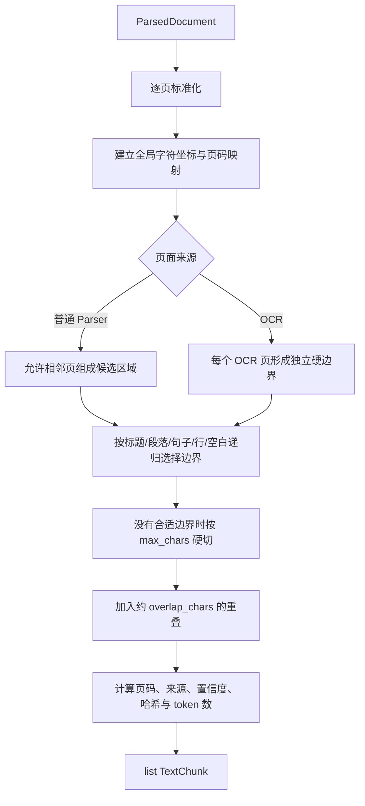

# Chunker 逻辑、输入输出与策略选择

## 1. Chunker 解决什么问题

Embedding 模型不能把任意长文档无损压缩成一个向量。整篇文档只生成一个向量会稀释局部细节；切得太碎又会丢失上下文。因此 Chunker 的目标不是“每 800 字切一刀”，而是在以下目标之间取平衡：

- 每个 Chunk 聚焦相对完整的语义；
- 长度不超过模型和系统限制；
- 相邻 Chunk 保留少量上下文；
- 命中后能追溯到原文页码和字符位置；
- 相同输入与配置产生相同的顺序、范围和内容哈希。

当前实现是一个适合本项目第一版的可解释基线：目标 800 字符、最大 1,000 字符、重叠约 100 字符。

## 2. 当前处理流程



### 2.1 文本标准化

`normalize_text()` 执行：

1. `CRLF`、`CR` 统一为 `LF`；
2. 删除每行末尾空格；
3. 连续多个空行最多保留一个；
4. 删除文档首尾空白。

先标准化再计算坐标非常重要。数据库中的 `char_start/char_end` 指向的是“标准化全文”，而不是格式不稳定的原始字节：

```python
normalized[chunk.char_start:chunk.char_end] == chunk.content
```

### 2.2 边界优先级

当内容超过目标长度时，依次寻找：

1. Markdown 标题起点；
2. 段落边界；
3. 中英文句子结束标点；
4. 换行；
5. 空格；
6. 最大长度处硬切。

标题和段落比固定长度更能代表作者原本的内容结构；句子边界可以避免把一句话拆成两半；硬切只作为兜底，确保任何超长内容都不会突破 `max_chars`。

### 2.3 为什么需要重叠

如果定义在 Chunk A 结尾，而结论在 Chunk B 开头，完全无重叠可能使两个 Chunk 都缺少完整语义。约 100 字符的重叠让边界附近内容同时出现在相邻向量中。

代价是：

- 向量数量与存储略微增加；
- 相邻结果可能包含重复正文；
- Search 层以后可能需要去重或合并相邻 Chunk。

所以重叠不是越大越好，应通过 Recall@5 和实际问题集调整。

### 2.4 为什么 OCR 页不能跨页

OCR 的错误率和置信度以页面为单位。若把第 2 页 OCR 内容和第 3 页普通文本合成一个 Chunk，就难以准确解释来源与置信度。因此 OCR 页面是硬边界：可以在同一 OCR 页内部切成多个 Chunk，但不能和前后页面合并。

普通 Parser 页面可以跨页合并，并记录 `page_start/page_end`，因为文本层的页码边界通常不代表语义边界。

## 3. 输入输出对照

输入：

```text
# 数据库迁移

Alembic 使用 revision 文件描述结构变化。


执行 upgrade 后，数据库进入新的 revision。
```

标准化后：

```text
# 数据库迁移

Alembic 使用 revision 文件描述结构变化。

执行 upgrade 后，数据库进入新的 revision。
```

假设使用较小的演示窗口，可能得到：

| chunk_index | content | char_start/end | page | source |
|---:|---|---|---|---|
| 0 | `# 数据库迁移 ... 描述结构变化。` | `[0, 39)` | 1 | parser |
| 1 | `描述结构变化。 ... 新的 revision。` | `[31, 70)` | 1 | parser |

两个范围发生重叠是有意设计；每个范围都能在标准化全文中直接切片验证。

`token_count` 支持注入真实模型 tokenizer。任务 8 单独运行时默认使用字符数作为可解释的临时计数；任务 9 接入 BGE 后，处理 Service 应注入 Embedding Provider 的 `count_tokens()`，数据库最终保存模型真实 token 数。

## 4. RAG 常见 Chunker 策略

| 策略 | 做法 | 优点 | 局限 | 适用场景 |
|---|---|---|---|---|
| 固定长度 | 每 N 个字符/token 切分 | 简单、快、稳定 | 容易切断语义 | 日志、统一短文本、最初基线 |
| 递归结构切分 | 标题→段落→句子→字符 | 可解释、无需模型 | 不能判断跨段语义 | 本项目当前阶段、Markdown、制度文档 |
| 文档结构切分 | 按 HTML、Markdown、PDF 标题、章节、表格切 | 尊重作者结构 | 依赖高质量版面解析 | 手册、报告、合同、论文 |
| 语义切分 | 比较相邻句向量，在语义突变处切分 | 主题边界更自然 | 预处理慢、阈值敏感 | 长段落、转写文本、结构较弱文档 |
| 父子/小块检索大块返回 | 小 Chunk 建索引，命中后返回父段落 | 兼顾召回精度和回答上下文 | 需要父子模型与二次回查 | FAQ、手册、长章节 |
| 多粒度索引 | 同时保存句子、段落、章节向量 | 适应事实题和总结题 | 向量量大、去重复杂 | 查询类型差异大 |
| 上下文化 Chunk | 给 Chunk 前置文档标题、章节或生成的上下文 | 减少代词和背景丢失 | 增加 token/生成成本 | 多份相似文档、财报、版本化制度 |
| Late Chunking | 先用长上下文模型编码全文，再对 token 表示分块池化 | 保留跨 Chunk 上下文 | 需要支持长上下文和 token 级输出的模型 | 指代多、上下文依赖强的长文档 |
| 层次树/RAPTOR | 聚类叶子 Chunk 并递归生成摘要节点 | 支持全局性、跨章节问题 | 建索引成本高、更新复杂 | 长书、研究资料、多跳问答 |

## 5. 本项目为什么先采用当前方案

当前阶段最重要的是打通可验证链路，而不是一开始就采用最复杂算法：

- BGE-small 的上下文窗口有限，必须控制 Chunk 长度；
- PostgreSQL 需要保存稳定范围和页码，规则式切分最容易审计；
- OCR 结果可能有噪声，结构规则比额外调用模型更稳定；
- 任务 17 会建立 10 个问题的召回评测，届时才能用数据调整窗口，而不是凭感觉调参；
- 第五周还会加入 Reranker，先保留一个清晰基线才能判断改进来自哪里。

推荐演进顺序：

1. 当前递归边界切分作为基线；
2. 为 Chunk 补充文档名和章节标题上下文；
3. 实现“小块检索、父块返回”；
4. 用评测集比较固定、递归、语义切分；
5. 只有出现大量跨章节和全局问题时，再考虑 RAPTOR 或多粒度索引。

## 6. 参考资料

- [Anthropic：Contextual Retrieval](https://www.anthropic.com/engineering/contextual-retrieval)
- [LlamaIndex：Semantic Splitter](https://docs.llamaindex.ai/en/stable/api_reference/node_parsers/semantic_splitter/)
- [Late Chunking 论文](https://arxiv.org/abs/2409.04701)
- [RAPTOR 论文](https://arxiv.org/abs/2401.18059)
