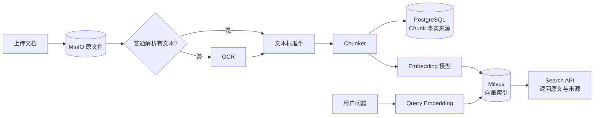

# 第四周学习任务清单：文档入库与向量检索

> 主要技术：Parser、OCR、Chunk、Embedding、Milvus
>
> 阶段目标：打通“原文件 → 文本 → Chunk → 向量 → 语义检索”的完整链路。
>
> 前置条件：FastAPI、PostgreSQL、MinIO、Redis、Docker Compose 已在 Linux 服务器运行。

## 1. 本周完成定义

本周不是只保存 Chunk，而是必须完成可运行的语义检索：



最低验收结果：

1. 上传 TXT、Markdown、文本型 PDF、DOCX 后可触发处理；
2. 至少一份扫描图片或扫描 PDF 真实调用 OCR 得到文字；
3. PostgreSQL 保存 Chunk 正文与页码来源；
4. Embedding 模型生成固定维度向量；
5. Milvus 保存并检索 Chunk 向量；
6. `/api/v1/search` 能用自然语言返回 Top K 相关片段；
7. 每条结果包含 `document_id`、`chunk_id`、页码、正文与相似度；
8. 自动化测试、学习文档和真实样例齐全。

## 2. 技术选择与边界

### 2.1 Parser

| 文件类型 | 第一版工具 | 处理方式 |
| --- | --- | --- |
| TXT / Markdown | Python 标准库 | UTF-8 解码，保留段落与标题 |
| PDF | `pypdf` | 按页提取文本，保留页码 |
| DOCX | `python-docx` | 提取段落、标题和基础表格文本 |
| 扫描 PDF / 图片 | PaddleOCR CPU | 普通解析无有效文本时启用 |

OCR 采用“按需回退”，而不是所有 PDF 都跑 OCR。普通 PDF 直接提取通常更快、更准确，也能避免重复文字。PaddleOCR 官方支持 CPU 推理；本周只处理清晰中文/英文样例，不做复杂版面、手写体和表格结构还原。

### 2.2 Embedding

第一版建议使用 `BAAI/bge-small-zh-v1.5`：模型约 24M 参数、输出 512 维向量，适合没有 GPU 的学习服务器。通过 `sentence-transformers` 或 `FlagEmbedding` 封装为 `EmbeddingProvider`，批量处理 Chunk，并对向量做归一化。

模型名和维度必须配置化：

```dotenv
EMBEDDING_MODEL=BAAI/bge-small-zh-v1.5
EMBEDDING_DIMENSION=512
EMBEDDING_DEVICE=cpu
```

如果服务器无法访问 Hugging Face，应先在可访问环境下载模型并放入持久化模型目录，或者使用允许访问的模型镜像；不能在每次 API 启动时重新下载。

### 2.3 Milvus

学习与代码开发可先使用 `pymilvus` 的统一客户端 API；服务器验收使用 Milvus Standalone。Milvus 官方提供 Lite、Standalone 和 Distributed 三种形态，客户端 API 可复用。本项目第四周使用 Standalone，不做集群高可用。

Milvus 只保存检索索引及关联标识，正文事实来源仍是 PostgreSQL：

| Milvus 字段 | 作用 |
| --- | --- |
| `chunk_id` | 主键，与 PostgreSQL Chunk 对应 |
| `document_id` | 标量过滤和删除文档向量 |
| `embedding` | 512 维浮点向量 |
| `page_number` | 可选标量过滤或展示 |

正文 `content` 可以只保存在 PostgreSQL。检索到 `chunk_id` 后批量回查 PostgreSQL，避免双份正文产生一致性问题。

### 2.4 本周暂不做

- Reranker 和混合检索；
- Neo4j、实体和关系抽取；
- Agno、MCP、Skills；
- LLM 生成答案和 RAG；
- Celery、Kafka、RabbitMQ 等异步队列；
- OCR 表格结构、版面还原、手写体和 GPU 优化。

## 3. 阶段一：数据模型、迁移与状态机

### 学习内容

- 一对多关系、外键、唯一约束、索引和级联删除；
- PostgreSQL 保存正文、Milvus 保存向量的职责拆分；
- Alembic 新迁移、升级和回滚 SQL；
- 处理任务的状态转换与幂等性。

### PostgreSQL 设计

`documents` 可增加：

| 字段 | 作用 |
| --- | --- |
| `parsed_at` | 最近成功处理时间 |
| `processing_error` | 最近失败原因 |
| `content_hash` | 判断原文件或解析内容是否变化 |

新增 `document_chunks`：

| 字段 | 作用 |
| --- | --- |
| `id` | UUID 主键，同时作为 Milvus 主键 |
| `document_id` | 外键，关联 `documents.id` |
| `chunk_index` | 文档内从 0 开始的稳定顺序 |
| `content` | Chunk 正文 |
| `char_start` / `char_end` | 标准化全文字符范围 |
| `page_number` | 来源页码，可为空 |
| `source_type` | `parser` 或 `ocr` |
| `created_at` | 创建时间 |

约束：

- `UNIQUE(document_id, chunk_index)`；
- `content` 不允许空白；
- 删除 Document 时级联删除 Chunk；
- 重建 Chunk 时使用事务替换，不能让新旧两套结果混合。

状态沿用现有 `uploaded / processing / ready / failed`：

```text
uploaded → processing → ready
                    └→ failed
ready → processing  # 允许重新处理
```

### 产出

- `DocumentChunk` 领域模型；
- `DocumentChunkORM` 与 Repository；
- Alembic 迁移；
- ORM、迁移和约束测试。

## 4. 阶段二：Parser 与 OCR

### 模块结构

```text
src/knowledge_assistant/processing/
├── parsers/
│   ├── base.py
│   ├── text_parser.py
│   ├── pdf_parser.py
│   └── docx_parser.py
├── ocr/
│   ├── base.py
│   └── paddle_ocr.py
└── models.py
```

核心抽象：

```text
DocumentParser.parse(stream) → ParsedDocument
OcrProvider.recognize(page_image) → OcrPage
```

`ParsedDocument` 至少包含页面或段落列表、来源类型、页码和文本。Parser 不直接写数据库，也不调用 Milvus，便于独立测试。

### OCR 触发规则

PDF 按页判断：

1. `pypdf` 尝试提取；
2. 去除空白后文本长度达到阈值，采用 Parser 文本；
3. 文本为空、极短或乱码比例过高，渲染该页为图片；
4. 调用 OCR；
5. 保存 `source_type=ocr`、页码和可获得的置信度。

不要因为整份 PDF 有一页文字就跳过其他扫描页，判断单位应是“页”。

### 测试样例

- 一份 UTF-8 TXT；
- 一份带标题的 Markdown；
- 一份两页文本 PDF；
- 一份包含标题、段落和表格的 DOCX；
- 一张清晰中文图片或一页扫描 PDF；
- 一个损坏文件和一个空文件。

## 5. 阶段三：Chunker 与可追溯性

第一版采用可解释基线：

1. 统一换行符和空白；
2. 优先按标题、段落累积；
3. 目标 800 字符，最大 1,000 字符；
4. 超长段落按句子标点继续拆分；
5. 相邻 Chunk 重叠约 100 字符；
6. 保存 `chunk_index`、字符范围、页码和 `source_type`；
7. 不跨页拼接 OCR 结果，避免页码追溯失真。

必须测试：空文本、短文本、边界长度、超长段落、多页文本、重叠范围、中文标点和重复处理。

阶段输出不是“若干字符串”，而是一组结构化 `TextChunk`，可被 PostgreSQL、Embedding 和 API 共用。

## 6. 阶段四：Embedding 与模型管理

### 核心抽象

```text
EmbeddingProvider.embed_documents(texts) → list[list[float]]
EmbeddingProvider.embed_query(query) → list[float]
```

文档和查询可以使用同一模型，但应保留两个方法，因为部分模型对 query 有专用前缀。实现必须校验：

- 返回向量数量与输入文本数量一致；
- 每个向量维度等于配置值；
- 空列表不调用模型；
- 空查询直接拒绝；
- 批量大小可配置，避免内存峰值；
- 模型在进程内复用，不在每个请求中重新加载。

需要记录到文档或日志的模型元数据：模型名称、版本或本地路径、向量维度、归一化方式和处理耗时。模型变化时必须重建整套 Milvus 向量，不能把不同模型的向量混在同一 Collection。

## 7. 阶段五：Milvus Collection 与向量 Repository

建议增加 `VectorRepository` 抽象，业务 Service 不直接依赖 `pymilvus`：

```text
upsert(chunks, embeddings)
search(query_vector, top_k, document_ids=None)
delete_by_document_id(document_id)
```

Collection 初始设计：

- 名称：`document_chunks_v1`；
- 主键：字符串形式 `chunk_id`；
- 向量：`FLOAT_VECTOR(512)`；
- 距离：归一化向量使用 `COSINE`；
- 索引：数据量较小时先用简单索引或 Milvus 默认策略，不急于调复杂参数；
- `document_id` 作为过滤字段。

一致性顺序：

```text
解析并在 PostgreSQL 保存 Chunk
  → 生成 Embedding
  → 写入 Milvus
  → 全部成功后 document.status = ready
```

若向量写入失败，Document 标记 `failed`，保留 PostgreSQL Chunk 便于重试。重新处理时先用 `document_id` 删除旧向量，再写入新向量；删除文档时同时删除 PostgreSQL Chunk 和 Milvus 向量。

## 8. 阶段六：处理 API 与 Search API

### 接口

| 方法 | 路径 | 作用 |
| --- | --- | --- |
| `POST` | `/api/v1/documents/{id}/process` | 解析、按需 OCR、分块、向量化和入库 |
| `GET` | `/api/v1/documents/{id}/chunks` | 分页查看 PostgreSQL Chunk |
| `POST` | `/api/v1/search` | 对查询向量化并从 Milvus 召回 Top K |

Search 请求示例：

```json
{
  "query": "如何配置数据库迁移？",
  "top_k": 5,
  "document_ids": null
}
```

响应至少包含：

```json
{
  "items": [
    {
      "document_id": "...",
      "chunk_id": "...",
      "content": "...",
      "page_number": 3,
      "score": 0.82
    }
  ]
}
```

由 Milvus 返回 `chunk_id + score`，再从 PostgreSQL 批量获取正文和来源。API 不应直接相信客户端传入的向量维度，也不把模型内部异常原样暴露给客户端。

可以把 `GET /documents/{id}/chunks` 或 Search 的 `document_ids` 过滤留给你自己实现，再进行代码审阅。

## 9. 阶段七：评测、服务器验收与文档

至少准备 5 份文档和 10 个问题，每个问题标注一个预期 Chunk。由于第五周才接入 Reranker，本周主要观察召回能力：

- Recall@5：正确 Chunk 是否进入前 5；
- Top 1 命中情况；
- OCR 文档是否能被检索；
- 返回页码和原文是否正确；
- 单文档处理耗时；
- 单次搜索耗时；
- 删除和重新处理是否留下重复向量。

服务器演示链：

```text
Compose 启动
  → 上传文本 PDF
  → 上传扫描样例
  → 分别调用 process
  → 查看 PostgreSQL Chunk
  → 查看 Milvus Collection
  → 用两个自然语言问题调用 search
  → 展示命中原文、页码和分数
```

必须形成：

- 《Parser、OCR 与文本质量》；
- 《Chunk、Embedding 与 Milvus 原理》；
- 《语义检索 API 调用链与一致性》；
- 《第四周召回测试与学习总结》；
- 自动化测试和真实运行截图或命令记录。

## 10. 建议进度

考虑工作日时间有限，采用“周末搭骨架、工作日晚间完成小闭环”的方式：

| 时间 | 主要任务 | 必须产出 |
| --- | --- | --- |
| 周末/第 1 天 | Chunk 表、迁移、Parser 抽象、TXT/MD | 数据表和纯文本解析测试 |
| 第 2 天 | PDF/DOCX Parser、按页 OCR | 多格式与扫描样例可提取 |
| 第 3 天 | Chunker、Embedding Provider | 结构化 Chunk 和 512 维向量 |
| 第 4 天 | Milvus 部署、Collection、VectorRepository | 向量可写入、查询和删除 |
| 第 5 天 | Process API、Search API、评测与文档 | 端到端检索和汇报材料 |

如果出现模型下载或 Milvus 镜像网络问题，先保留已经通过单元测试的代码，通过离线导入模型和镜像解决部署；不要用假向量冒充真实验收结果。

## 11. 官方参考资料

- [PaddleOCR 通用 OCR Pipeline](https://www.paddleocr.ai/main/en/version3.x/pipeline_usage/OCR.html)
- [BAAI/bge-small-zh-v1.5 模型卡](https://huggingface.co/BAAI/bge-small-zh-v1.5)
- [Milvus 部署形态说明](https://milvus.io/docs/install-overview.md)
- [Milvus Standalone Docker Compose](https://milvus.io/docs/install_standalone-docker-compose.md)
