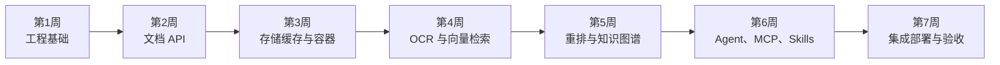

# Knowledge Assistant 七周学习与交付计划

## 1. 规划原则

项目按七周完成，每周必须同时具备四类产出：

1. 可运行的产品能力；
2. 自动化测试或可重复验收命令；
3. 能说明原理、常用 API、数据流和取舍的学习文档；
4. 一个可在汇报中演示的真实样例。

各周不是彼此独立的技术 Demo，而是沿同一条文档知识链逐步增加能力：



## 2. 七周总览

| 周次 | 阶段 | 主要技术 | 阶段目标 | 核心产出 |
| --- | --- | --- | --- | --- |
| 第 1 周 | 工程基础 | Python、Linux、AI Coding | 建立规范项目骨架和基础开发能力 | CLI、Document 模型、日志、测试和学习记录 |
| 第 2 周 | Web 与关系数据库 | FastAPI、Pydantic、SQLAlchemy、Alembic、PostgreSQL | 完成文档管理 API 和数据库迁移 | CRUD API、Repository、迁移、接口测试 |
| 第 3 周 | 数据与容器 | MinIO、Redis、Docker、Docker Compose | 完成原文件、元数据、缓存和容器化 | MinIO Adapter、Cache Aside、四服务 Compose、Linux 验收 |
| 第 4 周 | 文档入库与向量检索 | OCR、Embedding、Milvus | 打通文档解析到语义检索 | Parser/OCR、Chunk 表、向量入库、Search API |
| 第 5 周 | 检索增强与知识图谱 | Reranker、Neo4j | 提升排序质量并支持关系查询 | 重排对比、图模型、实体关系、图谱 API |
| 第 6 周 | Agent 与协议 | Agno、MCP、Skills | 完成 Agent 工具调用和 MCP 服务 | Agent、工具集、MCP Server、Skill 示例 |
| 第 7 周 | 集成与部署 | Nginx、Linux、Docker Compose | 完成系统联调、部署、验收和汇报 | 网关、完整编排、演示脚本、测试与总结 |

原始计划第三周包含 MySQL 对比。实际项目已经选择 PostgreSQL 作为唯一关系数据库，并将时间投入到更直接服务于文档系统的 MinIO 对象存储。MySQL 只保留在技术选型说明中，不实现双数据库适配，避免偏离主线。

## 3. 第 1～3 周已完成基线

| 能力 | 状态 | 后续依赖 |
| --- | --- | --- |
| Python 工程、CLI、日志、pytest、Ruff、mypy | 已完成 | 所有后续开发规范 |
| FastAPI、Pydantic、CRUD API | 已完成 | Process/Search/Agent API |
| PostgreSQL、SQLAlchemy、Alembic | 已完成 | Chunk、任务和图谱来源数据 |
| MinIO 原文件保存 | 已完成 | Parser/OCR 输入 |
| Redis Cache Aside | 已完成 | 文档缓存和后续 Agent 临时状态 |
| Dockerfile、Docker Compose、Linux 验收 | 已完成 | Milvus、Neo4j 和最终部署 |

## 4. 第 4 周：文档入库与向量检索

完整目标：

```text
MinIO 原文件
  → Parser / OCR
  → Chunk
  → PostgreSQL
  → Embedding
  → Milvus
  → Search API
```

核心验收：文本 PDF 和扫描样例都能检索；结果带 Chunk、页码和分数；重新处理不会重复写入。详细阶段见：[第四周学习任务清单](week04/第四周学习任务清单.md)。

## 5. 第 5 周：检索增强与知识图谱

### Reranker 主线

```text
Milvus 召回 Top 20～30
  → Reranker 对 query + chunk 打分
  → 返回 Top 5
```

产出：

- `RerankerProvider` 抽象与一个实际模型；
- `/search` 支持 `rerank=true`；
- 至少 20 个问题的小型评测集；
- Recall@K、MRR、Top 5 命中率及重排前后对比。

### Neo4j 主线

第一版图模型：

```text
(Document)-[:HAS_CHUNK]->(Chunk)
(Chunk)-[:MENTIONS]->(Entity)
(Entity)-[:RELATED_TO]->(Entity)
```

使用规则或模型从小样本文档抽取实体关系，保存来源 `chunk_id`。提供 Cypher 示例和至少一个图谱查询 API。图谱用于实体关系和路径查询，不替代 Milvus 语义检索。

## 6. 第 6 周：Agent、MCP 与 Skills

### Agno Agent

Agent 至少能调用：

- `search_documents(query)`；
- `get_document(document_id)`；
- `query_graph(entity)`；
- `list_documents()`。

回答必须包含证据 Chunk 或文档来源；无证据时不编造答案。

### MCP Server

将文档搜索和详情查询暴露为 MCP Tools，明确工具名称、输入 Schema、输出 Schema、错误处理和权限边界。使用 MCP Inspector 或兼容客户端进行调用演示。

### Skills

编写至少一个可重复使用的项目 Skill，例如“从知识库检索并形成带引用的技术说明”，记录 Skill 与普通 Prompt、MCP Tool 的区别。

## 7. 第 7 周：集成、部署、验收与汇报

最终架构：

```text
Nginx
  → FastAPI / Agent / MCP
      → PostgreSQL
      → MinIO
      → Redis
      → Milvus
      → Neo4j
```

主要工作：

- Nginx 反向代理、请求大小与超时；
- 完整 Docker Compose、健康检查、启动依赖和命名卷；
- `.env`、应用账号、最小权限和端口暴露检查；
- 备份恢复、日志查看、故障排查和部署文档；
- 端到端测试：上传、处理、检索、重排、图谱、Agent、MCP；
- 汇报 PPT 或 Markdown、演示脚本、架构图和技术复盘。

## 8. 每周汇报模板

每周汇报固定回答五个问题：

1. 本周新增了什么用户可见能力？
2. 调用链和数据流是什么？
3. 学到了哪些核心技术原理和常用 API？
4. 遇到了什么问题，如何定位和验证？
5. 下周在当前能力上增加什么，而不是另起一个 Demo？

演示顺序固定为：先展示结果，再展示架构和调用链，最后展示测试与问题复盘。

## 9. 风险与压缩策略

| 风险 | 处理方式 |
| --- | --- |
| 工作日时间有限 | 周末搭骨架，工作日晚间完成可测试小步骤 |
| Docker Hub、PyPI、模型站点受限 | 提前验证镜像源，模型离线缓存，禁止每次启动下载 |
| OCR/Embedding CPU 较慢 | 只处理小样例，批量可配置，先保证正确性 |
| Milvus、Neo4j 增加内存压力 | 使用 Standalone，限制样例规模，监控容器内存 |
| 一周集成技术过多 | 每阶段有最低完成线；复杂优化和异步化不进入本周 |
| AI 生成代码难以讲解 | 每个模块必须有原理文档、调用链、测试和自行实现部分 |

压缩排期不等于省略基础数据质量。第四周如果 Parser/OCR 输出错误，后续向量检索、Reranker、知识图谱和 Agent 都会继承错误，因此每一阶段仍要保留测试和可追溯字段。
