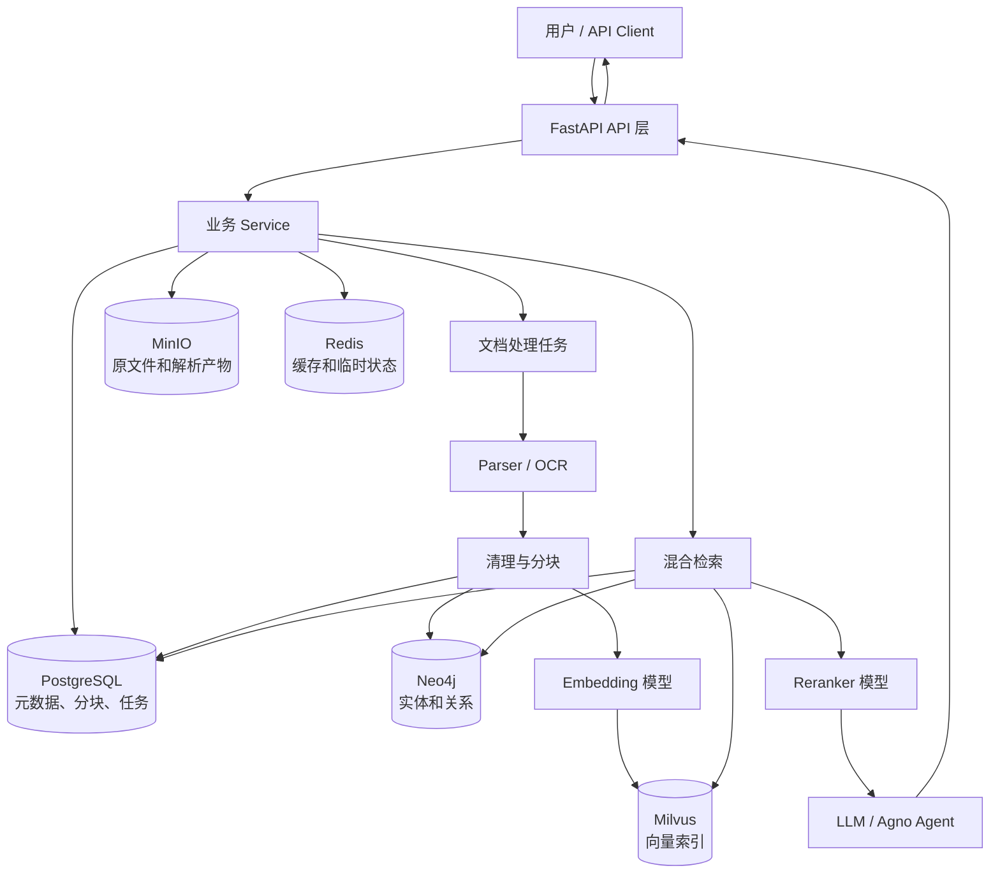
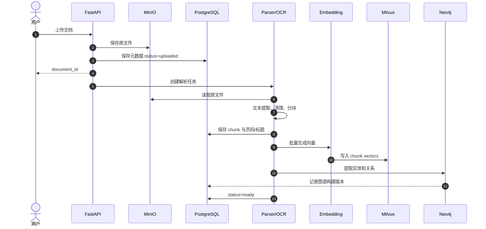
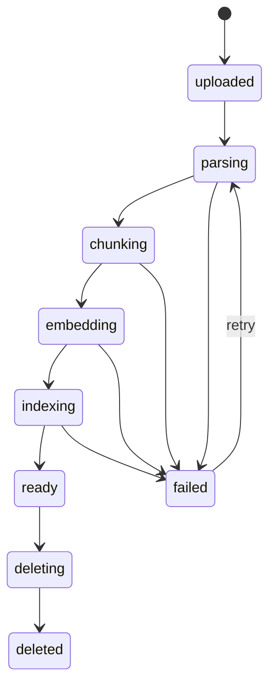
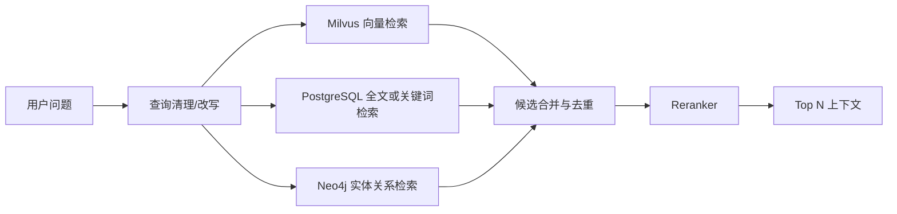
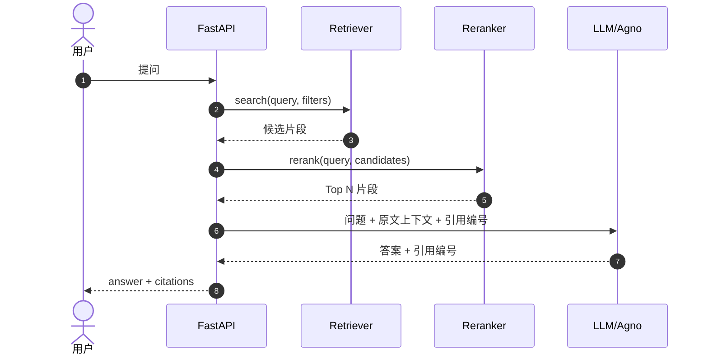

# Knowledge Assistant 功能目标与技术路线

> 本文是项目的全局目标文档。各周学习计划应服务于这里的产品能力，而不是为了使用技术而堆叠技术。

## 1. 产品定位

Knowledge Assistant 是一个面向企业内部文档的知识检索与问答系统。用户可以上传 PDF、DOCX、TXT、Markdown 或扫描件，系统完成解析、切分、索引和知识关联，并在回答问题时返回可核验的原文引用。

最终目标不是“做一个能聊天的页面”，而是建立以下闭环：

```text
文档可管理
  → 内容可解析
  → 片段可检索
  → 结果可重排
  → 问题可回答
  → 答案可引用和追溯
  → 数据可删除和重建
```

## 2. 目标用户与核心场景

### 主要用户

- 需要快速查找项目资料、规范和制度的研发人员。
- 需要跨多个文档汇总信息的产品、运营或项目人员。
- 需要确认答案出处和版本的审核人员。
- 维护企业知识库和文档权限的管理员。

### 核心场景

1. 上传一份或一批文档，查看处理状态。
2. 按关键词搜索包含指定术语的原文片段。
3. 用自然语言提问，得到带文档名、页码或片段编号的答案。
4. 查看某个答案使用了哪些原文依据。
5. 查询一个实体与其他实体的关系，例如“系统 A 依赖哪些服务”。
6. 更新或删除文档后，旧向量、旧图谱和旧缓存不会继续参与回答。
7. 解析失败时能看到失败阶段和错误原因，并支持重试。

## 3. MVP 功能边界

第一版可演示 MVP 必须完成：

- 文档上传、列表、详情、状态修改和删除。
- MinIO 保存原文件，PostgreSQL 保存元数据。
- PDF、DOCX、TXT、Markdown 文本解析。
- 基于规则的文本清理和分块。
- Embedding 生成和 Milvus 向量存储。
- 单路向量检索 API。
- Reranker 对候选片段重新排序。
- 基于检索结果生成回答。
- 回答返回文档、片段和页码等引用。
- Redis 缓存文档详情和短期查询结果。
- Docker Compose 一键启动基础服务。

MVP 暂不要求：

- 多租户和复杂 RBAC。
- 实时多人协作编辑。
- Kubernetes 和生产级高可用。
- 大规模分布式任务平台。
- 复杂前端工作台。
- 图数据库参与每一次简单问答。
- 同时支持 PostgreSQL 和 MySQL。

## 4. 当前已完成基线

| 能力 | 状态 | 说明 |
| --- | --- | --- |
| Python 工程结构、CLI、日志 | 已完成 | 第一周产出 |
| FastAPI 文档 CRUD | 已完成 | 请求/响应 Schema 和路由拆分 |
| PostgreSQL、SQLAlchemy、Alembic | 已完成 | 元数据持久化与迁移 |
| MinIO 原文件存储 | 已完成 | 独立应用账号和最小权限 |
| Redis 文档详情缓存 | 已完成 | Cache Aside、TTL、失效和降级 |
| Dockerfile | 已有骨架 | 需要最终 Compose 验收 |
| Docker Compose 四服务编排 | 已完成 | Linux 服务器已验收 |
| 文档解析、切块 | 未开始 | 后续主线第一步 |
| Embedding、Milvus | 未开始 | 向量检索主线 |
| Reranker | 未开始 | 提升候选排序质量 |
| OCR | 未开始 | 扫描件和图片文本提取 |
| Neo4j 知识图谱 | 未开始 | 实体关系检索与解释 |
| RAG 问答、Agno | 未开始 | 组装检索和模型调用 |
| MCP、Skills | 未开始 | 对外提供工具和标准化能力 |

## 5. 目标系统架构



## 6. 文档入库流程



### 状态机



状态必须反映处理进度，否则用户只知道“上传成功”，不知道文档是否已经可以检索。

## 7. 文档解析与分块

### 解析目标

把不同格式转换为统一结构：

```text
Document
  ├── metadata
  ├── pages / sections
  └── chunks
        ├── chunk_id
        ├── text
        ├── page_number
        ├── section_title
        ├── token_count
        └── content_hash
```

### 格式处理

| 格式 | 第一版处理方式 |
| --- | --- |
| TXT / Markdown | 直接解码，保留标题结构 |
| PDF | 提取每页文本和页码 |
| DOCX | 提取标题、段落和表格文本 |
| 扫描 PDF / 图片 | OCR 后保留页码和置信度 |

### 分块策略

第一版建议：

- 优先按标题、段落和页面等语义边界切分。
- 过长段落再按 token 数切分。
- 相邻 Chunk 保留少量 overlap，避免答案跨边界丢失。
- 每个 Chunk 必须能追溯到 document_id、页码和原文位置。
- 使用内容哈希判断文档或片段是否需要重新索引。

不要一开始只使用固定字符数暴力切分。分块质量会直接影响向量检索和最终回答质量。

## 8. 向量检索与 Milvus

### Embedding 是什么

Embedding 模型把文本转换成固定维度的浮点向量。语义相近的文本，在向量空间中的距离通常更近。

```text
“如何重置数据库密码”
        ↓ Embedding
[0.012, -0.184, ..., 0.073]
```

### Milvus 保存什么

建议 Collection 字段：

| 字段 | 作用 |
| --- | --- |
| `chunk_id` | 与 PostgreSQL Chunk 对应 |
| `document_id` | 按文档过滤和删除 |
| `embedding` | 向量字段 |
| `embedding_model` | 模型名称或版本 |
| `document_version` | 避免旧版本参与检索 |
| `created_at` | 索引时间 |

正文和复杂业务元数据仍以 PostgreSQL 为准。Milvus 重点负责向量近邻搜索，不替代关系数据库。

### 检索 API

建议新增：

```text
POST /api/v1/search
```

请求示例：

```json
{
  "query": "文档上传后保存在哪里？",
  "top_k": 10,
  "document_ids": [],
  "use_reranker": true
}
```

响应包含：

- chunk_id
- document_id 和文档名
- 原文片段
- 页码或章节
- 向量相似度
- Reranker 分数

## 9. 检索策略

只做向量检索并不能覆盖所有情况：型号、编号、精确术语和专有名词通常更适合关键词检索。因此目标是混合检索。



实施顺序：

1. 先完成单路向量检索，建立可测基线。
2. 加入关键词检索，处理精确匹配。
3. 使用加权或 RRF 合并候选。
4. 使用 Reranker 重新排序。
5. 最后按问题类型决定是否查询知识图谱。

## 10. Reranker 的作用

Embedding 检索适合从大量片段中快速召回候选，但 Top K 排序未必足够精确。Reranker 同时阅读“问题 + 候选片段”，输出更精确的相关性分数。

```text
Milvus 召回 Top 30
  → Reranker 精排
  → 取 Top 5 给 LLM
```

Reranker 更慢，所以不能对全部 Chunk 执行，只对初步召回候选运行。产出中需要对比“只用向量”和“向量 + Reranker”的检索结果。

## 11. OCR 模块

OCR 只在普通解析无法得到有效文本时启用：

```text
PDF 文本层存在且质量合格 → 普通解析
PDF 无文本或乱码比例高 → 转图片 → OCR
```

OCR 产出至少包含：

- page_number
- text
- confidence
- bounding boxes（后续可选）
- OCR model/version

OCR 结果不能直接当作绝对正确文本。低置信度页面应标记，回答引用时可以提示“来源于 OCR”。

## 12. 知识图谱与 Neo4j

### 图谱解决什么问题

向量检索擅长语义相似，知识图谱擅长明确关系和多跳问题：

```text
系统 A --依赖--> Redis
系统 A --部署于--> 服务器 B
服务器 B --属于--> 测试环境
```

适合的问题：

- “系统 A 依赖哪些数据库？”
- “某服务故障会影响哪些模块？”
- “负责人 X 管理哪些项目？”
- “从组件 A 到组件 D 有什么依赖路径？”

### 第一版图模型

节点：

- `Document`
- `Chunk`
- `System`
- `Service`
- `Database`
- `Person`
- `Organization`

关系：

- `MENTIONS`
- `DEPENDS_ON`
- `DEPLOYED_ON`
- `OWNED_BY`
- `BELONGS_TO`
- `DERIVED_FROM`

每条实体或关系必须保留来源 chunk_id 和抽取版本，否则无法解释图谱信息来自哪里。

### 图谱不替代向量检索

并非所有文档都适合稳定抽取实体关系，也并非所有问题都需要多跳查询。第一版采用“向量检索为主、图谱按需增强”，避免把简单问答都变成复杂 Cypher 查询。

## 13. RAG 问答与引用

建议新增：

```text
POST /api/v1/answers
```



回答必须包含：

- `answer`
- `citations[]`
- 每条引用的 document_id、文档名、chunk_id、页码和原文摘要
- 使用的模型版本
- 无足够依据时明确回答“不确定”

评价重点不是语言是否流畅，而是答案是否由检索到的证据支持。

## 14. 数据删除和重建

删除文档最终需要清理：

```text
PostgreSQL 文档和 Chunk
MinIO 原文件和解析产物
Milvus 向量
Neo4j 来源关系
Redis 缓存
```

跨多个系统无法依赖单个数据库事务。建议使用状态机和后台补偿：

```text
ready → deleting → deleted
                  ↘ delete_failed → retry
```

所有下游记录必须带 document_id 和版本号，才能批量删除、重建并避免旧索引继续参与检索。

## 15. 后续 API 规划

| 接口 | 用途 | 阶段 |
| --- | --- | --- |
| `POST /documents` | 上传原文件 | 已完成 |
| `GET /documents` | 分页列表 | 已完成 |
| `GET /documents/{id}` | 文档详情 | 已完成 |
| `PATCH /documents/{id}` | 更新名称/状态 | 已完成 |
| `DELETE /documents/{id}` | 删除文档 | 已完成基础版 |
| `POST /documents/{id}/process` | 启动或重试解析 | 文档处理阶段 |
| `GET /documents/{id}/chunks` | 查看分块结果 | 文档处理阶段 |
| `POST /search` | 返回检索片段 | 向量检索阶段 |
| `POST /answers` | RAG 回答与引用 | 问答阶段 |
| `GET /tasks/{id}` | 查看处理进度 | 异步任务阶段 |
| `GET /graph/entities/{id}` | 查看实体关系 | 图谱阶段 |

## 16. 里程碑与每周产出

| 周次 | 产品目标 | 技术重点 | 必须产出 |
| --- | --- | --- | --- |
| 第 1 周 | 可管理本地文档 | Python、CLI、日志、测试 | CLI、文档模型、学习文档 |
| 第 2 周 | 文档元数据 API | FastAPI、Pydantic、PostgreSQL、SQLAlchemy、Alembic | CRUD API、迁移、测试 |
| 第 3 周 | 基础设施可重复运行 | MinIO、Redis、Docker、Compose | 对象存储、缓存、四服务 Compose（已完成） |
| 第 4 周 | 打通文档入库与向量检索 | Parser、OCR、Chunk、Embedding、Milvus | 处理接口、向量入库、Search API、召回样例 |
| 第 5 周 | 检索增强与知识图谱 | Reranker、Neo4j、实体关系抽取 | 重排对比、图模型、图谱查询 API |
| 第 6 周 | Agent 与协议 | Agno、MCP、Skills | Agent 工具调用、MCP Server、Skill 示例 |
| 第 7 周 | 集成、部署与验收 | Nginx、Linux、Docker Compose | 完整部署、演示脚本、测试报告和汇报材料 |

每周不是“学完一个技术”，而是交付一个可运行、可测试、可讲解的产品能力。

## 17. 检索质量验收

在实现 Milvus 前先建立一个小型评测集，例如：

```text
20 个测试问题
每个问题标注 1～3 个正确 Chunk
覆盖语义问法、精确术语、跨页信息和无答案问题
```

建议记录：

- Recall@K：正确片段是否进入前 K。
- MRR：第一个正确片段排在多前。
- Reranker 前后 Top 5 对比。
- 答案引用准确率。
- 无答案问题的拒答率。
- 检索和回答延迟。

没有评测集，就无法判断换 Embedding、调整 Chunk 或增加 Reranker 是否真的改善效果。

## 18. 技术原则

1. PostgreSQL 是业务元数据唯一事实来源。
2. MinIO 保存原始文件，Milvus 保存向量，Neo4j 保存关系，各司其职。
3. Redis 数据可丢失，业务必须可以回源或重建。
4. 每个 Chunk 和关系都必须能追溯到原文。
5. 先完成单路检索基线，再增加混合检索和图谱。
6. 先同步小闭环，再引入异步任务；不要过早引入复杂队列。
7. 删除、重建和版本升级从设计第一天就要考虑。
8. 技术选型必须用测试数据和指标验证，而不是只看 Demo 效果。
9. Secret、模型凭据和内部地址不能进入代码仓库。
10. 每个阶段必须有代码、测试、学习文档和演示证据。

## 19. 下一阶段的明确起点

第三周 Compose 收尾已完成并在 Linux 服务器验收。根据七周交付节奏，第四周直接完成“解析、OCR、分块、向量化与语义检索”闭环：

```text
上传文档
  → 读取 MinIO 原文件
  → Parser 提取文本，扫描件按需 OCR
  → 生成 Chunk
  → PostgreSQL 保存 Chunk
  → Embedding 生成向量
  → Milvus 保存向量
  → Search API 返回可追溯片段
```

第四周详细任务见：[第四周学习任务清单](week04/第四周学习任务清单.md)，七周整体安排见：[七周项目学习与交付计划](七周项目学习与交付计划.md)。第五周再增加 Reranker 和 Neo4j；第四周不提前混入图谱、Agent 或 LLM。
